# Análise de Tarefas: HTA e GOMS/KLM

## Tabela de Contribuição

| Integrante | Contribuição no Artefato | Data | Ferramenta de IA e Contribuição |
| :--- | :--- | :---: | :--- |
| [Edvaldo Soares Brasileiro Filho](https://github.com/PajeMurici-dev) | [Modelagem da Tarefa 3 com HTA e GOMS/KLM](#tarefa-3-busca-avancada-no-forum-hta-e-gomsklm-edvaldo-soares) com apoio de IA generativa; validação empírica pendente. | 26/09/2026 | LLM: apoio na estruturação HTA/GOMS/KLM; revisar e validar com usuários |
| [Gustavo Antonio Rodrigues e Silva](https://github.com/gus-ant) | [Autoria individual da Tarefa 2 (Cadastro e Onboarding)](#tarefa-2-cadastro-e-onboarding-do-novo-usuario-gustavo-antonio) | 26/09/2026 | *A ser desenvolvido pelo discente em sua branch de trabalho* |
| [Vinicius Silva Araruna](https://github.com/ViniciusA05) | [Estruturação metodológica, fundamentação e autoria integral da Tarefa 1 (Criação de Tópico com Tags e Markdown: HTA e KLM)](#tarefa-1-criacao-e-publicacao-de-topico-com-tags-e-markdown-vinicius-silva-araruna) | 26/09/2026 | Suporte na estruturação Markdown e tabelas |

---

## Introdução

Este artefato documenta a **Análise de Tarefas** realizada sobre as principais interações do **Fórum Diolinux Plus**, desenvolvida no âmbito da disciplina de Interação Humano-Computador (FGA0173), sob docência do Prof. Dr. André Barros de Sales (Faculdade UnB Gama — FGA/UnB).

A análise de tarefas é uma das abordagens mais tradicionais e rigorosas de IHC para compreender em profundidade o trabalho dos usuários, as operações mentais e físicas necessárias e os gargalos de usabilidade existentes em um sistema interativo (*Barbosa & Silva, 2021, p. 177*). Segundo Annett e Duncan (1967) e Card, Moran e Newell (1983), analisar tarefas não significa apenas inventariar as funções oferecidas pelo software, mas decompor sistematicamente o que as pessoas realmente fazem para atingir seus objetivos de alto nível, identificando os conhecimentos requeridos, as decisões operacionais e as condições contextuais sob as quais as ações se desenrolam.

---

## Metodologia e Técnicas Canônicas Adotadas

Em consonância com as exigências pedagógicas do Tópico 11 do Plano de Ensino da disciplina (que estabelece a modelagem de pelo menos uma tarefa individual para cada integrante empregando no mínimo duas técnicas formais distintas), a equipe selecionou métodos canônicos amplamente consolidados na literatura científica de IHC:

1. **Análise Hierárquica de Tarefas (HTA — *Hierarchical Task Analysis*)**: Proposta originalmente por Annett e Duncan (1967) e aprofundada por Barbosa e Silva (2021, p. 178-185), a HTA decompõe um objetivo de alto nível em subobjetivos, planos de execução e operações físicas/cognitivas elementares. A técnica destaca-se por evidenciar a lógica de ordenação e dependência temporal entre ações e por identificar pontos críticos onde ocorrem falhas operacionais e custos de aprendizado.
2. **GOMS e Modelo de Nível de Teclas (KLM — *Keystroke-Level Model*)**: Formulado por Card, Moran e Newell (1983) e detalhado por Barbosa e Silva (2021, p. 185-188), o GOMS (*Goals, Operators, Methods, Selection Rules*) modela o conhecimento procedural do usuário. Sua variante quantitativa, o KLM, permite prever com precisão matemática o tempo de execução que um usuário especialista sem erros levará para concluir uma tarefa computacional, decompondo-a em operadores motores ($K, P, B, H$) e cognitivos ($M$).
3. **Árvores de Tarefas Concorrentes (CTT — *Concurrent Task Trees*)**: Introduzida por Paternò (2000), a notação CTT enriquece a modelagem hierárquica ao categorizar as tarefas conforme seus agentes de execução (tarefas do usuário, do sistema, interativas ou abstratas) e formalizar operadores temporais avançados (escolha, concorrência, desativação e sincronização).

---

## Mapeamento Geral das Tarefas Analisadas

A Tabela 1 apresenta a visão sistêmica da divisão das tarefas prioritárias do Fórum Diolinux Plus entre os membros da equipe, garantindo cobertura das principais jornadas da plataforma.

**Tabela 1** — Mapeamento de atribuição das tarefas e técnicas adotadas

| Tarefa Analisada | Técnicas Empregadas | Autor Responsável | Revisor |
| :--- | :--- | :--- | :--- |
| **Tarefa 1**: Criação e Publicação de Tópico de Dúvida com Tags e Formatação Markdown | HTA (Diagrama + Tabela) + GOMS/KLM | [Vinicius Silva Araruna](https://github.com/ViniciusA05) | [Gustavo Antonio](https://github.com/gus-ant) |
| **Tarefa 2**: Cadastro e Onboarding do Novo Usuário | HTA (Diagrama + Tabela) + CTT | [Gustavo Antonio](https://github.com/gus-ant) | [Edvaldo Soares](https://github.com/PajeMurici-dev) |
| **Tarefa 3**: Busca Avançada e Filtros de Categoria | HTA (Diagrama + Tabela) + GOMS/CMN-GOMS | [Edvaldo Soares](https://github.com/PajeMurici-dev) | [Vinicius Silva Araruna](https://github.com/ViniciusA05) |

_Fonte: Elaborada pelos autores, 2026._

A Tabela 1 assegura que cada integrante assume a responsabilidade direta pela modelagem aprofundada de um fluxo crítico do fórum.

---

## Tarefa 1: Criação e Publicação de Tópico com Tags e Markdown (Vinicius Silva Araruna)

- **Autor Principal**: [Vinicius Silva Araruna](https://github.com/ViniciusA05)
- **Revisor**: [Gustavo Antonio Rodrigues e Silva](https://github.com/gus-ant)
- **Objeto de Análise**: Fluxo de composição, categorização taxonômica, inserção de blocos de código com sintaxe Markdown e submissão de nova postagem de dúvida na plataforma Discourse do Fórum Diolinux Plus.

### 1. Modelagem HTA (Análise Hierárquica de Tarefas)

A Figura 1 apresenta o diagrama hierárquico da Tarefa 1 elaborado na notação canônica de Annett e Duncan (1967) e Barbosa e Silva (2021).

```mermaid
graph TD
    classDef goal fill:#1E293B,stroke:#0EA5E9,stroke-width:2px,color:#F8FAFC;
    classDef sub fill:#334155,stroke:#94A3B8,stroke-width:1.5px,color:#F8FAFC;
    classDef op fill:#0F172A,stroke:#38BDF8,stroke-width:1px,color:#E2E8F0;
    classDef plan fill:#475569,stroke:#F59E0B,stroke-width:1.5px,color:#FEF3C7;

    G0["0. Publicar Tópico de Dúvida Técnica no Fórum Diolinux Plus"]:::goal
    P0["Plano 0: Realizar 1 depois 2 depois 3 depois 4 e finalmente 5"]:::plan

    G0 --> P0
    P0 --> G1["1. Acionar Mecanismo de Criação de Tópico"]:::sub
    P0 --> G2["2. Definir Título e Avaliar Desduplicação"]:::sub
    P0 --> G3["3. Categorizar e Classificar por Tags"]:::sub
    P0 --> G4["4. Redigir e Formatar Conteúdo da Mensagem"]:::sub
    P0 --> G5["5. Revisar e Confirmar Publicação"]:::sub

    P1["Plano 1: 1.1 ou 1.2"]:::plan
    G1 --> P1
    P1 --> O11["1.1 Clicar no botão '+ Novo Tópico'"]:::op
    P1 --> O12["1.2 Pressionar tecla de atalho 'c'"]:::op

    P2["Plano 2: 2.1 depois 2.2 e opcionalmente 2.3"]:::plan
    G2 --> P2
    P2 --> O21["2.1 Clicar no campo de título e digitar descrição"]:::op
    P2 --> O22["2.2 Inspecionar painel lateral de tópicos semelhantes"]:::op
    P2 --> O23["2.3 Ajustar termos do título se houver tópico correlato"]:::op

    P3["Plano 3: 3.1 depois 3.2"]:::plan
    G3 --> P3
    P3 --> O31["3.1 Selecionar categoria adequada no dropdown"]:::op
    P3 --> O32["3.2 Inserir uma ou mais tags representativas"]:::op

    P4["Plano 4: 4.1 depois 4.2 e iterativamente 4.3"]:::plan
    G4 --> P4
    P4 --> O41["4.1 Redigir texto explicativo do problema"]:::op
    P4 --> O42["4.2 Inserir blocos de código/logs com Markdown (três crases)"]:::op
    P4 --> O43["4.3 Monitorar renderizador em tempo real na aba dividida"]:::op

    P5["Plano 5: 5.1 depois 5.2"]:::plan
    G5 --> P5
    P5 --> O51["5.1 Clicar em 'Criar Tópico' ou atalho Ctrl+Enter"]:::op
    P5 --> O52["5.2 Confirmar redirecionamento para o tópico criado"]:::op
```



**Figura 1** — Diagrama HTA da tarefa de criação e publicação de tópico de dúvida com tags e Markdown no Fórum Diolinux Plus.  
_Fonte: Elaborada por [Vinicius Silva Araruna](https://github.com/ViniciusA05), 2026._

Conforme representado na Figura 1, o objetivo 0 se desdobra em cinco subobjetivos sequenciais rigorosos governados pelo Plano 0.

A Tabela 2 apresenta a legenda dos elementos constitutivos da notação HTA utilizada no diagrama.

**Tabela 2** — Legenda da notação gráfica HTA empregada

| Elemento Gráfico | Notação HTA Canônica | Descrição e Papel na Modelagem |
| :---: | :---: | :--- |
| **Retângulo Escuro com Borda Ciano** | Objetivo Nível 0 | Meta de alto nível que representa o estado final desejado pelo usuário na interação. |
| **Retângulo com Borda Cinza** | Subobjetivo (Nível 1) | Decomposição funcional de uma etapa necessária e obrigatória da tarefa. |
| **Retângulo Escuro com Borda Azul** | Operação (Nível 2) | Comportamento físico ou perceptual indivisível executado diretamente na interface. |
| **Retângulo com Borda Âmbar** | Plano de Execução | Regra lógica condicional ou sequencial que dita a ordem de execução dos subobjetivos subordinados. |

_Fonte: Elaborada por [Vinicius Silva Araruna](https://github.com/ViniciusA05), 2026._

A Tabela 3 complementa o diagrama hierárquico ao apresentar a decomposição tabular completa, com o mapeamento detalhado dos objetivos, operações, planos, problemas de usabilidade detectados na interface e recomendações ergonômicas de melhoria.

**Tabela 3** — Decomposição hierárquica tabular da Tarefa 1 (Criação e Publicação de Tópico)

| Identificador | Nome do Objetivo / Operação | Relação / Plano | Problemas de Usabilidade Detectados | Recomendações de Melhoria na Interface |
| :--- | :--- | :--- | :--- | :--- |
| **0** | **Publicar Tópico de Dúvida Técnica no Fórum Diolinux Plus** | **Plano 0**: Executar 1, 2, 3, 4 e 5 em sequência ordenada. | Usuários inexperientes tendem a redigir o corpo sem antes definir tags ou verificar duplicatas. | Adicionar indicador progressivo de preenchimento (checklist contextual). |
| **1** | **Acionar Mecanismo de Criação de Tópico** | **Plano 1**: Executar 1.1 ou 1.2. | O atalho `c` só funciona se o foco não estiver em um campo de texto ativo. | Sinalizar o atalho no tooltip do botão "+ Novo Tópico". |
| 1.1 | Clicar no botão "+ Novo Tópico" | Operação física | Botão bem posicionado no canto superior direito. | Manter padrão de contraste alto. |
| 1.2 | Pressionar tecla de atalho `c` | Operação de teclado | Desconhecido pela esmagadora maioria dos novatos. | Exibir dica de atalho de teclado no primeiro login. |
| **2** | **Definir Título e Avaliar Desduplicação** | **Plano 2**: Executar 2.1, 2.2 e, se aplicável, 2.3. | Se o título for muito curto (menos de 15 caracteres), o Discourse bloqueia a publicação sem feedback em tempo real. | Exibir contador regressivo de caracteres mínimos diretamente no campo. |
| 2.1 | Clicar no campo de título e digitar descrição | Operação motora e cognitiva | Títulos genéricos (ex: "Socorro me ajudem") prejudicam buscas futuras. | Inserir placeholder instrucional ("Ex: Como configurar placa NVIDIA no Pop!_OS"). |
| 2.2 | Inspecionar painel de tópicos semelhantes | Operação visual/cognitiva | O painel lateral ocupa espaço considerável e pode distrair telas menores. | Permitir colapsar o painel de sugestões com um clique sem perder a busca. |
| 2.3 | Ajustar termos do título se houver tópico correlato | Operação cognitiva | Usuário pode abandonar o fluxo se achar que a dúvida já foi respondida. | Permitir vincular como tópico derivado ou réplica com um clique. |
| **3** | **Categorizar e Classificar por Tags** | **Plano 3**: Executar 3.1 e 3.2. | Excesso de categorias causa indecisão e dúvida de enquadramento. | Limitar a seleção primária às 5 categorias mais utilizadas. |
| 3.1 | Selecionar categoria adequada no dropdown | Operação de seleção | O seletor exibe muitas opções sem uma hierarquia visual nítida. | Agrupar categorias por tema (Hardware, Software, Distribuições). |
| 3.2 | Inserir uma ou mais tags representativas | Operação de digitação | Algumas tags possuem sinônimos não unificados no sistema. | Autocompletar inteligente com tags consolidadas e populares. |
| **4** | **Redigir e Formatar Conteúdo da Mensagem** | **Plano 4**: Executar 4.1 e 4.2 monitorando 4.3 iterativamente. | Usuários frequentemente colam logs de erro longos sem formatação de código. | Detecção automática de saídas de terminal com inserção automática de crases. |
| 4.1 | Redigir texto explicativo do problema | Operação motora/cognitiva | Ausência de roteiro para o usuário informar versão de distro e hardware. | Disponibilizar template padrão de abertura de chamado técnico. |
| 4.2 | Inserir blocos de código com Markdown (três crases) | Operação de formatação | O botão de formatação de código da barra insere apenas indentação de 4 espaços por padrão. | Alterar o comportamento padrão da barra para inserir blocos de código cercados (```` ``` ````). |
| 4.3 | Monitorar renderizador em tempo real na aba dividida | Operação perceptiva | Em telas compactas de notebooks, o editor divide a tela tornando o espaço restrito. | Adicionar opção de alternância rápida entre abas "Editar" e "Pré-visualizar". |
| **5** | **Revisar e Confirmar Publicação** | **Plano 5**: Executar 5.1 e confirmar em 5.2. | O botão "Criar Tópico" fica desabilitado sem aviso caso falte categoria obrigatória. | Exibir tooltip explicativo em vermelho sobre o botão desabilitado indicando a pendência. |
| 5.1 | Clicar em "Criar Tópico" ou atalho Ctrl+Enter | Operação física/motora | Operação rápida e responsiva. | Manter atalho de submissão rápida universal. |
| 5.2 | Confirmar redirecionamento para o tópico criado | Operação de validação | Transição de página é rápida. | Apresentar confirmação sutil com opção de edição imediata nos primeiros 5 minutos. |

_Fonte: Elaborada por [Vinicius Silva Araruna](https://github.com/ViniciusA05), 2026._

Conforme evidenciado na Tabela 3, a análise hierárquica revela que as principais oportunidades de ganho ergonômico residem na orientação contextual do editor e na simplificação da escolha de taxonomia de categorias e tags.

---

### 2. Modelagem GOMS / KLM (Keystroke-Level Model)

O Modelo de Nível de Teclas (KLM) de Card, Moran e Newell (1983) destina-se a quantificar o tempo gasto por um **usuário especialista** executando uma tarefa rotineira no sistema sem cometer erros (*Barbosa & Silva, 2021, p. 187*).

#### Operadores Canônicos e Tempos Padronizados

A Tabela 4 define os valores temporais empíricos padrão da literatura adotados no cálculo.

**Tabela 4** — Valores padrão dos operadores do modelo KLM

| Operador | Denominação | Descrição Operacional | Tempo Canônico Adotado | Referência na Literatura |
| :---: | :--- | :--- | :---: | :--- |
| **$K$** | *Keystroke* (Tecla) | Pressionar e soltar uma tecla comum de caractere no teclado físico (usuário bom digitador: 40 a 60 ppm). | **0,20 s** | Card, Moran e Newell (1983); Barbosa e Silva (2021). |
| **$P$** | *Pointing* (Apontar) | Mover o cursor do mouse até um alvo gráfico na tela utilizando a Lei de Fitts. | **1,10 s** | Card, Moran e Newell (1983). |
| **$B$** | *Button Click* (Botão) | Pressionar e soltar o botão primário do mouse (clique). | **0,20 s** | Card, Moran e Newell (1983). |
| **$H$** | *Homing* (Mover Mãos) | Mover as mãos entre o teclado físico e o dispositivo apontador (mouse ou touchpad). | **0,40 s** | Card, Moran e Newell (1983). |
| **$M$** | *Mental Preparation* | Preparação mental e planejamento cognitivo prévio antes de iniciar uma sub-rotina ou bloco de ações. | **1,35 s** | Card, Moran e Newell (1983); Barbosa e Silva (2021). |
| **$R$** | *System Response* | Tempo de resposta e renderização do sistema computacional durante a interação. | **0,50 s** (média Discourse) | Medição empírica na plataforma Diolinux Plus. |

_Fonte: Elaborada por [Vinicius Silva Araruna](https://github.com/ViniciusA05) com base em Card, Moran e Newell (1983), 2026._

A Tabela 4 sintetiza as constantes de engenharia utilizadas para calcular o tempo total da tarefa.

#### Roteiro Operacional da Tarefa no KLM

Considera-se o cenário onde o usuário especialista Lucas Mendonça (Persona Primária) já se encontra na página inicial do fórum autenticado e deseja postar sua dúvida técnica.
- Título conciso: *"Erro Docker no Fedora"* (22 caracteres);
- Categoria: "Desenvolvimento";
- Tag: `docker`;
- Corpo textual conciso com bloco de código de 3 linhas de terminal (total: 85 caracteres digitados/colados);
- Método de execução eficiente empregado por usuário especialista.

A Tabela 5 detalha a decomposição passo a passo da tarefa segundo o KLM.

**Tabela 5** — Decomposição quantitativa das operações KLM para a Tarefa 1

| Passo | Descrição da Ação Operacional | Operadores KLM Envolvidos | Tempo Parcial (s) |
| :---: | :--- | :---: | :---: |
| 1 | Preparação mental para abrir o compositor de tópico | $M$ | 1,35 s |
| 2 | Mover as mãos para o teclado e acionar atalho de criação de tópico (`c`) | $H + K$ | 0,40 + 0,20 = 0,60 s |
| 3 | Tempo de renderização da janela do editor pelo Discourse | $R$ | 0,50 s |
| 4 | Preparação mental para formulação do título | $M$ | 1,35 s |
| 5 | Digitar o título do tópico (22 caracteres) | $22 \times K$ | $22 \times 0,20 = 4,40\text{ s}$ |
| 6 | Mover a mão para o mouse para selecionar categoria | $H$ | 0,40 s |
| 7 | Apontar o cursor para o seletor suspenso de categoria | $P$ | 1,10 s |
| 8 | Clicar para abrir a listagem de categorias | $B$ | 0,20 s |
| 9 | Tempo de exibição da lista suspensa | $R$ | 0,20 s |
| 10 | Preparação mental e busca visual da categoria "Desenvolvimento" | $M$ | 1,35 s |
| 11 | Apontar para o item "Desenvolvimento" e clicar | $P + B$ | 1,10 + 0,20 = 1,30 s |
| 12 | Apontar para o campo de tags e clicar | $P + B$ | 1,10 + 0,20 = 1,30 s |
| 13 | Mover as mãos de volta para o teclado | $H$ | 0,40 s |
| 14 | Digitar a tag `docker` (6 caracteres) e confirmar com Enter | $7 \times K$ | $7 \times 0,20 = 1,40\text{ s}$ |
| 15 | Mover foco para a área de texto do corpo da mensagem (`Tab` ou clique) | $K$ | 0,20 s |
| 16 | Preparação mental para organizar a estrutura do texto e bloco de código | $M$ | 1,35 s |
| 17 | Digitar corpo do texto e comandos Markdown com crases (85 caracteres) | $85 \times K$ | $85 \times 0,20 = 17,00\text{ s}$ |
| 18 | Olhar de verificação na pré-visualização ao lado | $M$ | 1,35 s |
| 19 | Acionar atalho de envio direto (`Ctrl+Enter`) | $2 \times K$ | $2 \times 0,20 = 0,40\text{ s}$ |
| 20 | Tempo de envio e resposta do servidor Discourse | $R$ | 0,80 s |
| **TOTAL** | **Tempo Previsto de Execução pelo Modelo KLM** | **$5M + 3H + 4P + 3B + 117K + 3R$** | **36,15 s** |

_Fonte: Elaborada por [Vinicius Silva Araruna](https://github.com/ViniciusA05), 2026._

#### Análise e Interpretação dos Resultados do KLM

A análise quantitativa dos tempos da Tabela 5 conduz a conclusões ergonômicas reveladoras:

1. **Predomínio da Digitação Motora ($K$)**: A digitação responde por aproximadamente $23,6\text{ s}$ dos $36,15\text{ s}$ totais ($65,3\%$). Isso confirma que o desempenho na tarefa está intrinsecamente ligado à agilidade do teclado e à eficiência dos atalhos de Markdown.
2. **Custo das Transições Teclado-Mouse ($H$)**: As constantes trocas de modo entre digitar texto e apontar campos suspensos com o mouse consomem $1,2\text{ s}$ apenas em movimentos de braço ($3 \times H$) e outros $4,8\text{ s}$ em apontamentos e cliques ($P + B$). Se o editor permitisse autocompletar tags e categorias inline via teclado (e.g., digitando `#desenvolvimento`), o tempo de tarefa cairia cerca de $5\text{ segundos}$ ($14\%$ de ganho de eficiência).
3. **Carga Cognitiva Preparatória ($M$)**: As pausas mentais representam $6,75\text{ s}$ ($18,7\%$). Elas ocorrem nos momentos críticos de transição: antes de titular a dúvida, ao inspecionar seletor de categorias e ao verificar o renderizador de Markdown. A automação da detecção de duplicatas e a presença de templates contextuais reduzem diretamente a duração dessas pausas cognitivas.

---

## Tarefa 2: Cadastro e Onboarding do Novo Usuário (Gustavo Antonio)

- **Autor Principal**: [Gustavo Antonio Rodrigues e Silva](https://github.com/gus-ant)
- **Revisor**: [Edvaldo Soares Brasileiro Filho](https://github.com/PajeMurici-dev)
- **Técnicas Adotadas**: HTA (Análise Hierárquica de Tarefas) e CTT (Árvores de Tarefas Concorrentes)

!!! info "Espaço Reservado para Desenvolvimento Individual (Gustavo Antonio)"
    Esta tarefa é de responsabilidade autoral exclusiva do discente **Gustavo Antonio Rodrigues e Silva**, sendo desenvolvida diretamente em sua respectiva branch temática (`feat/...`) para posterior submissão via Pull Request e revisão por Edvaldo Soares.

---

## Tarefa 3: Busca Avançada e Filtros de Categoria (Edvaldo Soares)

- **Autor Principal**: [Edvaldo Soares Brasileiro Filho](https://github.com/PajeMurici-dev)
- **Revisor**: [Vinicius Silva Araruna](https://github.com/ViniciusA05)
- **Técnicas Adotadas**: HTA (Análise Hierárquica de Tarefas) e GOMS / CMN-GOMS

- **Cenário de uso**: Uma pessoa acessa o fórum para encontrar informações sobre um problema de Wi-Fi no Linux Mint. Antes de criar uma publicação, pesquisa discussões existentes, examina os resultados e avalia se alguma resposta atende à necessidade.
- **Status da modelagem**: Proposta analítica inicial; confirmar os passos na interface e validar com participantes antes de caracterizar resultados como empíricos.

#### 1. Modelagem HTA — Análise Hierárquica de Tarefas

A HTA parte dos objetivos do usuário e os decompõe em subobjetivos, operações e planos. A estrutura abaixo segue Barbosa e Silva (2010, p. 192–196). A Figura 3 apresenta o diagrama hierárquico da decomposição da tarefa.

```mermaid
graph TD
    classDef goal fill:#1E293B,stroke:#0EA5E9,stroke-width:2px,color:#F8FAFC;
    classDef sub fill:#334155,stroke:#94A3B8,stroke-width:1.5px,color:#F8FAFC;
    classDef op fill:#0F172A,stroke:#38BDF8,stroke-width:1px,color:#E2E8F0;
    classDef plan fill:#475569,stroke:#F59E0B,stroke-width:1.5px,color:#FEF3C7;

    G0["0. Encontrar uma discussão útil sobre o problema de Wi-Fi no Linux Mint"]:::goal
    P0["Plano 0: executar 1, 2, 3 e 4; sem resultado útil, executar 5"]:::plan
    G0 --> P0
    P0 --> G1["1. Acessar a busca do fórum"]:::sub
    P0 --> G2["2. Formular e executar a consulta"]:::sub
    P0 --> G3["3. Examinar os resultados"]:::sub
    P0 --> G4["4. Avaliar uma discussão candidata"]:::sub
    P0 --> G5["5. Reformular a busca ou encerrar"]:::sub
    G1 --> O11["1.1 Localizar e acionar o campo de busca"]:::op
    G2 --> O21["2.1 Digitar termos relacionados ao problema"]:::op
    G2 --> O22["2.2 Aplicar filtros de categoria e tag, se disponíveis"]:::op
    G2 --> O23["2.3 Executar a consulta"]:::op
    G3 --> O31["3.1 Examinar títulos e trechos dos resultados"]:::op
    G3 --> O32["3.2 Comparar categoria, tag e data, quando exibidas"]:::op
    G3 --> O33["3.3 Selecionar um resultado potencialmente relevante"]:::op
    G4 --> O41["4.1 Abrir a discussão selecionada"]:::op
    G4 --> O42["4.2 Comparar o problema com a necessidade atual"]:::op
    G4 --> O43["4.3 Verificar as respostas e uma solução aplicável"]:::op
    G5 --> O51["5.1 Alterar termos ou rever/remover filtros"]:::op
    G5 --> O52["5.2 Executar novamente ou encerrar sem resultado"]:::op
```



**Figura 3** — Diagrama HTA da busca de discussão sobre Wi-Fi no Linux Mint.  
_Fonte: Elaborada por [Edvaldo Soares Brasileiro Filho](https://github.com/PajeMurici-dev), 2026._

**Plano 0:** acessar a busca, formular e executar a consulta, examinar resultados e avaliar uma discussão candidata. Se nenhum resultado for útil, reformular os termos ou rever os filtros; repetir até encontrar conteúdo aplicável ou encerrar.

#### 2. Modelagem GOMS e estimativa KLM

GOMS descreve objetivos, operadores, métodos e regras de seleção. KLM estima o tempo de uma sequência de operadores para um usuário competente que já domina a tarefa e não comete erros. O cálculo abaixo é uma estimativa teórica, não uma medição com participantes (BARBOSA; SILVA, 2010, p. 196–199).

**Objetivo G0:** localizar uma discussão que possa responder a uma necessidade sobre Wi-Fi no Linux Mint.

**Método M1 — busca direta com filtros na consulta:**

1. Formular consulta com termos relacionados ao problema.
2. Incluir filtros de categoria e tag, se forem conhecidos e aceitos pela interface.
3. Executar a busca.
4. Examinar os resultados e selecionar um candidato.
5. Abrir a discussão e avaliar a compatibilidade do conteúdo.
6. Se nenhum resultado for útil, alterar os termos ou rever os filtros e repetir.

**Regras de seleção:**

- Se o usuário conhece o nome da distribuição ou do componente, inclui esse termo na consulta.
- Se os resultados forem numerosos ou pouco relacionados, acrescenta um filtro pertinente, desde que compreenda seu efeito.
- Se não houver resultado útil, remove ou altera um filtro e tenta termos mais amplos.
- Se encontrar uma discussão compatível, abre o tópico e avalia as respostas.
- Se nenhuma discussão for aplicável após a reformulação, encerra a busca ou segue para a tarefa de criação de tópico, modelada separadamente.

A Tabela 7 adota os tempos de referência de Barbosa e Silva (2010, p. 199): K = 0,20 s para digitador mediano; P = 1,10 s; B = 0,10 s por pressionar ou soltar o botão; H = 0,40 s; M = 1,20 s. O tempo de resposta do sistema varia.

**Tabela 7** — Operadores KLM e tempos de referência adotados

| Operador | Significado | Tempo adotado |
| :---: | :--- | :---: |
| **K** | Pressionar e soltar uma tecla | 0,20 s |
| **P** | Apontar o cursor para um alvo na tela | 1,10 s |
| **B** | Pressionar ou soltar o botão do mouse | 0,10 s |
| **H** | Mover a mão entre teclado e mouse | 0,40 s |
| **M** | Preparação mental para uma ação ou sequência relacionada | 1,20 s |
| **T(n)** | Digitar cadeia de n caracteres | n × K |
| **R** | Aguardar a resposta do sistema | Variável; medir na observação |

_Fonte: Barbosa e Silva (2010, p. 199), aplicada à tarefa._

Para uma conta reproduzível, considera-se a consulta `wifi Linux Mint categories:linux tags:linux-mint`, com 48 caracteres, digitada no campo de busca. A sintaxe de filtros `categories:` e `tags:` é documentada pelo Discourse (DISCOURSE, s.d.); a categoria, a tag e a compatibilidade dessa consulta precisam ser confirmadas na instância do fórum antes de usar o cálculo como resultado final. A Tabela 8 apresenta a sequência de operadores KLM calculada.

**Tabela 8** — Sequência KLM ilustrativa para a busca

| Ordem | Operador | Ação modelada | Tempo |
| :---: | :---: | :--- | :---: |
| 1 | M | Preparar a consulta e decidir os filtros | 1,20 s |
| 2 | H | Mover a mão do teclado para o mouse | 0,40 s |
| 3 | P | Apontar para o controle de busca | 1,10 s |
| 4 | B + B | Pressionar e soltar para ativar a busca | 0,20 s |
| 5 | H | Mover a mão para o teclado | 0,40 s |
| 6 | T(48) | Digitar a consulta: 48 × 0,20 s | 9,60 s |
| 7 | K | Pressionar Enter | 0,20 s |
| 8 | R₁ | Aguardar a apresentação dos resultados | Variável |
| 9 | M | Examinar resultados e escolher um candidato | 1,20 s |
| 10 | H | Mover a mão do teclado para o mouse | 0,40 s |
| 11 | P | Apontar para o resultado | 1,10 s |
| 12 | B + B | Pressionar e soltar para abrir o resultado | 0,20 s |
| 13 | R₂ | Aguardar a abertura da discussão | Variável |
| 14 | M | Comparar a discussão com a necessidade | 1,20 s |
|  |  | **Subtotal, sem R₁, R₂ e leitura detalhada** | **17,20 s** |

_Fonte: Elaborada por [Edvaldo Soares Brasileiro Filho](https://github.com/PajeMurici-dev), 2026, com tempos de referência de Barbosa e Silva (2010, p. 199)._

O subtotal de **17,20 segundos** cobre somente os operadores modelados. Não inclui tempo de resposta, leitura detalhada, reformulação da consulta ou diferenças individuais de digitação. Se a interface permitir aplicar filtros por controles gráficos em vez de digitar sintaxe, deve-se modelar esse método e comparar as sequências após observação.

#### Limites e validação necessária

1. Confirmar na interface como acessar a busca e quais filtros estão disponíveis.
2. Verificar se categoria, tag, ordenação e eventual indicação de solução aceita podem ser usados na busca da instância atual.
3. Conduzir a tarefa com participantes e registrar consultas, filtros, reformulações, erros e critério de sucesso.
4. Revisar HTA e GOMS com base nas estratégias observadas.
5. Recalcular o KLM para o método efetivamente usado; apresentar separadamente tempo de espera e leitura.
6. Submeter a análise à revisão de Vinicius.

---

## Histórico de Versão

A Tabela 9 documenta o histórico de versões deste artefato.

**Tabela 9** — Histórico de versão do documento

| Versão | Data | Descrição | Autor(es) | Revisor(es) |
| :---: | :---: | :--- | :---: | :---: |
| `1.0` | 26/09/2026 | Estruturação metodológica e modelagem da Tarefa 1 por Vinicius Silva Araruna | [Vinicius Silva Araruna](https://github.com/ViniciusA05) | [Edvaldo Soares Brasileiro Filho](https://github.com/PajeMurici-dev) |
| `1.1` | 26/09/2026 | Inclusão do rascunho de HTA e GOMS/KLM para busca avançada; validação empírica pendente | [Edvaldo Soares Brasileiro Filho](https://github.com/PajeMurici-dev), com apoio de IA generativa | [Vinicius Silva Araruna](https://github.com/ViniciusA05) |

_Fonte: Elaborada pelos autores, 2026._

---

## Referências Bibliográficas

[1] ANNETT, John; DUNCAN, Keith D. *Task analysis and training design*. Journal of Occupational Psychology, v. 41, n. 4, p. 211-221, 1967.

[2] BARBOSA, Simone Diniz Junqueira; SILVA, Bruno Santana da. *Interação Humano-Computador*. 1. ed. Rio de Janeiro: Elsevier, 2010.

[3] BARBOSA, Simone Diniz Junqueira et al. *Interação Humano-Computador e Experiência do Usuário*. 1. ed. Rio de Janeiro: Autopublicação, 2021.

[4] CARD, Stuart K.; MORAN, Thomas P.; NEWELL, Allen. *The Psychology of Human-Computer Interaction*. Hillsdale: Lawrence Erlbaum Associates, 1983.

[5] PATERNÒ, Fabio. *Model-Based Design and Evaluation of Interactive Applications*. London: Springer-Verlag, 2000.

[6] DISCOURSE. *Searching for content effectively*. Discourse Meta. Disponível em: <https://meta.discourse.org/t/searching-for-content-effectively/273328>. Acesso em: 26 set. 2026.

---

## Agradecimentos e Uso de Inteligência Artificial (IA) Generativa

Durante a preparação deste artefato, foi utilizado suporte de Inteligência Artificial Generativa para estruturar o rascunho preliminar da Tarefa 3 e auxiliar na formatação Markdown do diagrama e das tabelas. A modelagem proposta deve ser revisada pelo autor e validada na interface e com participantes; ela não é apresentada como resultado empírico. A contribuição da Tarefa 1 é atribuída a Vinicius Silva Araruna.
