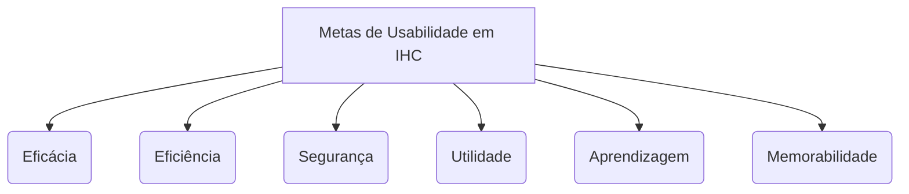

# Metas de Usabilidade

## Tabela de Contribuição e Uso de IA Generativa

| Integrante | Contribuição | Revisor | Ferramenta de IA Utilizada | Propósito do Uso de IA |
| :--- | :--- | :--- | :--- | :--- |
| [Gustavo Antonio](https://github.com/gus-ant) | Elaboração do documento de Metas de Usabilidade, definição dos critérios e matriz de avaliação do Diolinux Plus | [Vinicius Silva Araruna](https://github.com/ViniciusA05) | Gemini | Apoio na estruturação inicial, fundamentação teórica e inserção de evidências visuais. |

---

## Introdução

Este artefato especifica as **Metas de Usabilidade** aplicadas ao **Fórum Diolinux Plus**. As metas de usabilidade estabelecem os objetivos operacionais e qualitativos que a interface deve atingir para proporcionar uma experiência satisfatória, segura e produtiva para os membros da comunidade, abrangendo desde usuários iniciantes em ecossistemas Linux até moderadores e administradores da plataforma.

---

## Metodologia e Fundamentação Teórica

Conforme a literatura clássica de Interação Humano-Computador (PREECE, ROGERS e SHARP, 2013; BARBOSA et al., 2021, p. 103; NIELSEN, 1993), as metas de usabilidade focam na otimização da interação entre a pessoa e o sistema, avaliando o quão bem um produto auxilia o usuário a realizar suas tarefas.

Abaixo é apresentado o trecho original do livro-texto com **marca-texto digital amarelo** sobre a definição e importância das metas de usabilidade no processo de design de IHC:

> **Figura 1:** Trecho do livro-texto de IHC detalhando a definição das Metas de Usabilidade no processo de design.
>
> 
>
> *Fonte: BARBOSA et al. (2021, p. 103).*

Diferente das metas de experiência do usuário (que abrangem aspectos subjetivos como "ser divertido" ou "ser motivador"), as metas de usabilidade são **objetivas** e **mensuráveis**, subdivididas em 6 dimensões fundamentais:

---

## Análise das 6 Metas de Usabilidade no Diolinux Plus

### 1. Eficácia (*Effectiveness*)
Refere-se à capacidade do sistema em permitir que os usuários realizem suas tarefas de forma correta e alcancem plenamente seus objetivos (ex: solucionar um erro no sistema operacional, publicar um tutorial ou gerenciar denúncias).

- **Aplicação no Diolinux Plus:**
  - **Membros Comuns:** Conseguem encontrar soluções para problemas de software/hardware pesquisando ou criando novos tópicos detalhados.
  - **Moderadores:** Conseguem organizar discussões através do encerramento de tópicos resolvidos, fusão de conversas duplicadas e aplicação de marcações formais.
- **Métrica de Avaliação:** Taxa de conclusão de tarefas sem erros impeditivos (Meta: $> 90\%$ de sucesso na primeira tentativa de busca ou publicação).

> **Figura 2:** Captura real da estrutura de tópico técnico do Diolinux Plus evidenciando categorização e identificação clara do autor (Eficácia e Utilidade).
>
> 
>
> *Fonte: Captura realizada via agente web no fórum Diolinux Plus.*

---

### 2. Eficiência (*Efficiency*)
Diz respeito ao nível de apoio que a interface oferece ao usuário no cumprimento de suas tarefas com o menor tempo e esforço cognitivo possíveis.

- **Aplicação no Diolinux Plus:**
  - O fórum conta com sistema de busca com *autocomplete* dinâmico por tags, atalhos de teclado avançados (tecla `?`, `c`, `/`) e carregamento em página única (*Single Page Application*).
  - O editor de mensagens flutuante permite navegar por outros tópicos enquanto se digita uma resposta.
- **Métrica de Avaliação:** Tempo médio para localização de tópicos resolvidos e número de cliques necessários para criar uma nova postagem (Meta: $< 3$ cliques a partir da home).

> **Figura 3:** Busca dinâmica no fórum com sugestão preditiva de tags e palavras-chave (Eficiência e Aprendizagem).
>
> 
>
> *Fonte: Captura realizada via agente web no fórum Diolinux Plus.*

---

### 3. Segurança (*Safety*)
Envolve proteger o usuário de condições perigosas e situações indesejadas, minimizando riscos de erros e oferecendo meios simples de recuperação caso o usuário cometa um equívoco.

- **Aplicação no Diolinux Plus:**
  - **Salvamento Automático de Rascunhos:** Caso a janela seja fechada acidentalmente, o texto digitado permanece preservado no rodapé.
  - **Função Desfazer e Edição:** O usuário pode editar suas postagens após o envio para corrigir comandos ou trechos incorretos.
  - **Confirmação de Ações Críticas:** Ações administrativas (como banimento de usuário ou exclusão permanente de tópico) exigem confirmação explícita.
- **Métrica de Avaliação:** Taxa de recuperação de erros inadvertidos sem perda de dados (Meta: $100\%$ de preservação de rascunhos em caso de fechamento de aba).

---

### 4. Utilidade (*Utility*)
Refere-se ao grau em que o sistema fornece o conjunto correto de funcionalidades de que o usuário necessita para realizar o seu trabalho/tarefa.

- **Aplicação no Diolinux Plus:**
  - Disponibilização de suporte nativo a blocos de código com formatação de sintaxe (*syntax highlighting* para bash, python, C++, etc.), essencial para fóruns de tecnologia.
  - Upload de imagens de captura de tela e arquivos de log por arrastar-e-soltar (*drag and drop*).
  - Sistema de reputação (curtidas e badges) que valoriza os membros mais solícitos.
- **Métrica de Avaliação:** Adequação dos recursos disponíveis às necessidades declaradas pelos perfis de usuário (Meta: $100\%$ de suporte a formatadores de código e logs no editor).

---

### 5. Aprendizagem (*Learnability*)
Avalia a facilidade com que novos usuários aprendem a navegar, interagir e utilizar os recursos do sistema logo no primeiro contato.

- **Aplicação no Diolinux Plus:**
  - Padrões visuais altamente intuitivos e consistentes com grandes redes sociais e fóruns modernos (botão *"Criar Tópico"* em destaque azul, ícones universais de busca, perfil e notificações).
  - Exibição de dicas de contexto na primeira criação de tópico e presença de um tópico fixado com as *"Regras da Comunidade"*.
- **Métrica de Avaliação:** Tempo necessário para que um usuário novato publique sua primeira dúvida sem necessitar de suporte externo (Meta: $< 5$ minutos).

---

### 6. Memorabilidade (*Memorability*)
Refere-se à facilidade com que usuários casuais conseguem reter o modelo mental de navegação e operação do sistema após um longo período sem utilizá-lo.

- **Aplicação no Diolinux Plus:**
  - A estrutura da interface mantém consistência rígida entre seções (categorias à esquerda, feed central, ações à direita), de modo que o usuário não precisa "reaprender" a utilizar a plataforma caso fique semanas sem acessar.
  - Disponibilização de uma central completa de atalhos de teclado (tecla `?`).
- **Métrica de Avaliação:** Desempenho e velocidade de execução em acessos recorrentes após 30 dias de inatividade.

> **Figura 4:** Modal de ajuda com central de atalhos ativado pela tecla `?` (Memorabilidade e Eficiência).
>
> 
>
> *Fonte: Captura realizada via agente web no fórum Diolinux Plus.*

---

## Tabela de Síntese e Critérios de Aceite das Metas

| Meta de Usabilidade | Objetivo na Interface | Critério de Aceite / Métrica | Evidência Visual | Status no Diolinux Plus |
| :--- | :--- | :--- | :--- | :---: |
| **Eficácia** | Permitir encontrar respostas para dúvidas Linux e moderar o fórum | $> 90\%$ de sucesso na resolução de buscas | [Figura 2](#1-eficacia-effectiveness) | **Atende** |
| **Eficiência** | Agilizar o fluxo de publicação e consulta com atalhos e busca dinâmica | Tempo de busca $< 30$ segundos | [Figura 3](#2-eficiencia-efficiency) | **Atende** |
| **Segurança** | Evitar perda de textos digitados e acidentes em ações de moderadores | $100\%$ de salvamento automático de rascunhos | Validação e Rascunho | **Atende** |
| **Utilidade** | Fornecer syntax highlighting, suporte a logs e controle de tópicos | Presença nativa de blocos de código e upload | [Figura 2](#1-eficacia-effectiveness) | **Atende** |
| **Aprendizagem** | Facilitar o primeiro acesso de usuários leigos na publicação de dúvidas | Tempo de aprendizado inicial $< 5$ minutos | [Figura 3](#2-eficiencia-efficiency) | **Atende** |
| **Memorabilidade** | Garantir retorno fácil após tempo de inatividade com layout padronizado | Reconhecimento imediato dos painéis | [Figura 4](#6-memorabilidade-memorability) | **Atende** |

---

## Histórico de Versão

| Versão | Data | Descrição | Autor(es) | Revisor(es) |
| :---: | :---: | :--- | :--- | :--- |
| `1.0` | 05/10/2026 | Criação do documento de Metas de Usabilidade com as 6 dimensões clássicas, recorte marcado do livro e capturas reais do fórum | [Gustavo Antonio](https://github.com/gus-ant) | [Vinicius Silva Araruna](https://github.com/ViniciusA05) |

---

## Referências Bibliográficas

[1] BARBOSA, Simone Diniz Junqueira et al. *Interação Humano-Computador e Experiência do Usuário*. 1. ed. Rio de Janeiro: Autopublicação, 2021. Cap. 6: Processos de Design de IHC (Ciclo de Mayhew), p. 103–108.

[2] NIELSEN, Jakob. *Usability Engineering*. Boston: Academic Press, 1993.

[3] PREECE, Jennifer; ROGERS, Yvonne; SHARP, Helen. *Design de Interação: Além da Interação Homem-Computador*. 3. ed. Porto Alegre: Bookman, 2013. Cap. 1: O que é Design de Interação?, p. 15–22.
