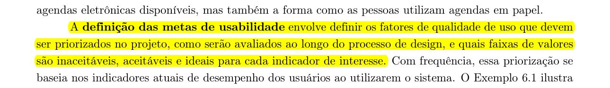
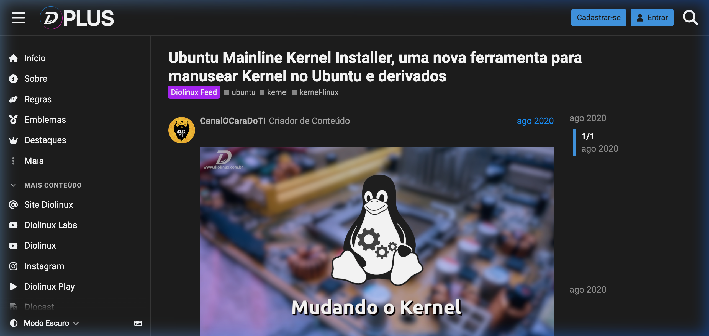
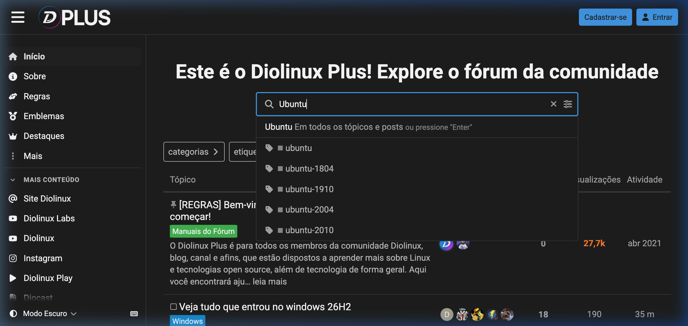
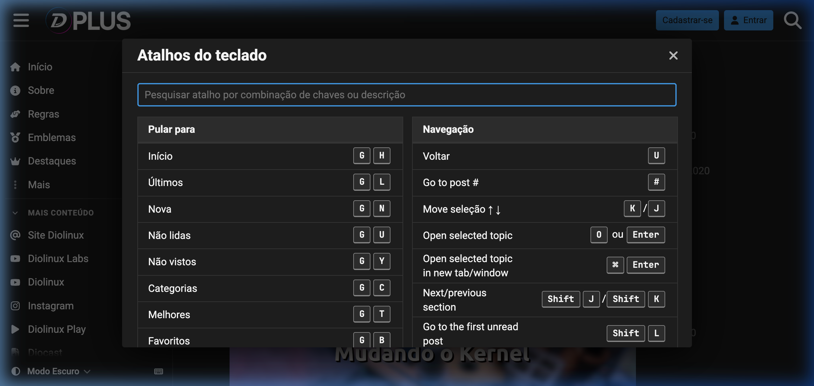

# Metas de Usabilidade e Experiência do Usuário (UX)

## Tabela de Contribuição e Uso de IA Generativa

| Integrante | Contribuição no Artefato | Data | Ferramenta de IA Utilizada | Propósito do Uso de IA |
| :--- | :--- | :---: | :--- | :--- |
| [Vinicius Silva Araruna](https://github.com/ViniciusA05) | Redação integral do documento, fundamentação teórica de usabilidade e UX, avaliação prática no Diolinux Plus, mapeamento de personas/tarefas e matriz de priorização | 05/10/2026 | Antigravity (LLM) | Apoio na estruturação analítica, verificação de métricas e formatação Markdown. |
| [Edvaldo Soares Brasileiro Filho](https://github.com/PajeMurici-dev) | Revisão técnica por pares e validação do mapeamento de tarefas HTA | 05/10/2026 | - | Revisão humana de conformidade acadêmica. |
| [Gustavo Antonio Rodrigues e Silva](https://github.com/gus-ant) | Revisão técnica por pares e validação da consonância com o Guia de Estilo | 05/10/2026 | - | Revisão humana de conformidade acadêmica. |

---

## Introdução

Este artefato documenta a definição e a priorização das **Metas de Usabilidade** e das **Metas de Experiência do Usuário (UX)** para o **Fórum Diolinux Plus**, desenvolvidas na fase de **Análise de Requisitos** da disciplina de Interação Humano-Computador (FGA0173), na Faculdade UnB Gama (FGA/UnB).

No Ciclo de Vida de Mayhew (1999), a análise de requisitos estabelece os alicerces operacionais e qualitativos que norteiam todo o processo iterativo de design e avaliação. Conforme destacam Barbosa e Silva (2021, p. 104-106), a especificação clara de metas de usabilidade e de experiência previne concepções vagas de qualidade, permitindo que a equipe de projeto estabeleça critérios mensuráveis para decidir se uma intervenção na interface foi bem-sucedida ou se introduziu novas barreiras cognitivas ao usuário.

Neste projeto, as metas são fundamentadas nas características da comunidade de software livre que frequenta o Diolinux Plus, conectando-se diretamente ao elenco de personas e à análise de tarefas HTA elaborados na Etapa 2.

---

## Metodologia e Fundamentação Teórica

A abordagem metodológica adotada conjuga a Engenharia de Usabilidade clássica de Nielsen (1993) e as dimensões afetivas e subjetivas do Design de Interação propostas por Rogers, Sharp e Preece (2013), harmonizadas pelo framework pedagógico de Barbosa e Silva (2021).

### Metas de Usabilidade (Nielsen, 1993)
As metas de usabilidade concentram-se no desempenho operacional, na produtividade e na ausência de atritos funcionais durante a interação. São estruturadas em seis dimensões fundamentais:

1. **Eficácia (*Effectiveness*)**: Capacidade de o sistema permitir que o usuário atinja seus objetivos de maneira completa e correta (ex: publicar uma dúvida técnica com os diagnósticos necessários ou encontrar a solução precisa para um erro de sistema operacional).
2. **Eficiência (*Efficiency*)**: Produtividade propiciada pelo sistema na realização das tarefas, minimizando o dispêndio desnecessário de tempo e de recursos cognitivos ou motores.
3. **Segurança no Uso (*Safety*)**: Grau de proteção oferecido ao usuário contra erros indesejados, perdas de dados acidentais ou situações de estresse, assegurando mecanismos transparentes de reversão e recuperação.
4. **Utilidade (*Utility*)**: Capacidade de o sistema disponibilizar as funcionalidades e os recursos tecnológicos estritamente pertinentes e necessários para o domínio de trabalho do usuário.
5. **Facilidade de Aprendizado (*Learnability*)**: Rapidez e facilidade com que um usuário novato ou em transição compreende o modelo conceitual do sistema e se torna produtivo na execução das tarefas básicas.
6. **Facilidade de Memorização (*Memorability*)**: Capacidade de o sistema permitir que um usuário casual ou que retorne após longo período de inatividade retenha os padrões de navegação e comandos sem necessitar de retreinamento.

### Metas de Experiência do Usuário — UX (Rogers, Sharp e Preece, 2013)
Enquanto a usabilidade avalia se o sistema funciona bem do ponto de vista funcional, a experiência do usuário investiga como o indivíduo se sente ao interagir com a interface. As autoras organizam as metas de UX em aspectos positivos almejados (satisfatório, motivador, engajador, recompensador, acolhedor) e aspectos negativos a serem mitigados (frustrante, confuso, entediante, punitivo).

### Níveis de Desempenho e Critérios de Aceite (Barbosa e Silva, 2021)
Barbosa e Silva (2021, p. 106) orientam que a definição das metas não deve se restringir a declarações genéricas, exigindo a determinação de indicadores e faixas de valores com três patamares: o nível inaceitável (limiar de reprovação da interface), o nível aceitável (mínimo exigido para entrega) e o nível ideal (estado ótimo almejado no projeto).

A Figura 1 reproduz o trecho do livro-texto de Barbosa e Silva (2021, p. 106) que fundamenta a definição e priorização das metas de usabilidade na Engenharia de Usabilidade.



**Figura 1** — Definição e priorização de metas de usabilidade segundo Barbosa e Silva (2021, p. 106).

_Fonte: Barbosa e Silva (2021, p. 106)._

---

## Avaliação Prática das Metas de Usabilidade no Fórum Diolinux Plus

Nesta seção, cada uma das seis metas de usabilidade é examinada criticamente à luz da interface real do Fórum Diolinux Plus (baseado no software Discourse), contrastando seus pontos fortes com os atritos práticos enfrentados pelos membros da comunidade.

### 1. Eficácia (*Effectiveness*)
A eficácia no Diolinux Plus reside na capacidade de membros encontrarem diagnósticos válidos e resolverem dúvidas sobre distribuição, drivers e programas Linux sem falhas de comunicação ou respostas equivocadas.

- **Aplicação no Sistema:** A plataforma oferece categorização temática detalhada (ex: Iniciantes, Hardware, Notícias, Customização), sistema de tags e ferramenta de marcação de "Solução Aceita", que pinça a postagem resolutiva diretamente para o topo do tópico.
- **Atritos e Limitações Identificadas:** Usuários novatos com frequência redigem pedidos de ajuda sem fornecer os relatórios de hardware e logs do terminal necessários, gerando ciclos extensos de mensagens pedindo esclarecimentos. Adicionalmente, quando o usuário busca por sintomas vagos (ex: "tela preta após reiniciar"), a busca textual retorna tópicos não resolvidos ou desatualizados misturados a soluções definitivas, exigindo esforço investigativo manual redundante.

A Figura 2 ilustra a interface de visualização de tópico no Diolinux Plus, destacando a taxonomia de categorias e as tags de sistema que suportam a eficácia comunicativa.



**Figura 2** — Interface de exibição de tópico técnico no Diolinux Plus com identificação de autor, tags e categorias.

_Fonte: Captura realizada no Fórum Diolinux Plus, 2026._

### 2. Eficiência (*Efficiency*)
A eficiência reflete o custo operacional e o tempo que um usuário experiente despende para redigir postagens, moderar conteúdos ou localizar documentações técnicas.

- **Aplicação no Sistema:** O fórum é construído como uma aplicação de página única (*Single Page Application* — SPA), dotada de um editor flutuante minimizável no rodapé. Isso permite que o usuário navegue por múltiplos tópicos, copie trechos e referências e redija respostas em paralelo sem perder o contexto. Além disso, conta com um abrangente catálogo de atalhos de teclado (como a tecla `/` para busca instantânea e `c` para abrir o compositor de tópico).
- **Atritos e Limitações Identificadas:** Os atalhos de teclado são totalmente invisíveis para quem utiliza a interface via mouse ou dispositivos móveis, sem qualquer *tooltip* explícito ou botão permanente de ajuda rápida. Usuários não avançados são forçados a realizar trajetos com múltiplos cliques pelo menu superior para aplicar filtros simples.

A Figura 3 demonstra o mecanismo de busca dinâmica com autocompletar e filtros de categoria no Diolinux Plus, acelerando a localização de tópicos.



**Figura 3** — Modal de busca rápida preditiva no Diolinux Plus com segmentação por tópicos, categorias e usuários.

_Fonte: Captura realizada no Fórum Diolinux Plus, 2026._

### 3. Segurança no Uso (*Safety*)
A segurança garante que o usuário não perca horas de redação técnica e não cometa enganos irreversíveis ao interagir ou formatar instruções do terminal.

- **Aplicação no Sistema:** O salvamento automático contínuo de rascunhos (*drafts*) opera em tempo real, sincronizado no navegador e no servidor. Caso o navegador trave, a conexão caia ou a aba seja fechada inadvertidamente, o conteúdo redigido reaparece intacto ao reabrir a plataforma. Além disso, o histórico de revisões de mensagens permite auditar e reverter qualquer edição equivocada de código.
- **Atritos e Limitações Identificadas:** As regras automáticas de proteção contra spam vinculadas ao nível de confiança inicial (Trust Level 0) bloqueiam a publicação de mais de uma imagem e restringem links externos para membros recém-cadastrados. Quando um usuário iniciante tenta enviar capturas de tela do seu erro de boot ou links de repositórios, o sistema bloqueia o envio com alertas genéricos, provocando surpresa e frustração por falta de um aviso prévio no editor.

### 4. Utilidade (*Utility*)
A utilidade traduz a oferta dos instrumentos computacionais exigidos pela rotina de suporte técnico e desenvolvimento de software.

- **Aplicação no Sistema:** O editor suporta blocos formatados de código-fonte com realce de sintaxe (*syntax highlighting*) para dezenas de linguagens e interpretadores de comando (Bash, Python, C++, Rust, YAML). Suporta ainda upload por arrastar e soltar (*drag-and-drop*) de logs e capturas de tela, menções de usuários com `@` e renderização de tabelas em Markdown.
- **Atritos e Limitações Identificadas:** Inexiste um assistente estruturado ou formulário guiado (*template form*) para abertura de tópicos de suporte. O usuário novato precisa memorizar manualmente a sintaxe de crases triplas (```` ```bash ````) para não poluir visualmente a página com saídas de terminal desformatadas.

### 5. Facilidade de Aprendizado (*Learnability*)
A facilidade de aprendizado mensura a facilidade com que novatos que migraram do Windows para o Linux começam a participar do ecossistema.

- **Aplicação no Sistema:** A interface reproduz convenções hegemônicas da Web moderna (feed centralizado, botão de criação em destaque azul, sinos de notificação e ícones universais). O bot nativo da plataforma (*discobot*) envia uma mensagem privada interativa ensinando novos membros a curtir, formatar e anexar arquivos.
- **Atritos e Limitações Identificadas:** A taxonomia dos níveis de confiança (*Trust Levels* de 0 a 4), os operadores booleanos da busca avançada e os critérios formais para marcação de solução não são explicados de forma integrada na navegação principal, exigindo que o usuário localize voluntariamente as diretrizes da comunidade para entender como seu perfil evolui.

### 6. Facilidade de Memorização (*Memorability*)
A facilidade de memorização assegura que membros ocasionais possam reutilizar o fórum meses após a resolução de seu primeiro problema sem estranhamento.

- **Aplicação no Sistema:** A rigidez da arquitetura de informação do Discourse mantém invariantes as posições do painel lateral de categorias, da barra de pesquisa e dos controles de conta. O acionamento da tecla `?` abre uma central de atalhos que atua como suporte de memória externo imediato.
- **Atritos e Limitações Identificadas:** Poucos atritos nesta dimensão, sendo a retenção do modelo mental um dos maiores pontos de estabilidade da plataforma.

A Figura 4 exibe o modal de atalhos de navegação e edição do Fórum Diolinux Plus, ativado via atalho de teclado.



**Figura 4** — Modal de auxílio com catálogo de atalhos de teclado do Fórum Diolinux Plus.

_Fonte: Captura realizada no Fórum Diolinux Plus, 2026._

---

## Metas de Experiência do Usuário (UX) no Fórum Diolinux Plus

O engajamento em uma comunidade de suporte voluntário depende de fatores afetivos e de pertencimento social. Foram selecionadas e analisadas cinco metas primordiais de UX para o projeto:

1. **Motivador e Engajador**: A interface utiliza um ecossistema de insígnias (*badges*), contadores de leitura e métricas de engajamento que incentivam membros a voltar frequentemente e compartilhar soluções para problemas complexos de terceiros.
2. **Recompensador e Valorizador**: Quando o autor de uma dúvida marca a postagem de outro membro como "Solução Aceita", o sistema premia visualmente a resposta com um contorno verde destacado e incrementa a contagem de soluções no perfil público do respondedor, satisfazendo a necessidade de reconhecimento técnico.
3. **Acolhedor e Não Intimidador**: Comunidades técnicas tradicionais de Linux historicamente carregam o estigma de respostas ríspidas a perguntas básicas (como o infame bordão "RTFM — *Read The Fucking Manual*"). O Diolinux Plus contrapõe essa barreira com mensagens amigáveis de moderação e lembretes de empatia, promovendo um ambiente receptivo para usuários em transição de sistema operacional.
4. **Redução de Frustração**: A interface combate a frustração preservando rascunhos em tempo real e indicando tópicos similares durante a digitação do título, evitando que o usuário gaste tempo criando uma postagem duplicada cujo tema já foi debatido exaustivamente.
5. **Prestativo e Cooperativo**: O sistema atua como assistente proativo ao sugerir tags relevantes e autoexpandir links de repositórios do GitHub e comandos do terminal com prévias explicativas.

---

## Articulação com Personas e Análise de Tarefas (HTA)

As metas de usabilidade e experiência do usuário (UX) fundamentam-se na resolução de atritos reais vivenciados pelos utilizadores da interface. Em consonância com a reformulação metodológica decorrente do feedback da disciplina, o projeto do Fórum Diolinux Plus estrutura seu público-alvo em torno de três **papéis funcionais de utilizadores do sistema** (superando classificações motivacionais abstratas):

1. **Desenvolvedor / Contribuidor de Software Livre** (*Lucas Mendonça — Persona Primária*): Utilizador com experiência técnica intermediária/avançada que publica dúvidas complexas com comandos, tutoriais e logs do terminal, busca debates aprofundados e atua colaborativamente na resolução de problemas de outros membros.
2. **Estudante / Usuário Aprendiz do Sistema** (*Persona Secundária*): Utilizador em processo de aprendizagem ou transição para Linux que consulta a base de conhecimento para solucionar entraves cotidianos de instalação/drivers, busca orientações passo a passo e publica dúvidas de primeiro nível.
3. **Administrador / Moderador do Fórum** (*Persona Secundária*): Utilizador investido de privilégios de gestão comunitária, responsável pela integridade taxonômica (categorias e tags), fechamento de discussões resolvidas, mediação de conflitos e governança das regras éticas da plataforma.

A Tabela 1 sintetiza o mapeamento integrado relacionando as metas clássicas de usabilidade de Nielsen (1993) e as metas de UX de Rogers, Sharp e Preece (2013) a esses papéis de utilizadores, vinculando-os diretamente às três tarefas modeladas na Análise Hierárquica de Tarefas (HTA) da Etapa 2 e aos fluxos de moderação da plataforma.

**Tabela 1** — Mapeamento Integrado: Metas de Usabilidade e UX versus Papéis de Utilizadores e Tarefas HTA

| Meta de IHC / UX | Papel de Utilizador Impactado | Tarefa HTA Associada | Ponto de Tensão na Interface Atual | Indicador Mensurável / Critério de Aceite |
| :--- | :--- | :--- | :--- | :--- |
| **Eficácia** | Desenvolvedor / Contribuidor *(Primária)* e Estudante / Aprendiz *(Secundária)* | Tarefa 1: Criação e Publicação de Tópico de Dúvida | Estudantes publicam dúvidas sem logs do terminal ou dados de hardware, gerando respostas imprecisas e retrabalho para quem responde. | Maior ou igual a 90% dos tópicos de suporte abertos com especificações de sistema e hardware na postagem inicial. |
| **Eficiência** | Desenvolvedor / Contribuidor *(Primária)* e Administrador / Moderador *(Secundária)* | Tarefa 3: Busca Avançada e Filtros de Categoria | Dificuldade em filtrar rapidamente tópicos que já possuem solução aceita versus tópicos abertos, gerando duplicidade de discussões. | Redução do tempo médio de localização de soluções técnicas para até 45 segundos. |
| **Segurança no Uso** | Estudante / Aprendiz *(Secundária)* e Administrador / Moderador *(Secundária)* | Tarefa 2: Onboarding Interativo, Tutorial do Discobot e Progressão de Confiança | Bloqueio súbito de upload de logs e capturas de erro para membros em Trust Level 0 (anti-spam automático), interrompendo a jornada sem orientação clara sobre como atingir o Trust Level 1. | Zero ocorrências de bloqueio de postagem sem aviso contextual prévio e orientações claras de progressão de nível. |
| **Utilidade** | Desenvolvedor / Contribuidor *(Primária)* | Tarefa 1: Criação e Publicação de Tópico de Dúvida | Ausência de assistente estruturado de código força a digitação manual de crases Markdown, gerando blocos desformatados. | Maior ou igual a 95% dos trechos de código e comandos postados com realce de sintaxe (*syntax highlighting*) correto. |
| **Facilidade de Aprendizado** | Estudante / Aprendiz *(Secundária)* | Tarefa 2: Onboarding Interativo, Tutorial do Discobot e Progressão de Confiança | Sobrecarga cognitiva no primeiro contato para assimilar a taxonomia de categorias, atalhos de navegação e cumprir o tutorial interativo do bot assistente sem abandonar a plataforma. | Conclusão do onboarding prático e primeira interação orientada em menos de 4 minutos no primeiro contato. |
| **Facilidade de Memorização** | Desenvolvedor / Contribuidor *(Primária)* e Estudante / Aprendiz *(Secundária)* | Tarefa 3: Busca Avançada e Filtros de Categoria | Atalhos de teclado (como `/` para busca e `c` para criar tópico) são invisíveis na interface gráfica, exigindo reaprendizado. | Preservação de atalhos em modal permanente de ajuda (`?`) acessível em 100% das páginas do fórum. |
| **Recompensa e Reconhecimento (UX)** | Desenvolvedor / Contribuidor *(Primária)* | Fluxo de Solução Aceita e Tarefa 1 | Autores de dúvidas esquecem de assinalar a resposta que solucionou o problema, frustrando contribuidores voluntários. | Aumento da taxa de tópicos de dúvida com solução oficialmente marcada para pelo menos 75%. |
| **Acolhimento e Redução de Frustração (UX)** | Estudante / Aprendiz *(Secundária)* | Tarefa 1: Criação de Tópico e Tarefa 2: Onboarding Interativo | Sentimento de intimidação técnica frente a restrições de novato (Trust Level 0) ou advertências de moderação por enquadramento incorreto de categoria/tags. | Exibição proativa de dicas contextuais no compositor e sugestão de tópicos resolvidos correlatos em menos de 1 segundo durante a digitação do título. |

_Fonte: Elaborada pelos autores, 2026._

Conforme detalhado na Tabela 1, a matriz estabelece cobertura exaustiva das seis metas clássicas de usabilidade e das duas dimensões centrais de experiência, associando cada critério às tarefas formais de HTA (Tarefas 1, 2 e 3) e aos papéis funcionais do fórum.

---

## Matriz de Priorização das Metas de Usabilidade e UX

Para orientar a tomada de decisões no projeto e calibrar os testes de usabilidade previstos no Ciclo de Mayhew, a equipe estabeleceu níveis de desempenho inaceitáveis, aceitáveis e ideais para cada indicador, em conformidade com Barbosa e Silva (2021, p. 106).

A Tabela 2 consolida a matriz de priorização das metas, classificando-as hierarquicamente em Prioridade Crítica (P1), Prioridade Alta (P2) e Prioridade Média (P3).

**Tabela 2** — Matriz de Priorização das Metas de Usabilidade e UX para o Projeto Diolinux Plus

| Dimensão / Meta | Grau de Prioridade | Justificativa de Projeto | Nível Inaceitável | Nível Aceitável | Nível Ideal |
| :--- | :---: | :--- | :--- | :--- | :--- |
| **Eficácia Técnica** | **Crítica (P1)** | O objetivo precípuo do fórum é solucionar problemas computacionais; se a dúvida não é respondida corretamente, o sistema falha em seu propósito central. | Taxa de resolução de dúvidas abaixo de 60% | Taxa de resolução entre 75% e 85% | Taxa de resolução igual ou superior a 90% com solução aceita formal |
| **Segurança de Dados e Rascunhos** | **Crítica (P1)** | A perda de textos extensos de diagnóstico técnico em caso de falha de conexão afasta irremediavelmente os usuários. | Qualquer perda de rascunho por fechamento acidental de janela (abaixo de 98%) | 99% de recuperação automática de rascunhos | 100% de persistência com sincronização offline e online imediata |
| **Facilidade de Aprendizado (Onboarding e Trust Levels)** | **Alta (P2)** | Estudantes e novatos em transição para Linux desistem da plataforma caso o onboarding guiado pelo Discobot seja confuso e as restrições de Trust Level 0 pareçam punitivas e inexplicadas. | Taxa de abandono do onboarding interativo acima de 40% dos novos membros | Taxa de conclusão do tutorial inicial entre 70% e 80% | Taxa de conclusão igual ou superior a 90% com progressão natural para Trust Level 1 |
| **Eficiência na Busca** | **Alta (P2)** | O acervo histórico do Diolinux Plus possui milhares de tópicos; a busca rápida evita a criação de tópicos repetidos por estudantes e agiliza a moderação. | Tempo para encontrar tópico relevante acima de 90 segundos | Tempo de localização entre 30 e 45 segundos | Tempo de localização de até 15 segundos com autocompletar facetado |
| **Sentimento de Recompensa (UX)** | **Alta (P2)** | A retenção de Desenvolvedores e Contribuidores voluntários experientes depende diretamente do prestígio técnico e reconhecimento social na comunidade. | Taxa de marcação de solução aceita abaixo de 30% | Taxa de marcação entre 50% e 65% | Taxa de marcação igual ou superior a 80% com lembretes ao autor |
| **Utilidade (Ferramentas de Código)** | **Média (P3)** | Recursos de formatação de logs enriquecem a legibilidade técnica, embora possam ser supridos por comandos Markdown básicos. | Inexistência de realce de sintaxe para Bash e logs | Suporte manual a blocos de código com sintaxe básica | Inserção assistida de snippets com detecção automática de linguagem |
| **Memorabilidade de Atalhos** | **Média (P3)** | Afeta principalmente usuários frequentes de desktop, tendo menor impacto sobre novatos ou visitantes casuais. | Interface exigir reaprendizado após 30 dias de inatividade | Manutenção das rotas de navegação nos menus superiores | Retenção imediata com modal contextual de atalhos e dicas |

_Fonte: Elaborada pelos autores, 2026._

Conforme evidenciado na Tabela 2, os esforços centrais de prototipação da Etapa 4 serão concentrados nas metas de prioridade crítica e alta (P1 e P2), assegurando a máxima efetividade das intervenções de design de interface propostas pelo Grupo 08.

---

## Histórico de Versão

| Versão | Data | Descrição | Autor(es) | Revisor(es) |
| :---: | :---: | :--- | :--- | :--- |
| `1.0` | 05/10/2026 | Elaboração inicial completa do documento de Metas de Usabilidade e UX com fundamentação em Nielsen e Rogers/Sharp/Preece, aplicação no Diolinux Plus, mapeamento de personas/HTA e matriz de priorização | [Vinicius Silva Araruna](https://github.com/ViniciusA05) | [Edvaldo Soares Brasileiro Filho](https://github.com/PajeMurici-dev), [Gustavo Antonio Rodrigues e Silva](https://github.com/gus-ant) |

---

## Declaração sobre o Uso de Inteligência Artificial Generativa

Em conformidade com as diretrizes éticas e pedagógicas da disciplina de Interação Humano-Computador, declara-se que ferramentas de modelos de linguagem de grande porte (LLMs via plataforma Antigravity) foram empregadas exclusivamente como suporte instrumental para auxílio na estruturação das tabelas comparativas, padronização da notação matemática e revisão ortográfica dos textos em Markdown. Todas as análises críticas do Fórum Diolinux Plus, o cruzamento conceitual com as tarefas HTA e personas da equipe e a definição dos critérios métricos de priorização foram formulados, revisados e validados intelectualmente pelos discentes responsáveis.

---

## Referências Bibliográficas

[1] BARBOSA, Simone Diniz Junqueira; SILVA, Bruno Santana da. *Interação Humano-Computador*. Rio de Janeiro: Elsevier / Campus, 2010.

[2] BARBOSA, Simone Diniz Junqueira et al. *Interação Humano-Computador e Experiência do Usuário*. 1. ed. Rio de Janeiro: Autopublicação, 2021. Cap. 6: Processos de Design de IHC (Ciclo de Mayhew), p. 103–108.

[3] MAYHEW, Deborah J. *The Usability Engineering Lifecycle: A Practitioner's Handbook for User Interface Design*. San Francisco: Morgan Kaufmann, 1999.

[4] NIELSEN, Jakob. *Usability Engineering*. Boston: Academic Press, 1993.

[5] PREECE, Jennifer; ROGERS, Yvonne; SHARP, Helen. *Design de Interação: Além da Interação Homem-Computador*. 3. ed. Porto Alegre: Bookman, 2013. Cap. 1: O que é Design de Interação?, p. 15–22.
