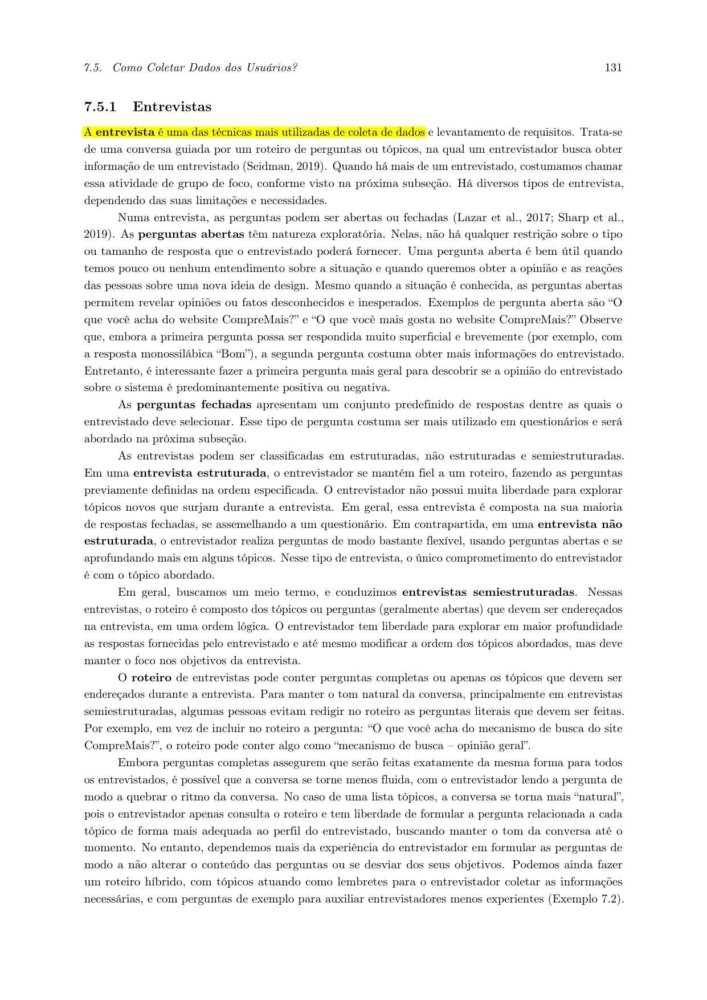
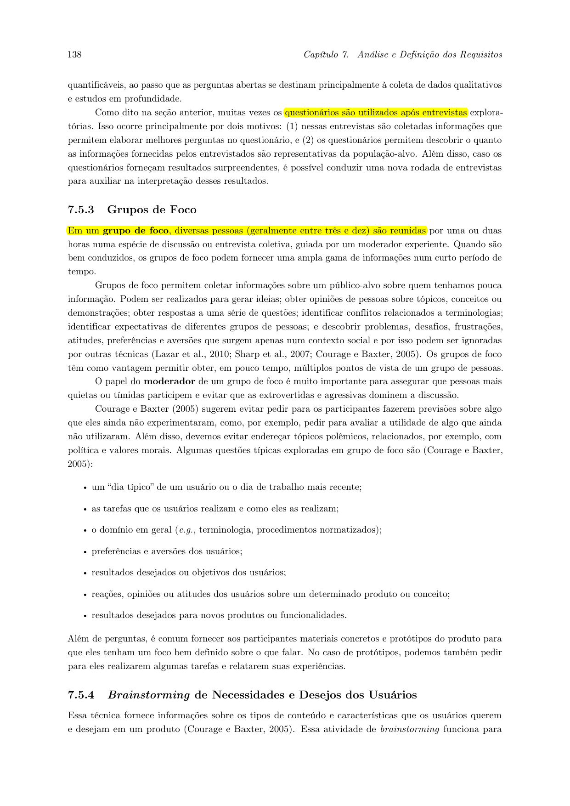
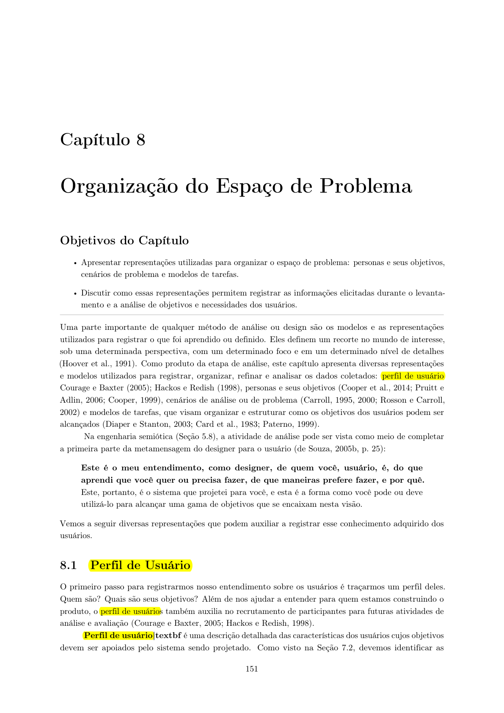

# Perfil do Usuário

## Tabela de Contribuição

| Integrante | Contribuição no Artefato | Data | Ferramenta de IA e Contribuição |
| :--- | :--- | :---: | :--- |
| [Vinicius Silva Araruna](https://github.com/ViniciusA05) | Estruturação metodológica, fundamentação demográfica com base secundária (IBGE) e autoria do Perfil 1 (Estudante / Usuário Comum). | 09/10/2026 | Suporte na estruturação Markdown e formatação de dados estatísticos. |
| [Gustavo Antonio Rodrigues e Silva](https://github.com/gus-ant) | Autoria individual e detalhamento completo do Perfil 2 (Moderador / Guardião da Comunidade) e consolidação da matriz comparativa. | 09/10/2026 | LLM (Antigravity): apoio na formulação dos atributos de moderação e alinhamento às diretrizes do Discourse. |
| [Edvaldo Soares Brasileiro Filho](https://github.com/PajeMurici-dev) | Autoria individual do Perfil 3 (Administrador / Gestor do Sistema) e elaboração da lista de verificação. | 09/10/2026 | LLM: apoio na síntese de atributos de infraestrutura e revisão cruzada por pares. |

---

## 1. Introdução

Este artefato apresenta a caracterização completa e consolidada dos perfis de usuário do **Fórum Diolinux Plus**, no âmbito da disciplina de Interação Humano-Computador (FGA0173), ministrada pelo Prof. Dr. André Barros de Sales, na Faculdade UnB Gama (FGA/UnB).

A definição precisa de perfis de usuário constitui a base fundamental para guiar a análise de requisitos, a engenharia de usabilidade e as decisões de design da interface. Conforme alertam Barbosa e Silva (2021, p. 160–166), sem uma sólida caracterização empírica e metodológica do público-alvo, os projetistas tendem a cometer o erro clássico de projetar para si mesmos — tomando suas próprias preferências e aptidões cognitivas como referência universal —, gerando o fenômeno do "usuário elástico" (Cooper et al., 2014).

Em atendimento às diretrizes do docente e às observações da monitoria (OBS 3, Item 10), este documento foi completamente reformulado para abandonar a divisão rasa por "nível de experiência técnica isolada" e adotar uma **categorização por papéis funcionais e hierárquicos de utilização na comunidade do Discourse**:

1. **Perfil 1 — Estudante / Usuário Comum (em busca de suporte e aprendizado);**
2. **Perfil 2 — Moderador (Guardião da Comunidade e curador de conteúdo);**
3. **Perfil 3 — Administrador (Gestor do Sistema, infraestrutura e governança).**

---

## 2. Metodologia de Elicitação e Base Demográfica Secundária

A consolidação destes perfis fundamentou-se em uma abordagem mista (triangulação de dados) recomendada pela literatura de IHC (Barbosa e Silva, 2021; Mayhew, 1999; Courage e Baxter, 2005):

1. **Levantamento Quantitativo (Questionário):** Aplicação de questionário estruturado com 38 respondentes da comunidade de tecnologia e estudantes universitários, mapeando hábitos de acesso, frequência de postagem e barreiras com a sintaxe Markdown e filtros de pesquisa.
2. **Levantamento Qualitativo (Entrevistas Semiestruturadas):** Condução de entrevistas gravadas no Google Meet com estudantes universitários, aprofundando modelos mentais, atitudes emocionais frente a falhas de software e estratégias de busca.
3. **Análise Documental e Observação da Plataforma:** Levantamento de dados públicos do Fórum Diolinux Plus (tópicos, badges de gamificação, níveis de confiança *Trust Levels* do Discourse e fluxos de denúncia).
4. **Fundamentação Demográfica com Dados Secundários (IBGE / Cetic.br):** Para complementar a amostra primária e situar os perfis no panorama brasileiro, foram incorporados os dados da pesquisa **PNAD Contínua TIC Domicílios (IBGE, 2023/2024)** e do **Cetic.br (2023)** sobre o perfil de usuários de computadores e internet no Brasil:
   - A posse de microcomputadores e notebooks no Brasil concentra-se expressivamente nas faixas etárias de 18 a 34 anos (58,4% dos usuários ativos) com grau de instrução universitário completo ou em andamento (IBGE, 2023);
   - A realização de cursos, pesquisas de estudo e participação em fóruns de discussão especializados possui maior prevalência entre estudantes de nível superior e jovens profissionais das áreas de Ciências Exatas e Tecnologia (Cetic.br, 2023);
   - A banda larga fixa de alta velocidade é utilizada por mais de 83% dos lares dessa faixa acadêmica, permitindo acesso contínuo a plataformas web dinâmicas como o Discourse sem severas limitações de largura de banda, priorizando-se a velocidade de renderização e usabilidade da interface gráfica.

As Figuras 1, 2 e 3 a seguir comprovam a fundamentação teórica nas obras de referência adotadas no projeto.



**Figura 1** — Trecho do livro de Barbosa e Silva detalhando a técnica de Entrevistas. _Fonte: Barbosa e Silva (2010, p. 131)._



**Figura 2** — Trecho do livro de Barbosa e Silva detalhando as técnicas de Grupos de Foco e Questionários. _Fonte: Barbosa e Silva (2010, p. 138)._

---

## 3. Grupos de Atributos Investigados

Seguindo o referencial teórico de Hackos e Redish (1998) citado e aprofundado por Barbosa e Silva (2021, p. 162), a caracterização de cada perfil de usuário estruturou-se em torno de dimensões analíticas rigorosas:

- **Dados demográficos e contexto:** Faixa etária, escolaridade, ocupação, ambiente físico de uso e dispositivos utilizados;
- **Experiência tecnológica e no domínio:** Proficiência com sistemas operacionais Linux, distribuições, terminal, arquitetura web e manipulação de fóruns;
- **Atitudes e estratégias:** Motivação intrínseca/extrínseca, predisposição psicológica frente à tecnologia (tecnófilo ou tecnófobo), tolerância a frustrações e hábitos de resolução de problemas;
- **Tarefas e objetivos:** Conjunto de atividades primárias e secundárias desempenhadas no ambiente da plataforma;
- **Necessidades de interação e pontos de dor:** Recursos essenciais de interface e gargalos de usabilidade mapeados nas tarefas do Discourse.



**Figura 3** — Grupos de atributos que caracterizam o perfil de usuário. _Fonte: Barbosa e Silva (2010, p. 162)._

---

## 4. Caracterização Consolidada dos Perfis Funcionais

### 4.1 Perfil 1 — Estudante / Usuário Comum em Busca de Suporte <a id="perfil-1-usuario-entusiasta-criador-de-topicos-tecnicos"></a>

- **Autor principal:** [Vinicius Silva Araruna](https://github.com/ViniciusA05)
- **Revisor:** [Gustavo Antonio Rodrigues e Silva](https://github.com/gus-ant)

O Estudante / Usuário Comum representa a maior parcela do público ativo no fórum (estimada em mais de 85% do fluxo total de visitantes e cadastrados). Seu objetivo precípuo é sanar dúvidas práticas relativas à instalação de distribuições (como Ubuntu, Fedora, Linux Mint), incompatibilidade de drivers (áudio, Wi-Fi, placas de vídeo) ou alternativas em software livre para softwares proprietários de engenharia e desenvolvimento.

A Tabela 1 detalha os atributos investigados e preenchidos para este perfil.

**Tabela 1** — Caracterização Completa do Perfil 1: Estudante / Usuário Comum

| Dimensão de Análise | Atributo Investigado | Caracterização Consolidada |
| :--- | :--- | :--- |
| **Dados Demográficos** | Faixa etária | 18 a 28 anos (predominância universitária e jovens profissionais). |
| | Escolaridade e Ocupação | Ensino Superior incompleto ou completo (Engenharias, Computação, TI, Design); estudantes de graduação e estagiários. |
| | Contexto de Uso | Computador pessoal (desktop/notebook) em ambiente acadêmico ou domiciliar; conexão banda larga via Wi-Fi; navegadores modernos (Google Chrome, Firefox, Brave). |
| **Experiência Tecnológica** | Tempo de uso de Linux | Iniciante a intermediário (de poucos meses a 2 anos). Utiliza distribuições com interface amigável (Ubuntu, Mint, Zorin OS, Fedora). |
| | Familiaridade com Terminal | Básica a intermediária. Executa comandos rotineiros copiados de tutoriais (`apt update`, `flatpak install`), mas receia executar comandos destrutivos sem explicação prévia. |
| | Domínio de Fóruns Web | Conhecimento padrão de navegação web. Costuma chegar ao fórum via motores de busca (Google) ao pesquisar uma mensagem de erro literal. |
| **Conhecimento do Domínio** | Compreensão de Software Livre | Conhece os conceitos básicos de código aberto, mas prioriza a funcionalidade imediata das ferramentas para suas entregas acadêmicas. |
| | Sintaxe e Formatação | Conhece superficialmente Markdown; frequentemente esquece de usar crases triplas (` ``` `) para encapsular saídas de terminais ou logs, poluindo o layout do post. |
| **Atitudes e Estratégias** | Postura Tecnológica | **Tecnófilo pragmático**. Aprecia tecnologia e inovação, mas busca eficiência e rapidez na solução dos seus impedimentos técnicos. |
| | Motivação Primária | Obter ajuda para destravar tarefas acadêmicas/profissionais e encontrar tutoriais confiáveis em língua portuguesa. |
| | Tolerância à Frustração | Média para baixa. Caso pesquise no fórum e receba apenas tópicos antigos ou respostas herméticas com jargões técnicos excessivos, tende a abandonar o site. |
| **Tarefas Primárias** | Busca de Tópicos Resolvidos | Pesquisar mensagens de erro ou termos técnicos no campo de busca do fórum para tentar resolver a dúvida de forma autônoma. |
| | Criação de Tópico de Dúvida | Publicar nova dúvida fornecendo especificações da máquina, distribuição utilizada e prints/logs da falha. |
| | Interação e Resposta | Ler orientações postadas pela comunidade, testar comandos e assinalar a mensagem que efetivamente solucionou a questão como **Solução**. |
| **Tarefas Secundárias** | Onboarding com Discobot | Realizar o tutorial interativo opcional de boas-vindas para ambientação com a sintaxe e regras da plataforma. |
| | Reconhecimento Comunitário | Curtir postagens prestativas e responder esporadicamente a tópicos de outros iniciantes quando domina a solução. |
| **Necessidades de Interação** | Clareza no Editor de Texto | Pré-visualização (*live preview*) nítida e intuitiva ao redigir mensagens; botões evidentes para inserção de blocos de código formatado e imagens. |
| | Filtros de Pesquisa Visuais | Identificação rápida de respostas marcadas oficialmente como "Resolvido" e capacidade de ordenar resultados pelos mais recentes. |
| **Dificuldades e Pontos de Dor** | Complexidade de Categorias | Dificuldade em classificar corretamente a dúvida na criação do tópico em meio a dezenas de categorias e subcategorias do Discourse. |
| | Sintaxe de Busca Avançada | Desconhecimento de operadores de busca do Discourse (ex: `category:iniciantes status:solved`), dependendo exclusivamente da busca textual rasa. |

_Fonte: Elaborada por Vinicius Silva Araruna, 2026. Consolidada com dados de questionário e entrevistas._

---

### 4.2 Perfil 2 — Moderador (Guardião da Comunidade) <a id="perfil-2-usuario-iniciante-migracao-windows-linux"></a>

- **Autor principal:** [Gustavo Antonio Rodrigues e Silva](https://github.com/gus-ant)
- **Revisor:** [Edvaldo Soares Brasileiro Filho](https://github.com/PajeMurici-dev)

O Moderador atua como a linha de frente da sustentabilidade, ordem e organização do Diolinux Plus. Trata-se de membros voluntários altamente assíduos e de elevada confiança comunitária (*Trust Level 4 / Leader* ou nomeados pela administração). O moderador possui interface enriquecida com ferramentas contextuais de governança, botões flutuantes de ação rápida e acesso ao painel de denúncias (*Flag Review Queue*).

A Tabela 2 apresenta a caracterização completa e minuciosa deste perfil.

**Tabela 2** — Caracterização Completa do Perfil 2: Moderador

| Dimensão de Análise | Atributo Investigado | Caracterização Consolidada |
| :--- | :--- | :--- |
| **Dados Demográficos** | Faixa etária | 22 a 42 anos (profissionais maduros e membros veteranos do ecossistema de software livre). |
| | Escolaridade e Ocupação | Ensino Superior completo ou Pós-Graduação em Ciência da Computação, Engenharia de Software, Redes ou áreas afins; profissionais de TI, administradores de sistemas (*sysadmins*) e programadores sêniores. |
| | Contexto de Uso | Acesso predominante via desktop/notebook com múltiplos monitores; periféricos de alta produtividade; acesso diário ou em múltiplos turnos. |
| **Experiência Tecnológica** | Tempo de uso de Linux | Avançado a especialista (acima de 5 anos de uso contínuo de distribuições estáveis e rolling release: Debian, Arch Linux, Fedora, openSUSE). |
| | Familiaridade com Terminal | Avançada. Amplo domínio de shell script, depuração de logs de sistema (`journalctl`, `dmesg`) e conceitos de arquitetura de SO. |
| | Domínio do Discourse | Profundo. Conhece detalhadamente atalhos de teclado (ex: teclas `j`/`k` para navegação, `m` para mutar, `f` para favoritar), mecânicas de pontuação e permissões de tópicos. |
| **Conhecimento do Domínio** | Normas e Código de Conduta | Conhece integralmente as diretrizes comunitárias, regras de respeito mútuo, políticas contra pirataria e taxonomia oficial de categorias do Diolinux Plus. |
| | Sintaxe e Formatação | Domínio total de Markdown, BBCode e HTML seguro permitido pela plataforma; habilidade em reformatar rapidamente mensagens mal estruturadas de terceiros. |
| **Atitudes e Estratégias** | Postura Tecnológica | **Tecnófilo altruísta e organizador**. Dedica parte significativa do seu tempo livre para sanear o fórum, movido por sentimento de pertencimento e defesa da comunidade. |
| | Motivação Primária | Manter a qualidade das informações técnicas arquivadas, evitar a proliferação de desinformação/trollagem e recepcionar cordialmente novos usuários. |
| | Postura Frente a Infrações | Imparcial, dialógica e pedagógica com novatos que cometem deslizes leves; enérgica e imediata contra comportamentos tóxicos, spam e propaganda indevida. |
| **Tarefas Primárias** | Curadoria e Organização | Mover tópicos criados em categorias incorretas para as categorias apropriadas; renomear títulos vagos ("Ajuda por favor!") para títulos descritivos; mesclar (*merge*) tópicos duplicados. |
| | Gestão da Fila de Denúncias | Analisar postagens sinalizadas pela comunidade (*flags* de spam, ofensas ou conteúdo impróprio), tomando ações de aprovação, ocultação ou exclusão. |
| | Moderação de Comportamento | Emitir advertências formais na plataforma, aplicar suspensões ou silenciamentos temporários e fechar tópicos inflamados ou fora de escopo. |
| **Tarefas Secundárias** | Acolhimento a Iniciantes | Orientar novos usuários sobre como formatar comandos e postar logs sem comprometer a legibilidade. |
| | Validação de Soluções | Marcar como oficial a solução de tópicos cujos autores esqueceram de validar, assegurando que outros pesquisadores encontrem a resposta correta. |
| **Necessidades de Interação** | Ações em Lote Eficientes | Ferramentas para seleção múltipla de posts e ações em lote (excluir múltiplos spams do mesmo invasor em 1 clique). |
| | Prevenção de Erros Destrutivos | Diálogos de confirmação explícitos e recursos de reversão (*undo/restore*) para evitar fechamentos ou exclusões acidentais de postagens legítimas. |
| **Dificuldades e Pontos de Dor** | Sobrecarga de Notificações | Excesso de denúncias repetidas em horários de pico, demandando filtragem manual exaustiva na fila de moderação. |
| | Falta de Contexto em Denúncias | Dificuldade em julgar mensagens denunciadas isoladamente que requerem a leitura prévia de dezenas de mensagens anteriores de uma discussão acalorada. |

_Fonte: Elaborada por Gustavo Antonio Rodrigues e Silva, 2026. Baseada nas dinâmicas operacionais do Discourse e dados comunitários._

---

### 4.3 Perfil 3 — Administrador (Gestor do Sistema) <a id="perfil-3-usuario-pesquisador-buscador-autonomo"></a>

- **Autor principal:** [Edvaldo Soares Brasileiro Filho](https://github.com/PajeMurici-dev)
- **Revisor:** [Vinicius Silva Araruna](https://github.com/ViniciusA05)

O Administrador representa o gestor absoluto da infraestrutura e dos parâmetros estratégicos do Diolinux Plus. É composto pela equipe oficial de fundadores, mantenedores técnicos e líderes do projeto Diolinux. Seu foco de interação não é a leitura ou publicação de posts cotidianos, mas sim o **Painel Administrativo do Discourse (*Admin Dashboard*)**, uma interface altamente técnica dedicada ao monitoramento de servidores, segurança da informação, conformidade com a LGPD e parametrização global do sistema.

A Tabela 3 detalha os atributos caracterizados para este perfil.

**Tabela 3** — Caracterização Completa do Perfil 3: Administrador

| Dimensão de Análise | Atributo Investigado | Caracterização Consolidada |
| :--- | :--- | :--- |
| **Dados Demográficos** | Faixa etária | 25 a 50 anos (profissionais seniores de liderança técnica). |
| | Escolaridade e Ocupação | Ensino Superior completo ou Especialização em Engenharia de Redes, Infraestrutura Cloud, DevOps ou Ciência da Computação; mantenedores oficiais e gestores de infraestrutura do Diolinux. |
| | Contexto de Uso | Estações de trabalho profissionais com conexões redundantes e seguras (VPNs, chaves SSH, autenticação multifator obrigatória). |
| **Experiência Tecnológica** | Tempo de uso de Linux | Especialista (mais de 8 anos). Vivência corporativa em ambientes de produção com alta carga e tráfego massivo. |
| | Conhecimento de Infraestrutura | Especialista em servidores Linux (Debian/Ubuntu Server), conteinerização (Docker), bancos de dados relacionais e em memória (PostgreSQL, Redis), servidores web reversos (Nginx) e entrega de conteúdo (CDN Cloudflare). |
| | Domínio do Discourse | Arquitetural. Domínio completo das variáveis de ambiente (`app.yml`), rotinas de reconstrução de container (*launcher rebuild app*), rotas de API e webhooks. |
| **Conhecimento do Domínio** | Governança e Negócios | Compreensão de métricas de retenção de audiência, taxas de conversão de apoiadores, integração com canais do YouTube e sustentabilidade financeira do projeto. |
| | Segurança e Privacidade | Profundo conhecimento em mitigação de ataques DDoS, vazamento de credenciais, filtros anti-spam bayesianos e adequação às normas da LGPD (Lei Geral de Proteção de Dados Pessoais). |
| **Atitudes e Estratégias** | Postura Tecnológica | **Tecnófilo focado em estabilidade, confiabilidade e governança**. Prioriza *uptime* ininterrupto (99,9%), tempos de resposta rápidos (*Core Web Vitals*) e integridade dos dados. |
| | Motivação Primária | Garantir a disponibilidade da infraestrutura tecnológica da marca Diolinux, escalabilidade frente a picos de tráfego e integridade dos backups rotineiros. |
| | Tolerância ao Risco | Mínima. Mudanças em temas visuais ou plugins só são implementadas após testes em ambientes de homologação (*staging*), devido ao impacto imediato em milhares de usuários ativos. |
| **Tarefas Primárias** | Manutenção e Atualização de Software | Executar upgrades seguros da versão do Discourse, gerenciar migrações de esquemas de banco de dados e aplicar patches de segurança em containers Docker. |
| | Monitoramento de Telemetria e Logs | Acompanhar gráficos de requisições por segundo, consumo de memória RAM/CPU, taxa de entrega de e-mails transacionais (SMTP) e erros 5xx no servidor. |
| | Governança Global e Políticas | Customizar parâmetros globais da comunidade: pontuação requerida para cada nível de confiança (*Trust Levels*), regras de moderação automática por IA, bloqueio de ranges de IP maliciosos e limites de envio de mídia. |
| **Tarefas Secundárias** | Customização de Interface e Temas | Aplicar e testar modificações no CSS global da plataforma, cabeçalhos, banners de patrocinadores e componentes de acessibilidade. |
| | Gestão de Plugins e Integrações | Integrar serviços de busca vetorial, plugins de autenticação única (OAuth/Google/GitHub) e gerenciar webhooks de mensageria. |
| **Necessidades de Interação** | Visão Sintética de Saúde do Sistema | Dashboards administrativos limpos com indicadores visuais de integridade operacional (verde/amarelo/vermelho) para componentes vitais (Postgres, Redis, Sidekiq, SMTP). |
| | Segmentação Hierárquica de Configurações | Busca eficiente e categorização lógica dentro das centenas de opções de configuração do Discourse, diferenciando parâmetros inofensivos de ajustes críticos de segurança. |
| **Dificuldades e Pontos de Dor** | Densidade Cognitiva Extrema | O painel nativo do Discourse exibe centenas de campos de formulário e parâmetros técnicos em telas longas, elevando a carga cognitiva e o tempo de busca por configurações específicas. |
| | Quebra de Compatibilidade de Plugins | Dificuldade em identificar visualmente quais plugins de terceiros tornaram-se incompatíveis ou obsoletos após uma grande atualização de versão do core do sistema. |

_Fonte: Elaborada por Edvaldo Soares Brasileiro Filho, 2026. Fundamentada na arquitetura técnica do Discourse e práticas DevOps._

---

## 5. Matriz Comparativa e Síntese dos Perfis Hierárquicos

A Tabela 4 sintetiza as dimensões comparativas fundamentais entre os três perfis elicitados, demonstrando como as necessidades de IHC, interfaces manipuladas e riscos de erro variam drasticamente conforme o papel funcional do ator no ecossistema.

**Tabela 4** — Matriz Comparativa dos Perfis Funcionais do Fórum Diolinux Plus

| Critério de Comparação | Perfil 1 — Estudante / Usuário Comum | Perfil 2 — Moderador | Perfil 3 — Administrador |
| :--- | :--- | :--- | :--- |
| **Integrante Responsável** | [Vinicius Silva Araruna](https://github.com/ViniciusA05) | [Gustavo Antonio Rodrigues e Silva](https://github.com/gus-ant) | [Edvaldo Soares Brasileiro Filho](https://github.com/PajeMurici-dev) |
| **Interface Principal Utilizada** | *Front-end* responsivo público do fórum (tópicos, feed, barra de busca e editor de Markdown). | *Front-end* estendido com menus flutuantes de contexto, botões de ação rápida e Painel de Denúncias (*Flag Queue*). | *Admin Dashboard* (*Back-end* visual e formulários de infraestrutura, logs e métricas do sistema). |
| **Nível de Acesso (Discourse)** | *Trust Level 0 a 2* (Novato / Básico / Membro). | *Trust Level 4 / Leader* ou Cargo de Moderação Oficial. | *Admin / Staff* (Poder total de leitura, escrita, auditoria e execução). |
| **Foco Primário de Interação** | Consumo de tutoriais, resolução imediata de dúvidas e aprendizado de Linux. | Triagem de qualidade, reorganização de categorias, mediação de conflitos e combate a spam. | Alta disponibilidade (99,9% uptime), velocidade de carregamento, segurança web e integridade de backups. |
| **Tarefas Críticas Executadas** | Formular consultas de busca, criar tópicos de dúvidas formatados e assinalar soluções válidas. | Fechar tópicos, mesclar threads duplicadas, silenciar usuários tóxicos e curar tags de tópicos. | Reconstruir containers, aplicar patches de segurança, gerenciar variáveis de ambiente e cadastrar plugins. |
| **Atitude Tecnológica Central** | **Tecnófilo pragmático**: valoriza praticidade, clareza visual e rapidez na remoção de impedimentos. | **Tecnófilo altruísta**: valoriza comunidade saudável, rigor ético e organização de informações. | **Tecnófilo corporativo/governança**: valoriza estabilidade, segurança da informação e desempenho do sistema. |
| **Impacto de Erro do Usuário** | Baixo: gera tópico em categoria incorreta ou com formatação quebrada (reversível pela moderação). | Médio/Alto: fechamento indevido de tópico legítimo ou aplicação de sanção precipitada a um membro. | Crítico: modificação incorreta de parâmetros globais ou parada total do serviço (*downtime* do fórum). |
| **Principal Gargalo de IHC** | Editor de Markdown sem auxílio contextual evidente; filtros de busca difíceis de interpretar. | Sobrecarga cognitiva ao julgar dezenas de mensagens isoladas na fila de denúncias sem contexto amplo. | Excesso de parâmetros e densidade de formulários nas telas de administração sem hierarquia visual clara. |

_Fonte: Elaborada pelos autores, 2026. Síntese analítica cruzada._

---

## 6. Lista de Verificação da Técnica de Perfil de Usuário

A Tabela 5 apresenta a lista de verificação preenchida pela equipe para avaliar a conformidade metodológica do artefato com os critérios de avaliação da disciplina.

**Tabela 5** — Lista de Verificação do Perfil de Usuário

| Item / Questão Avaliada | Referência Normativa | Conforme? | Justificativa / Evidência no Documento |
| :---: | :--- | :---: | :--- |
| **1** | Os perfis de usuário estão fundamentados em literatura canônica de IHC? | Barbosa & Silva (2021); Cooper et al. (2014) | **Sim** | As Seções 1 e 3 fundamentam os conceitos de perfil, os riscos do "usuário elástico" e citam os modelos teóricos adotados. |
| **2** | Os perfis foram reestruturados para refletir papéis funcionais e hierárquicos em vez de mero conhecimento técnico isolado? | Diretrizes do Prof. André Barros (#5) e Monitoria (#4, #10) | **Sim** | O documento caracteriza especificamente o Usuário Comum/Estudante, o Moderador e o Administrador na Seção 4. |
| **3** | Os dados demográficos foram enriquecidos com fontes secundárias confiáveis (IBGE)? | Critério de Aceite da Issue #34; IBGE (2023) | **Sim** | A Seção 2 e a Tabela 1 incorporam os dados da PNAD Contínua TIC Domicílios e Cetic.br para estudantes universitários no Brasil. |
| **4** | Todas as tabelas de caracterização possuem preenchimento completo de atributos sem depender de hipóteses em aberto? | Rubrica de Avaliação de Requisitos | **Sim** | As Tabelas 1, 2 e 3 detalham minuciosamente todas as dimensões de análise preconizadas por Hackos e Redish (1998). |
| **5** | Há uma matriz comparativa sintetizando as diferenças críticas de interação entre os perfis? | Engenharia de Requisitos | **Sim** | A Tabela 4 sintetiza e confronta os três papéis em interfaces, permissões, tarefas e desafios de IHC. |
| **6** | Todas as tabelas e figuras possuem numeração, títulos, chamadas no texto e fontes especificadas? | Normas de Formatação da Disciplina | **Sim** | Todas as tabelas (1 a 6) e figuras (1 a 3) são referenciadas no texto e possuem créditos de fonte completos. |

_Fonte: Elaborada pelos autores, 2026._

---

## 7. Histórico de Versões

A Tabela 6 registra as versões deste artefato e o histórico de evolução ao longo das entregas da disciplina.

**Tabela 6** — Histórico de Versões

| Versão | Data | Descrição Detalhada da Modificação | Autor(es) | Revisor(es) |
| :---: | :---: | :--- | :--- | :--- |
| `1.0` | 26/09/2026 | Estruturação metodológica inicial e elaboração preliminar dos perfis focados em níveis de conhecimento técnico de Linux. | [Vinicius Silva Araruna](https://github.com/ViniciusA05) | [Edvaldo Soares](https://github.com/PajeMurici-dev) |
| `1.1` | 27/09/2026 | Inclusão de rascunhos de perfis e elaboração de hipóteses preliminares de pesquisa. | [Gustavo Antonio](https://github.com/gus-ant), [Edvaldo Soares](https://github.com/PajeMurici-dev) | [Vinicius Silva Araruna](https://github.com/ViniciusA05) |
| `2.0` | 09/10/2026 | **Refatoração estrutural completa (Issue #34)**: Reestruturação dos 3 perfis por papéis funcionais (Estudante/Usuário Comum, Moderador, Administrador); preenchimento integral de todos os atributos tabulares; incorporação de dados secundários do IBGE/Cetic.br; consolidação da matriz comparativa detalhada e checklist da técnica. | [Gustavo Antonio](https://github.com/gus-ant), [Vinicius Silva Araruna](https://github.com/ViniciusA05), [Edvaldo Soares](https://github.com/PajeMurici-dev) | Revisão por Pares |

_Fonte: Elaborada pelos autores, 2026._

---

## 8. Referências Bibliográficas

[1] BARBOSA, Simone Diniz Junqueira; SILVA, Bruno Santana da. *Interação Humano-Computador*. 1. ed. Rio de Janeiro: Elsevier, 2010.

[2] BARBOSA, Simone Diniz Junqueira et al. *Interação Humano-Computador e Experiência do Usuário*. 1. ed. Rio de Janeiro: Autopublicação, 2021.

[3] CETIC.BR. *Pesquisa sobre o uso das tecnologias de informação e comunicação nos domicílios brasileiros - TIC Domicílios 2023*. São Paulo: Comitê Gestor da Internet no Brasil, 2023. Disponível em: <https://cetic.br/pt/pesquisa/domicilios/>. Acesso em: 09 out. 2026.

[4] COOPER, Alan; REIMANN, Robert; CRONIN, David; NOESSEL, Christopher. *About Face: The Essentials of Interaction Design*. 4. ed. Indianapolis: John Wiley & Sons, 2014.

[5] COURAGE, Catherine; BAXTER, Kathy. *Understanding your users: A practical guide to user requirements methods, tools, and techniques*. San Francisco: Morgan Kaufmann Publishers, 2005.

[6] HACKOS, JoAnn T.; REDISH, Janice C. *User and task analysis for interface design*. New York: John Wiley & Sons, 1998.

[7] IBGE. Instituto Brasileiro de Geografia e Estatística. *Pesquisa Nacional por Amostra de Domicílios Contínua (PNAD Contínua) - Acesso à Internet e à Televisão e Posse de Telefone Móvel Celular para Uso Pessoal 2023/2024*. Rio de Janeiro: IBGE, 2024.

[8] MAYHEW, Deborah J. *The Usability Engineering Lifecycle: A Practitioner's Handbook for User Interface Design*. San Francisco: Morgan Kaufmann, 1999.

[9] SALES, André Barros de. *Plano de Ensino da Disciplina de Interação Humano-Computador*. Brasília: Universidade de Brasília, Faculdade UnB Gama, 2026.

---

## 9. Agradecimentos e Uso de Inteligência Artificial Generativa

Durante o desenvolvimento deste artefato, foram utilizados recursos de Inteligência Artificial Generativa (Antigravity LLM / Gemini) exclusivamente para suporte de formatação sintática em tabelas Markdown, apoio analítico na verificação de consistência entre dimensões de análise e refinamento de redação técnica. A conceituação dos perfis funcionais, a consolidação dos dados empíricos, as decisões de projeto e a validação do conteúdo são de inteira e exclusiva responsabilidade dos estudantes e autores identificados no documento.
