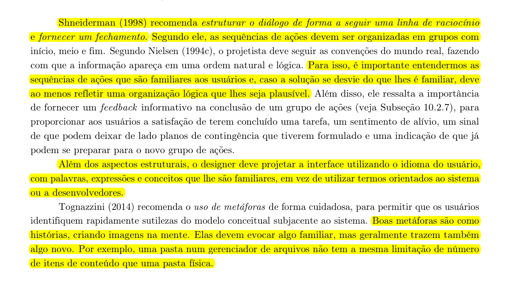
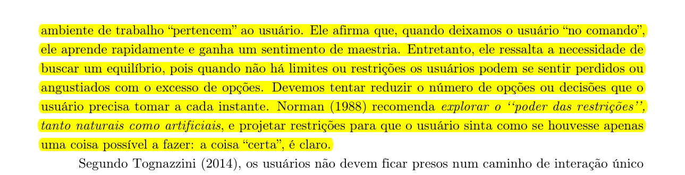
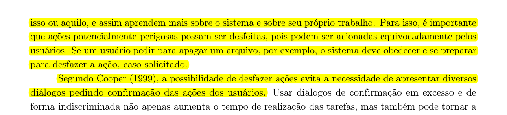
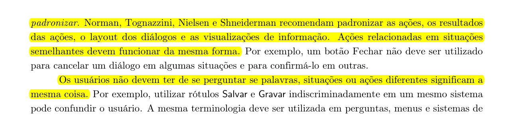
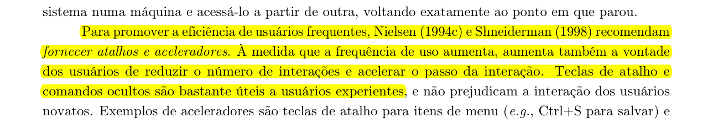
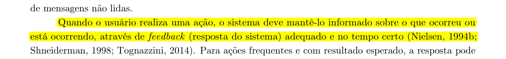
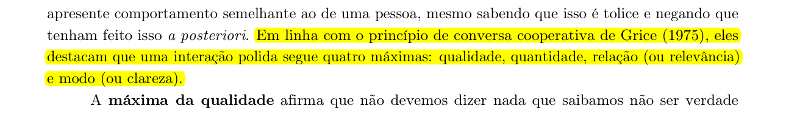
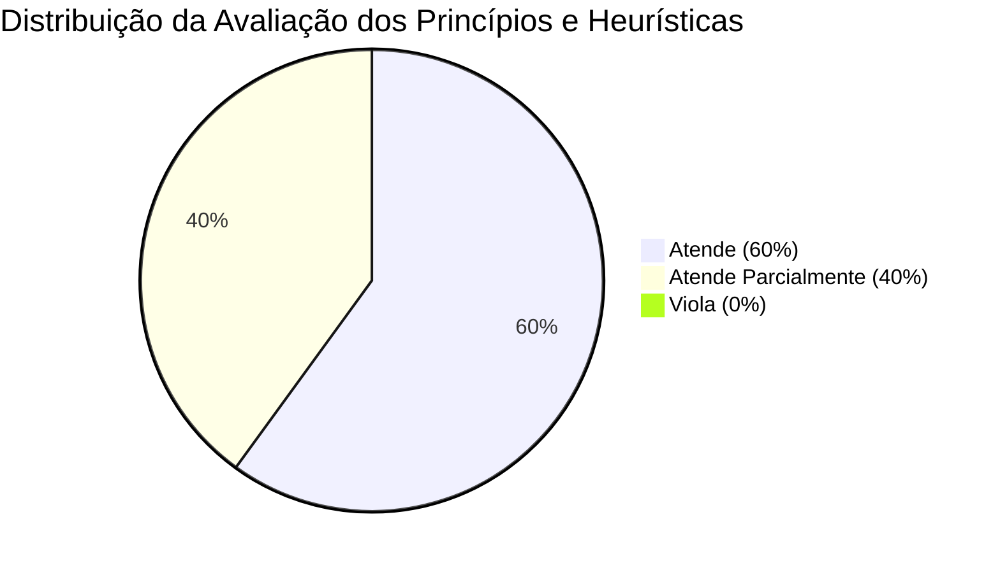

# Princípios Gerais de Projeto e Avaliação Heurística

## Tabela de Contribuição e Uso de IA Generativa

| Integrante | Contribuição | Revisor | Ferramenta de IA Utilizada | Propósito do Uso de IA |
| :--- | :--- | :--- | :--- | :--- |
| [Vinicius Silva Araruna](https://github.com/ViniciusA05) e [Gustavo Antonio](https://github.com/gus-ant) | Elaboração da fundamentação teórica, captura de evidências via agente web, avaliação heurística e classificação (Atende / Viola / Atende Parcialmente) | [Gustavo Antonio](https://github.com/gus-ant) | Gemini & Browser Subagent | Extração de páginas do livro-texto com destaques digitais e navegação automatizada para capturas de tela. |
| [Edvaldo Soares Brasileiro Filho](https://github.com/PajeMurici-dev) | Revisão do escopo, das inferências e da correspondência entre classificação e evidência disponível | Pendente | Codex (OpenAI) | Apoio à revisão factual e à redação, com base nas capturas registradas neste artefato. |

---

## Introdução

Este artefato apresenta a avaliação dos **Princípios Gerais de Projeto** e das **Heurísticas de Usabilidade de Nielsen (1994)** aplicadas ao **Fórum Diolinux Plus** (baseado na plataforma *Discourse*). O objetivo é correlacionar a teoria clássica de Interação Humano-Computador (IHC) com a prática real de interface do fórum, classificando cada diretriz visual e interativa como **Atende**, **Viola** ou **Atende Parcialmente**, suportado por fundamentação teórica extraída da literatura e evidências visuais capturadas em tempo real.

---

## Metodologia e Fundamentação Teórica

A análise fundamenta-se nos princípios e diretrizes de design de **Barbosa e Silva (2010, Cap. 8)**, na edição ampliada de **Barbosa et al. (2021, Cap. 10)** e nas 10 Heurísticas de Usabilidade formuladas por **Jakob Nielsen (1994)**. A indicação do capítulo varia entre as edições: o Capítulo 8 é sobre princípios na edição de 2010; na edição de 2021, o conteúdo correspondente aparece no Capítulo 10, nas páginas 221–232. O Capítulo 8 da edição de 2021 trata da organização do espaço de problema.

A inspeção da interface foi feita em **5 de outubro de 2026**, no site público do Diolinux Plus, em desktop e sem autenticação. As três capturas abaixo são a evidência usada para as observações visuais. Não foram testados fluxos de publicação, recuperação de erros, conta autenticada, outros tamanhos de tela ou diferentes navegadores. Assim, **Atende Parcialmente** também identifica casos em que a evidência observada não permite uma conclusão completa; não significa, por si só, que o sistema falhou.

Abaixo estão apresentados os trechos originais da literatura de referência (*Barbosa & Silva, 2021*) recortados e destacados com **marca-texto digital amarelo** conforme os padrões de fundamentação:

### 1. Correspondência com as Expectativas dos Usuários (Nielsen H2)
O sistema deve falar a linguagem do usuário, empregando palavras, conceitos e metáforas familiares à sua cultura e modelo mental.

> **Figura 1:** Trecho do livro destacando a linguagem do usuário, convenções do mundo real e uso de metáforas.
>
> 
>
> *Fonte: BARBOSA et al. (2021, p. 223).*

### 2. Simplicidade nas Estruturas das Tarefas (Nielsen H8 / Barbosa)
Reduzir o número de opções e decisões que o usuário precisa tomar a cada instante, explorando o poder das restrições e dividindo tarefas em passos simples.

> **Figura 2:** Trecho do livro destacando a simplicidade da estrutura de tarefas e restrições.
>
> 
>
> *Fonte: BARBOSA et al. (2021, p. 224).*

### 3. Equilíbrio entre Controle e Liberdade do Usuário (Nielsen H3)
Deixar o usuário no comando do ambiente de trabalho e fornecer capacidade de desfazer/refazer ações potencialmente perigosas.

> **Figura 3:** Trecho do livro destacando o controle do usuário e a reversibilidade de ações.
>
> 
>
> *Fonte: BARBOSA et al. (2021, p. 225).*

### 4. Consistência e Padronização (Nielsen H4)
Padronizar ações, resultados de ações, layouts de diálogos e terminologias para que o usuário não duvide do significado das palavras ou botões.

> **Figura 4:** Trecho do livro destacando a consistência e padronização.
>
> 
>
> *Fonte: BARBOSA et al. (2021, p. 226).*

### 5. Promover a Eficiência e Antecipação (Nielsen H7)
Fornecer atalhos e aceleradores para usuários experientes e antecipar as necessidades do usuário disponibilizando os recursos adequados.

> **Figura 5:** Trecho do livro destacando eficiência, aceleradores de uso e antecipação de necessidades.
>
> 
>
> *Fonte: BARBOSA et al. (2021, p. 227).*

### 6. Visibilidade do Status do Sistema e Reconhecimento (Nielsen H1 e H6)
Manter o usuário informado sobre o que ocorreu através de feedback adequado no tempo certo e visibilidade de opções.

> **Figura 6:** Trecho do livro destacando a visibilidade e o feedback do sistema.
>
> 
>
> *Fonte: BARBOSA et al. (2021, p. 228).*

### 7. Conteúdo Relevante e Expressão Adequada (Nielsen H8)
Apresentar apenas as informações necessárias para a tarefa atual, evitando poluição visual e dados irrelevantes.

> **Figura 7:** Trecho do livro destacando a relevância de conteúdo e clareza de expressão.
>
> 
>
> *Fonte: BARBOSA et al. (2021, p. 229).*

---

## Evidências Visuais da Interface Real (Diolinux Plus)

Para fundamentar empiricamente a avaliação, utilizou-se o agente de navegação web autônomo para capturar telas reais da interface do Diolinux Plus ([https://plus.diolinux.com.br](https://plus.diolinux.com.br)):

### Evidência 1: Busca Dinâmica com Sugestão Autônoma de Tags e Tópicos
A barra de pesquisa antecipa termos e classifica dinamicamente por etiquetas como `#ubuntu`, `#ubuntu-2004` e resultados prévios, reduzindo o esforço do usuário ao buscar soluções repetidas.

> **Figura 8:** Captura real da barra de busca do Diolinux Plus com autocomplete e tags.
>
> 
>
> *Fonte: Captura realizada via agente web no fórum Diolinux Plus.*

### Evidência 2: Estrutura Visual de Tópico Técnico (Breadcrumbs, Status e Perfil)
Visualização de um tópico indicando categoria (`Diolinux Feed`), tags associadas (`ubuntu`, `kernel`, `kernel-linux`), selo distintivo do autor (`Criador de Conteúdo`) e linha do tempo lateral para navegação rápida de posts.

> **Figura 9:** Captura real de um tópico técnico no Diolinux Plus.
>
> 
>
> *Fonte: Captura realizada via agente web no fórum Diolinux Plus.*

### Evidência 3: Aceleradores de Produtividade (Modal de Atalhos do Teclado)
Modal de atalhos do teclado mostrando comandos de navegação, como `G` seguido de `H` para Início e `G` seguido de `C` para Categorias, além de comandos para percorrer e abrir tópicos. A captura comprova a presença da lista de atalhos, mas não avalia todas as combinações ou a facilidade de descoberta desse recurso.

> **Figura 10:** Modal de atalhos de teclado do Discourse no Diolinux Plus.
>
> 
>
> *Fonte: Captura realizada via agente web no fórum Diolinux Plus.*

---

## Avaliação Prática e Classificação dos Princípios / Heurísticas

Abaixo é apresentada a matriz de avaliação heurística detalhada da interface real do Diolinux Plus:

| # | Princípio / Heurística (Nielsen / Barbosa) | Classificação | Análise Crítica e Justificativa na Interface Real | Evidência Visual / Recurso |
| :-: | :--- | :---: | :--- | :--- |
| **1** | **Visibilidade do Status do Sistema** *(Nielsen H1)* | **Atende** | Na leitura do tópico, a linha do tempo lateral mostra a posição `1/1` e as datas da publicação. Isso ajuda a pessoa a situar-se naquela discussão; a inspeção não avaliou notificações em tempo real. | [Figura 9](#evidencia-2-estrutura-visual-de-topico-tecnico-breadcrumbs-status-e-perfil) |
| **2** | **Correspondência com o Mundo Real** *(Nielsen H2 / Barbosa 1)* | **Atende** | A busca por “Ubuntu” oferece etiquetas reconhecíveis para o domínio, como `ubuntu` e `ubuntu-2004`, e a interface está em português. | [Figura 8](#evidencia-1-busca-dinamica-com-sugestao-autonoma-de-tags-e-topicos) |
| **3** | **Controle e Liberdade do Usuário** *(Nielsen H3 / Barbosa 3)* | **Atende Parcialmente** | A janela de atalhos tem um controle visível para fechá-la (`X`). A captura não cobre edição, exclusão, cancelamento de publicação ou desfazer/refazer ações; esses fluxos precisam de inspeção própria. | [Figura 10](#evidencia-3-aceleradores-de-produtividade-modal-de-atalhos-do-teclado) |
| **4** | **Consistência e Padronização** *(Nielsen H4 / Barbosa 4)* | **Atende** | Nas três telas, a barra superior, a navegação lateral, os botões e o tema escuro mantêm padrões visuais reconhecíveis entre busca, tópico e atalhos. A conclusão limita-se a essas telas. | Figuras [8](#evidencia-1-busca-dinamica-com-sugestao-autonoma-de-tags-e-topicos), [9](#evidencia-2-estrutura-visual-de-topico-tecnico-breadcrumbs-status-e-perfil) e [10](#evidencia-3-aceleradores-de-produtividade-modal-de-atalhos-do-teclado) |
| **5** | **Prevenção de Erros** *(Nielsen H5 / Barbosa 8)* | **Atende Parcialmente** | Não foi capturado nem executado o fluxo de criação de publicação; por isso, não há evidência suficiente para avaliar validações, prevenção de duplicidade ou confirmações antes de ações relevantes. | Fluxo de criação não inspecionado. |
| **6** | **Reconhecimento em vez de Memorização** *(Nielsen H6 / Barbosa 6)* | **Atende** | A busca sugere etiquetas relacionadas ao texto digitado e a janela reúne os atalhos com seus nomes e combinações, tornando opções visíveis durante a tarefa. | [Figura 8](#evidencia-1-busca-dinamica-com-sugestao-autonoma-de-tags-e-topicos) e [Figura 10](#evidencia-3-aceleradores-de-produtividade-modal-de-atalhos-do-teclado) |
| **7** | **Eficiência e Flexibilidade de Uso** *(Nielsen H7 / Barbosa 4)* | **Atende** | A janela documenta combinações para navegar por teclado, mover a seleção e abrir tópicos, oferecendo um caminho alternativo à navegação por ponteiro. Não foram avaliados leitores de tela ou outros modos de entrada. | [Figura 10](#evidencia-3-aceleradores-de-produtividade-modal-de-atalhos-do-teclado) |
| **8** | **Estética e Design Minimalista** *(Nielsen H8 / Barbosa 7)* | **Atende** | Na tela do tópico, o título, a categoria, as etiquetas e o conteúdo formam uma hierarquia visual clara; a busca mantém sugestões associadas ao termo digitado. A análise cobre somente as telas registradas. | [Figura 8](#evidencia-1-busca-dinamica-com-sugestao-autonoma-de-tags-e-topicos) e [Figura 9](#evidencia-2-estrutura-visual-de-topico-tecnico-breadcrumbs-status-e-perfil) |
| **9** | **Ajuda aos Usuários no Reconhecimento de Erros** *(Nielsen H9 / Barbosa 8)* | **Atende Parcialmente** | Não foi provocado um erro nem capturada uma mensagem de validação nesta inspeção. A clareza, a causa indicada e as opções de recuperação permanecem sem avaliação. | Fluxo de erro não inspecionado. |
| **10** | **Ajuda e Documentação** *(Nielsen H10)* | **Atende Parcialmente** | A página inicial apresenta links para Regras e um tópico identificado como “Manuais do Fórum”. A captura não permite verificar a cobertura, atualização ou facilidade de encontrar instruções para tarefas específicas. | [Figura 8](#evidencia-1-busca-dinamica-com-sugestao-autonoma-de-tags-e-topicos) |

---

## Síntese dos Resultados da Avaliação Heurística

### Principais Pontos Observados:
- **Busca e reconhecimento**: a caixa de busca sugere etiquetas relacionadas ao termo digitado.
- **Navegação**: a interface oferece navegação lateral, linha do tempo do tópico e comandos de teclado visíveis.
- **Consistência visual**: elementos recorrentes aparecem nas três telas inspecionadas.

### Próximas verificações:
- **Prevenção e recuperação de erros**: inspecionar a criação e edição de tópicos, registrando as mensagens de validação e as opções para corrigir ou cancelar.
- **Ajuda e descoberta de atalhos**: observar com participantes se encontram a documentação e a janela de atalhos sem instrução prévia.
- **Controle e liberdade**: verificar em tarefas reais como cancelar, editar ou reverter ações e quais confirmações são exibidas.

---

## Histórico de Versão

| Versão | Data | Descrição | Autor(es) | Revisor(es) |
| :---: | :---: | :--- | :--- | :--- |
| `1.0` | 25/09/2026 | Criação inicial do documento com os 8 princípios gerais | [Gustavo Antonio](https://github.com/gus-ant) | [Vinicius Silva Araruna](https://github.com/ViniciusA05) |
| `2.0` | 05/10/2026 | Atualização completa com marcações do livro-texto, evidências visuais do fórum real via agente web, 10 Heurísticas de Nielsen e matriz classificatória (Atende/Viola/Atende Parcialmente) | [Vinicius Silva Araruna](https://github.com/ViniciusA05) | [Gustavo Antonio](https://github.com/gus-ant) |
| `2.1` | 05/10/2026 | Ajuste da referência entre edições e revisão das classificações para separar observação de fluxos não testados | [Edvaldo Soares Brasileiro Filho](https://github.com/PajeMurici-dev) | Pendente |

---

## Referências Bibliográficas

[1] BARBOSA, Simone Diniz Junqueira; SILVA, Bruno Santana da. *Interação Humano-Computador*. 1. ed. Rio de Janeiro: Elsevier, 2010. Cap. 8: Princípios e Diretrizes para o Design de IHC, p. 203–218.

[2] BARBOSA, Simone Diniz Junqueira et al. *Interação Humano-Computador e Experiência do Usuário*. 1. ed. Rio de Janeiro: Autopublicação, 2021. Cap. 10: Princípios e Diretrizes para o Design de IHC, p. 221–232.

[3] NIELSEN, Jakob. *10 Usability Heuristics for User Interface Design*. Nielsen Norman Group, 1994. Disponível em: <https://www.nngroup.com/articles/ten-usability-heuristics/>. Acesso em: 05 out. 2026.
