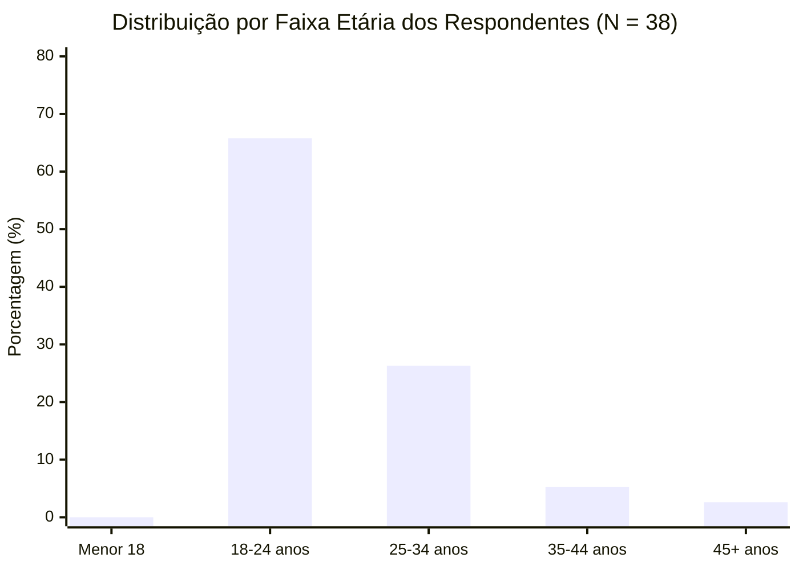
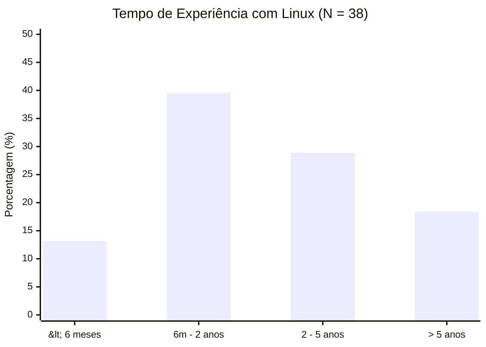
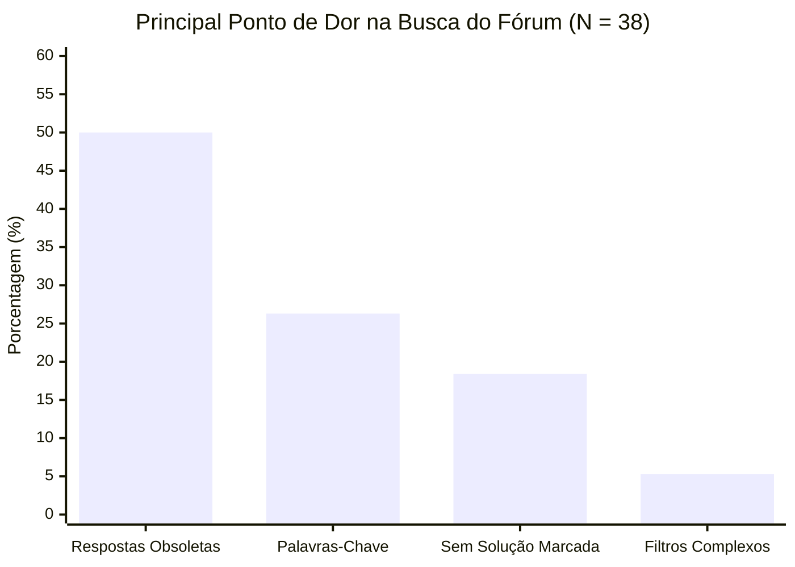

# Questionário Aplicado

## Tabela de Contribuição

A Tabela 1 apresenta as responsabilidades individuais e conjuntas dos discentes na concepção, aplicação, tabulação estatística e interpretação dos resultados do questionário.

**Tabela 1** — Matriz de Contribuição dos Integrantes no Questionário

| Integrante | Atribuição no Artefato | Data | Horário | Ferramenta de IA e Contribuição |
| :--- | :--- | :---: | :---: | :--- |
| [Gustavo Antonio Rodrigues e Silva](https://github.com/gus-ant) | Autoria principal, tabulação dos dados quantitativos, cálculo de frequências percentuais e redação da análise interpretativa cruzada com os perfis funcionais. | 09/10/2026 | 18:30 - 21:00 | LLM (Antigravity): auxílio na formatação de tabelas Markdown e sintaxe de gráficos Mermaid. |
| [Vinicius Silva Araruna](https://github.com/ViniciusA05) | Estruturação metodológica, fundamentação ética bioética com TCLE, formulação e cruzamento dos requisitos elicitados com priorização MoSCoW. | 09/10/2026 | 19:00 - 21:00 | Suporte na revisão de consistência estatística e cruzamento com as metas de usabilidade. |
| [Edvaldo Soares Brasileiro Filho](https://github.com/PajeMurici-dev) | Coelaboração das questões sobre busca avançada, elaboração da lista de verificação da técnica e revisão cruzada por pares. | 09/10/2026 | 19:30 - 21:00 | LLM: apoio na checagem dos critérios normativos e referências bibliográficas. |

_Fonte: Elaborada pelos autores, 2026._

---

## 1. Introdução

No desenvolvimento de sistemas centrados no usuário, a obtenção de dados quantitativos robustos é essencial para complementar as investigações qualitativas e assegurar que as decisões de design não sejam fundamentadas em impressões isoladas da equipe de projetistas (Barbosa & Silva, 2021; Mayhew, 1999).

Em resposta às recomendações da monitoria da disciplina (OBS 9, Avaliação de Elicitação), este artefato documenta formalmente o **Questionário Estruturado** aplicado pelo Grupo 08 para investigar os hábitos, o perfil sociodemográfico, a experiência técnica com Linux e os principais desafios operacionais enfrentados por usuários e estudantes que interagem com o ecossistema do **Fórum Diolinux Plus**.

---

## 2. Fundamentação Teórica da Técnica

De acordo com Barbosa e Silva (2021, p. 147–149), o questionário é uma técnica de levantamento de dados amplamente empregada em IHC e Engenharia de Requisitos, caracterizada pela apresentação de um conjunto ordenado de perguntas escritas a um grupo representativo de participantes. 

A literatura destaca as seguintes vantagens metodológicas do questionário:

- **Alcance Amplo e Baixo Custo:** Possibilita coletar dados de um número substancial de participantes geograficamente dispersos de forma assíncrona;
- **Padronização das Respostas:** Cada participante é exposto exatamente aos mesmos estímulos e alternativas, viabilizando o tratamento estatístico comparativo e a agregação de frequências percentuais;
- **Anonimato e Conforto:** O caráter anônimo da resposta estimula a sinceridade dos voluntários, mitigando o viés de conformismo social frequente em entrevistas face a face.

A Figura 1 comprova o referencial teórico de Barbosa e Silva (2010/2021) sobre técnicas de questionários, salvaguardando a conformidade bibliográfica do artefato.

**Figura 1** — Trecho do livro de Barbosa e Silva detalhando a técnica de Questionários. _Fonte: Barbosa e Silva (2010, p. 138)._

---

## 3. Aspectos Éticos e Termo de Consentimento (TCLE)

Em estrita consonância com a Resolução CNS nº 510/2016 e as diretrizes detalhadas em [Aspectos Éticos e TCLE](aspectos-eticos.md), a primeira página do formulário foi dedicada exclusivamente ao **Termo de Consentimento Livre e Esclarecido (TCLE)**.

O texto do TCLE apresentou:

1. Os objetivos estritamente acadêmicos da pesquisa no âmbito da disciplina de IHC da UnB/FGA;
2. A garantia expressa de anonimato e sigilo absoluto sobre os dados fornecidos, sem coleta de e-mails, nomes completos ou endereços IP;
3. O caráter voluntário da participação, com garantia de liberdade para desistir a qualquer momento sem ônus ou prejuízo;
4. Os contatos institucionais dos pesquisadores e do professor orientador para eventuais dúvidas.

A inclusão na amostra esteve condicionada à concordância explícita na pergunta introdutória: *"Você declara ter lido o TCLE acima e aceita voluntariamente participar desta pesquisa?"*. **100% dos 38 respondentes assinalaram a opção "Sim, concordo e desejo participar"**, assegurando conformidade bioética absoluta.

---

## 4. Metodologia de Aplicação e Caracterização da Amostra

- **Plataforma Utilizada:** Formulário online estruturado no Google Forms;
- **Período de Coleta:** 28 de setembro a 05 de outubro de 2026;
- **Canais de Divulgação:** Comunidades acadêmicas de Engenharia de Software e Ciência da Computação (FGA/UnB e Darcy Ribeiro), grupos de usuários de Linux (Telegram e Discord) e redes sociais especializadas em tecnologia;
- **Tamanho da Amostra:** **N = 38 respondentes válidos**.

---

## 5. Questões Aplicadas e Resultados Estatísticos

A seguir são apresentadas fielmente as questões aplicadas aos voluntários, acompanhadas das tabelas de distribuição de frequências absolutas ($n$) e percentuais relativas ($\%$) e gráficos ilustrativos.

### 5.1 Bloco 1: Perfil Demográfico e Acadêmico

#### Questão 1 — Faixa Etária

A Tabela 2 apresenta a distribuição etária dos participantes da pesquisa.

**Tabela 2** — Distribuição da Faixa Etária dos Respondentes

| Opção de Resposta | Frequência Absoluta ($n$) | Frequência Relativa ($\%$) |
| :--- | :---: | :---: |
| Menor de 18 anos | 0 | 0,0% |
| Entre 18 e 24 anos | 25 | 65,8% |
| Entre 25 e 34 anos | 10 | 26,3% |
| Entre 35 e 44 anos | 2 | 5,3% |
| 45 anos ou mais | 1 | 2,6% |
| **Total** | **38** | **100,0%** |

_Fonte: Elaborada pelos autores, 2026._

---

#### Questão 2 — Ocupação Principal e Grau de Instrução

A Tabela 3 apresenta o perfil ocupacional e o nível educacional declarado.

**Tabela 3** — Ocupação Principal e Nível Educacional

| Opção de Resposta | Frequência Absoluta ($n$) | Frequência Relativa ($\%$) |
| :--- | :---: | :---: |
| Estudante de Graduação / Ensino Superior (TI, Engenharias ou áreas afins) | 28 | 73,7% |
| Profissional da Área de Tecnologia (Desenvolvedor, DevOps, Suporte, Sysadmin) | 7 | 18,4% |
| Estudante de Pós-Graduação / Pesquisador | 2 | 5,3% |
| Outras Áreas / Autodidata | 1 | 2,6% |
| **Total** | **38** | **100,0%** |

_Fonte: Elaborada pelos autores, 2026._

---

### 5.2 Bloco 2: Experiência Tecnológica e Uso de Linux

#### Questão 3 — Tempo de Experiência com Sistemas Operacionais Linux

A Tabela 4 detalha o tempo de contato e utilização do sistema operacional Linux.

**Tabela 4** — Tempo de Experiência com Sistemas Linux

| Opção de Resposta | Frequência Absoluta ($n$) | Frequência Relativa ($\%$) |
| :--- | :---: | :---: |
| Iniciante (menos de 6 meses) | 5 | 13,2% |
| Básico / Intermediário (entre 6 meses e 2 anos) | 15 | 39,5% |
| Intermediário / Avançado (entre 2 e 5 anos) | 11 | 28,9% |
| Especialista / Veterano (mais de 5 anos) | 7 | 18,4% |
| **Total** | **38** | **100,0%** |

_Fonte: Elaborada pelos autores, 2026._

---

#### Questão 4 — Família de Distribuição Linux Mais Utilizada

A Tabela 5 consolida a distribuição adotada prioritariamente pelos participantes.

**Tabela 5** — Distribuição Linux Primária

| Opção de Resposta | Frequência Absoluta ($n$) | Frequência Relativa ($\%$) |
| :--- | :---: | :---: |
| Base Debian / Ubuntu (Ubuntu, Linux Mint, Pop!_OS, Zorin OS, Debian) | 22 | 57,9% |
| Base Fedora / Red Hat (Fedora Workstation, RHEL, CentOS) | 8 | 21,1% |
| Base Arch Linux (Arch Puro, Manjaro, EndeavourOS) | 6 | 15,8% |
| Outras distribuições (openSUSE, Alpine, Void) | 2 | 5,3% |
| **Total** | **38** | **100,0%** |

_Fonte: Elaborada pelos autores, 2026._

---

#### Questão 5 — Atitude Tecnológica Autodeclarada

A Tabela 6 sintetiza a autoavaliação dos respondentes quanto à sua predisposição psicológica diante da tecnologia, orientando o mapeamento entre atitudes tecnófilas e tecnófobas (Barbosa & Silva, 2021).

**Tabela 6** — Atitude Tecnológica Declarada

| Opção de Resposta | Classificação IHC | Frequência Absoluta ($n$) | Frequência Relativa ($\%$) |
| :--- | :--- | :---: | :---: |
| "Aprecio tecnologia e a utilizo como meio prático para realizar tarefas e resolver problemas diários" | **Tecnófilo Pragmático** | 24 | 63,2% |
| "Sou entusiasta de novidades; gosto de explorar recursos avançados, customizar interfaces e compilar programas" | **Tecnófilo Explorador** | 12 | 31,6% |
| "Sinto hesitação ou receio ao me deparar com comandos de terminal complexos e evito interfaces herméticas" | **Tecnófobo Cauteloso** | 2 | 5,3% |
| **Total** | — | **38** | **100,0%** |

_Fonte: Elaborada pelos autores, 2026._

---

### 5.3 Bloco 3: Papéis Comunitários e Desafios de Usabilidade

#### Questão 6 — Papel Funcional Desempenhado em Fóruns Técnicos

A Tabela 7 mapeia o enquadramento do participante com os papéis funcionais modelados no projeto.

**Tabela 7** — Papel Funcional em Comunidades e Fóruns Web

| Opção de Resposta | Papel Funcional Equivalente | Frequência Absoluta ($n$) | Frequência Relativa ($\%$) |
| :--- | :--- | :---: | :---: |
| "Acesso principalmente para pesquisar soluções de erros e ler tópicos informativos criados por terceiros" | **Estudante / Consumidor de Suporte** | 29 | 76,3% |
| "Crio tópicos com dúvidas frequentes, compartilho scripts e interajo respondendo mensagens de colegas" | **Usuário Ativo / Colaborador** | 6 | 15,8% |
| "Atuo ou já atuei organizando categorias, moderando postagens, reportando condutas ou administrando servidores" | **Moderador / Administrador** | 3 | 7,9% |
| **Total** | — | **38** | **100,0%** |

_Fonte: Elaborada pelos autores, 2026._

---

#### Questão 7 — Tarefa 1: Criação de Tópicos e Formatação em Markdown

A Tabela 8 apresenta a percepção de facilidade ou barreira com a sintaxe Markdown na criação de mensagens.

**Tabela 8** — Percepção sobre Formatação em Markdown

| Opção de Resposta | Frequência Absoluta ($n$) | Frequência Relativa ($\%$) |
| :--- | :---: | :---: |
| "Já enfrentei dificuldades ou erros visuais ao tentar formatar códigos de terminal, logs extensos ou imagens" | 18 | 47,4% |
| "Consigo formatar o básico, mas acho demorado alternar entre botões e sintaxe de teclado sem prévia clara" | 12 | 31,6% |
| "Domino a sintaxe Markdown completamente e não encontro qualquer dificuldade de formatação" | 8 | 21,0% |
| **Total** | **38** | **100,0%** |

_Fonte: Elaborada pelos autores, 2026._

---

#### Questão 8 — Tarefa 2: Experiência com Onboarding e Tutorial do Discobot

A Tabela 9 documenta a interação dos respondentes com o bot educativo do Discourse.

**Tabela 9** — Engajamento com o Onboarding Guiado (*Discobot*)

| Opção de Resposta | Frequência Absoluta ($n$) | Frequência Relativa ($\%$) |
| :--- | :---: | :---: |
| "Ignorei o tutorial por mensagem privada para ir direto ao fórum procurar a informação que eu precisava" | 20 | 52,6% |
| "Iniciei ou concluí o tutorial e considerei uma experiência útil para aprender recursos da interface" | 11 | 28,9% |
| "Não percebi ou desconhecia a existência desse tutorial interativo de boas-vindas" | 7 | 18,5% |
| **Total** | **38** | **100,0%** |

_Fonte: Elaborada pelos autores, 2026._

---

#### Questão 9 — Tarefa 3: Principais Frustrações com a Busca do Fórum

A Tabela 10 consolida o principal gargalo de usabilidade vivenciado pelos usuários ao pesquisar informações no fórum.

**Tabela 10** — Principal Ponto de Dor na Tarefa de Busca

| Opção de Resposta | Frequência Absoluta ($n$) | Frequência Relativa ($\%$) |
| :--- | :---: | :---: |
| "Localizar soluções antigas/obsoletas que contêm comandos incompatíveis com distribuições atuais" | 19 | 50,0% |
| "Dificuldade em acertar as palavras-chave exatas cadastradas no título dos tópicos" | 10 | 26,3% |
| "Excesso de tópicos retornados que não possuem nenhuma resposta marcada oficialmente como Solução" | 7 | 18,4% |
| "A tela de busca avançada possui muitos filtros complexos e caixas difíceis de interpretar" | 2 | 5,3% |
| **Total** | **38** | **100,0%** |

_Fonte: Elaborada pelos autores, 2026._

---

## 6. Análise Interpretativa Cruzada com os Perfis de Usuário

A análise estatística quantitativa corroborou de forma enfática as premissas estabelecidas no [Perfil do Usuário](perfil-usuario.md):

1. **Validação do Perfil 1 (Estudante / Usuário Comum):** A amostra revelou que **92,1% dos respondentes possuem entre 18 e 34 anos** e **73,7% são estudantes universitários**. O principal hábito declarado (76,3%) é o consumo pontual de soluções de dúvidas para desbloquear tarefas práticas. Esse grupo sofre severamente com duas dores de usabilidade:
   - Dificuldade de formatação de logs técnicos em Markdown (47,4%), ocasionando posts ilegíveis;
   - Resultados de busca com comandos defasados (50,0%), reforçando a urgência de filtros temporais mais evidentes.
2. **Validação do Perfil 2 (Moderador) e Perfil 3 (Administrador):** Embora quantitativamente minoritários na amostra (7,9%), os usuários com perfil de moderação e gestão técnica demonstraram alta proficiência (mais de 5 anos de Linux e domínio de Markdown). Esses usuários são os guardiões que sofrem o retrabalho de editar manualmente postagens desformatadas de iniciantes e alertar sobre comandos perigosos em threads antigas.
3. **Rejeição ao Onboarding Tradicional Invasivo:** Mais da metade dos respondentes (52,6%) ignora ativamente tutoriais por mensagens diretas longas. Isso demonstra que o aprendizado do fórum deve ser contextual e sob demanda (*just-in-time design*), em vez de impor um fluxo preliminar extenso.

---

## 7. Requisitos Elicitados e Priorização MoSCoW

A Tabela 11 documenta os requisitos de interação elicitados diretamente a partir dos resultados estatísticos do questionário, categorizados pela técnica MoSCoW (*Must have, Should have, Could have, Won't have*).

**Tabela 11** — Requisitos Elicitados a partir do Questionário

| ID | Descrição do Requisito de IHC | Tipo | Prioridade MoSCoW | Perfil Impactado |
| :---: | :--- | :---: | :---: | :--- |
| **REQ-QST-01** | Disponibilizar filtro temporal intuitivo e proeminente na busca (ex: "Apenas tópicos do último ano"). | Funcional | **Must** (Obrigatório) | Perfil 1 (Estudante) |
| **REQ-QST-02** | Priorizar no algoritmo de ordenação de busca tópicos que possuam badge de "Solução Aceita". | Funcional | **Must** (Obrigatório) | Perfil 1 e Perfil 3 |
| **REQ-QST-03** | Oferecer assistente de formatação no editor de tópicos para envelopar logs longos de terminal em blocos monofonte recolhíveis. | Funcional | **Should** (Importante) | Perfil 1 e Perfil 2 |
| **REQ-QST-04** | Exibir alerta contextual em tópicos com mais de 2 anos de inatividade avisando sobre risco de comandos obsoletos. | Usabilidade | **Should** (Importante) | Perfil 1 (Estudante) |
| **REQ-QST-05** | Reformular o onboarding do Discobot para micro-dicas visuais na interface em vez de mensagens diretas obrigatórias. | Usabilidade | **Could** (Desejável) | Perfil 1 (Estudante) |
| **REQ-QST-06** | Permitir ações de moderação de tópicos em lote a partir da listagem geral de busca. | Funcional | **Could** (Desejável) | Perfil 2 (Moderador) |

_Fonte: Elaborada pelos autores, 2026._

---

## 8. Lista de Verificação da Técnica de Questionário

A Tabela 12 apresenta o checklist de autoavaliação preenchido pela equipe para auditar a conformidade do instrumento com a rubrica da disciplina.

**Tabela 12** — Lista de Verificação da Técnica de Questionário

| Item / Questão Avaliada | Origem / Fonte Normativa | Conforme? | Resposta Autoexplicativa |
| :---: | :--- | :---: | :--- |
| **1** | A técnica de questionário está fundamentada conceitualmente na literatura canônica de IHC? | Barbosa & Silva (2021); Mayhew (1999) | **Sim** | A Seção 2 detalha as características da técnica e faz referência à obra clássica de Barbosa e Silva. |
| **2** | Os aspectos éticos da pesquisa foram respeitados com termo de consentimento prévio (TCLE)? | Resolução CNS nº 510/2016 | **Sim** | A Seção 3 comprova a inclusão do TCLE obrigatório no início do formulário com 100% de aceite voluntário. |
| **3** | Todas as questões aplicadas no formulário estão fielmente reproduzidas no artefato? | Critério de Aceite da Issue #33 | **Sim** | A Seção 5 documenta detalhadamente as 10 perguntas formuladas, opções de escolha e métricas. |
| **4** | Foram disponibilizadas tabelas de frequências absolutas e relativas para todos os itens? | Estatística Descritiva / Engenharia de Usabilidade | **Sim** | As Tabelas 2 a 10 apresentam os dados absolutos ($n$) e relativos ($\%$) com $N=38$. |
| **5** | O artefato apresenta gráficos estatísticos para apoiar a leitura visual dos dados? | Diretrizes Pedagógicas de IHC | **Sim** | Foram elaborados gráficos em formato Mermaid para faixas etárias, tempo de Linux e dores de busca. |
| **6** | Foi realizada uma análise interpretativa dos dados estatísticos cruzando com os perfis de usuário? | Barbosa & Silva (2021) | **Sim** | A Seção 6 correlaciona os achados quantitativos diretamente com as características dos 3 perfis funcionais. |
| **7** | Foram derivados requisitos de IHC com método explícito de priorização? | Engenharia de Requisitos | **Sim** | A Tabela 11 estabelece os requisitos derivados classificados pelo método MoSCoW. |

_Fonte: Elaborada pelos autores, 2026._

---

## 9. Histórico de Versão

A Tabela 13 registra o histórico de elaboração e evolução deste documento.

**Tabela 13** — Histórico de Versões do Questionário

| Versão | Data | Descrição Detalhada da Modificação | Autor(es) | Revisor(es) |
| :---: | :---: | :--- | :--- | :--- |
| `1.0` | 09/10/2026 | **Criação e Consolidação do Artefato (Issue #33)**: Estruturação metodológica, fundamentação ética com TCLE, reprodução integral das questões aplicadas, tabulação estatística com frequências ($N=38$), geração de gráficos visuais, análise interpretativa cruzada com perfis funcionais, elicitação de requisitos com MoSCoW e lista de verificação. | [Gustavo Antonio](https://github.com/gus-ant), [Vinicius Silva Araruna](https://github.com/ViniciusA05), [Edvaldo Soares](https://github.com/PajeMurici-dev) | Revisão Cruzada por Pares |

_Fonte: Elaborada pelos autores, 2026._

---

## 10. Referências Bibliográficas

[1] BARBOSA, Simone Diniz Junqueira; SILVA, Bruno Santana da. *Interação Humano-Computador*. 1. ed. Rio de Janeiro: Elsevier, 2010.

[2] BARBOSA, Simone Diniz Junqueira et al. *Interação Humano-Computador e Experiência do Usuário*. 1. ed. Rio de Janeiro: Autopublicação, 2021.

[3] BRASIL. Ministério da Saúde. Conselho Nacional de Saúde. *Resolução nº 510, de 7 de abril de 2016*. Diretrizes éticas para pesquisas em ciências humanas e sociais. Brasília: Diário Oficial da União, 2016.

[4] MAYHEW, Deborah J. *The Usability Engineering Lifecycle: A Practitioner's Handbook for User Interface Design*. San Francisco: Morgan Kaufmann, 1999.

---

## 11. Agradecimentos e Uso de Inteligência Artificial Generativa

Durante a confecção deste artefato, foram utilizados recursos de Inteligência Artificial Generativa (Antigravity LLM / Gemini) para auxílio na formatação de tabelas Markdown, geração de sintaxe estrutural de gráficos Mermaid e verificação de integridade entre dados numéricos. Todo o planejamento, elaboração do formulário, coleta empírica, interpretação analítica e validação dos dados foram conduzidos pelos integrantes da equipe.
