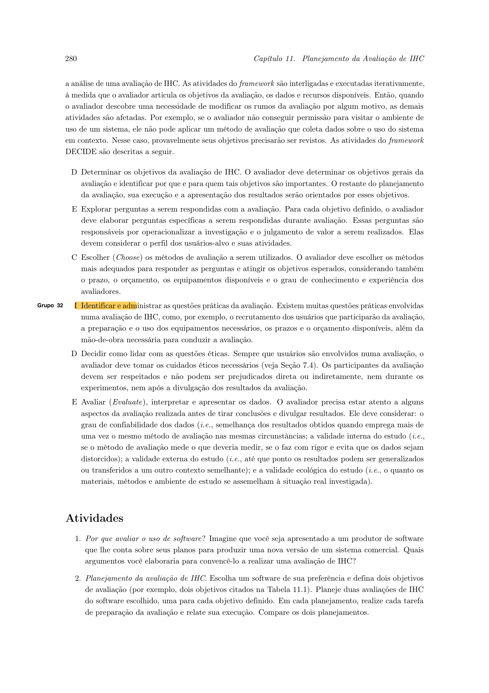
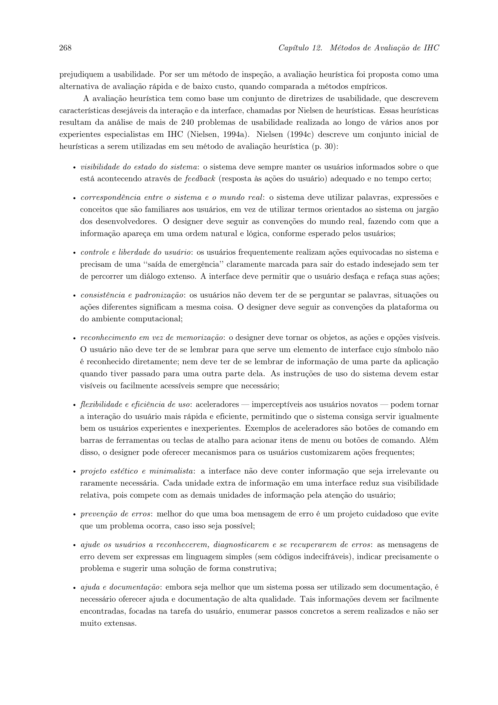

# Conteúdo Teórico e Avaliativo

## Tabela de Contribuição

| Integrante | Contribuição | Data | Horário |
| :--- | :--- | :---: | :---: |
| [Edvaldo Soares Brasileiro Filho](https://github.com/PajeMurici-dev) | [Item teórico individual a definir](#topicos-individuais-dos-demais-integrantes) | — | — |
| [Gustavo Antonio Rodrigues e Silva](https://github.com/gus-ant) | [Estruturação inicial da página teórica](#historico-de-versao) | 04/09/2026 | — |
| [Jonathan Lourenço Carpaneda](https://github.com/Jonathan-Carpaneda) | [Inclusão da tabela de contribuição no início, padronização e bibliografia ABNT](#introducao) | 05/09/2026 | — |
| [Pedro Paulo Almeida Araujo](https://github.com/Pedrop06) | [Revisão e validação metodológica dos itens teóricos](#historico-de-versao) | 06/09/2026 | — |
| [Vinicius Silva Araruna](https://github.com/ViniciusA05) | [Elaboração completa dos itens teóricos: Framework DECIDE e Avaliação Heurística (com citações, tabelas e evidências visuais)](#1-o-framework-decide-no-planejamento-da-avaliacao-de-ihc) | 06/09/2026 | 17:00 - 18:30 |

---

## Introdução

Este artefato destina-se à compilação e fundamentação científica dos tópicos teóricos de Interação Humano-Computador (IHC) elaborados individualmente pelos membros do Grupo 08, em estrito cumprimento aos critérios de avaliação da disciplina (Prof. Dr. André Barros de Sales, UnB Gama).

Cada integrante é responsável por desenvolver itens conceituais fundamentais para a condução do projeto prático, apresentando:
1. Conceituação teórica aprofundada baseada na literatura de referência (BARBOSA; SILVA, 2010; BARBOSA et al., 2021; NIELSEN, 1994);
2. Citação textual direta com indicação exata de autoria e numeração de página;
3. Fotografia / captura comprobatória em alta resolução da página correspondente na obra de referência;
4. Articulação prática explicando como o conceito teórico é operacionalizado nas atividades práticas do projeto do **Portal Domínio Público (MEC)**.

---

## 1. O Framework DECIDE no Planejamento da Avaliação de IHC

- **Autor do Item:** [Vinicius Silva Araruna](https://github.com/ViniciusA05)
- **Revisor Designado:** [Pedro Paulo Almeida Araujo](https://github.com/Pedrop06)
- **Referência Bibliográfica da Fonte:** BARBOSA, Simone Diniz Junqueira; SILVA, Bruno Santana da; SILVEIRA, Milene Selbach; GASPARINI, Isabela; DARIN, Ticianne; BARBOSA, Gabriel Diniz Junqueira. *Interação Humano-Computador e Experiência do Usuário*. Rio de Janeiro: Autopublicação, 2021. Capítulo 11: Planejamento da Avaliação de IHC, Seção 11.8: O Framework DECIDE, pp. 279–281.

### Fundamentação Teórica

O planejamento de uma avaliação de IHC é uma atividade crucial para orientar a coleta sistemática de dados e garantir que os resultados obtidos sejam válidos, confiáveis e úteis para o aprimoramento da interface. Avaliar sistemas interativos sem um planejamento formal prévio resulta frequentemente em desperdício de recursos, coleta de dados enviesados e incapacidade de responder às reais necessidades dos usuários.

Conforme ressaltam Barbosa et al. (2021, p. 279):

> *"Os critérios de qualidade de uso que podem ser analisados automaticamente por programas computacionais ainda são muito limitados, pois exigem uma definição a priori de regras definindo o que é 'bom' e 'ruim', e o que é 'certo' e 'errado'. A análise realizada por um avaliador humano ainda é fundamental para verificar a qualidade de uso, porque é difícil codificar num programa toda a visão que o avaliador pode adquirir sobre domínio, usuário, atividades e contexto, bem como sua capacidade de análise, principalmente diante de situações imprevistas."*

Para estruturar e operacionalizar o planejamento de avaliações de IHC, a literatura acadêmica adota amplamente o **Framework DECIDE**, proposto originalmente por Preece et al. (2002) e consolidado por Barbosa et al. (2021, p. 280). O framework organiza as atividades de planejamento em seis etapas interligadas e iterativas, cujas iniciais compõem o acrônimo DECIDE:

> *"As atividades do framework são interligadas e executadas iterativamente, à medida que o avaliador articula os objetivos da avaliação, os dados e recursos disponíveis. Então, quando o avaliador descobre uma necessidade de modificar os rumos da avaliação por algum motivo, as demais atividades são afetadas."* (BARBOSA et al., 2021, p. 280).

A Tabela 1 detalha os seis passos do framework DECIDE e o mapeamento de sua aplicação no projeto da disciplina.

**Tabela 1** — Estrutura operacional do Framework DECIDE e aplicação no projeto

| Letra | Etapa do Framework | Definição Metodológica (Barbosa et al., 2021, p. 280) | Aplicação no Projeto do Grupo 08 (Portal Domínio Público) |
| :---: | :--- | :--- | :--- |
| **D** | **Determinar os objetivos da avaliação de IHC** | Identificar os objetivos gerais da avaliação e justificar por que e para quem tais metas são relevantes. | Diagnosticar falhas de usabilidade, navegabilidade e arquitetura da informação na busca de acervo do Portal Domínio Público. |
| **E** | **Explorar perguntas a serem respondidas** | Desdobrar os objetivos gerais em perguntas específicas de avaliação que orientem a coleta empírica ou analítica. | Formulamos questões como: "O usuário consegue filtrar obras por autor sem ambiguidade?" e "A ausência de preview força downloads desnecessários?". |
| **C** | **Escolher os métodos de avaliação** | Selecionar os métodos mais adequados considerando prazos, custo, perfil de usuário e fidelidade do artefato. | Combinação equilibrada de métodos de inspeção (Avaliação Heurística) nas etapas iniciais e testes empíricos com usuários na etapa de alta fidelidade. |
| **I** | **Identificar e administrar as questões práticas** | Dimensionar recursos humanos, prazos, infraestrutura técnica, ferramentas e seleção de participantes. | Uso do Google Forms para perfil, Figma para prototipação interativa, gravação de telas e cronograma de sessões síncronas. |
| **D** | **Decidir como lidar com as questões éticas** | Garantir a integridade, privacidade, consentimento livre e esclarecido (TCLE) e respeito aos voluntários. | Elaboração formal do Termo de Consentimento Livre e Esclarecido (TCLE) na Etapa 2 e garantia de anonimato nas transcrições de testes. |
| **E** | **Avaliar (*Evaluate*), interpretar e apresentar os dados** | Tratar os dados brutos coletados, identificar padrões, avaliar confiabilidade e gerar o relatório final de reprojeto. | Consolidação dos problemas identificados por grau de severidade (0 a 4) e elaboração de recomendações formais de redesign. |

_Fonte: Elaborada pelo autor com base em Barbosa et al. (2021), 2026._

### Evidência Visual da Fonte Bibliográfica

A Figura 1 reproduz a página 280 da obra de referência, comprovando a definição conceitual do Framework DECIDE.

**Figura 1** — Registro textual do Framework DECIDE. (Fonte: Barbosa et al., 2021, p. 280).

---

## 2. Métodos de Inspeção: Avaliação Heurística de Usabilidade e Severidade

- **Autor do Item:** [Vinicius Silva Araruna](https://github.com/ViniciusA05)
- **Revisor Designado:** [Gustavo Antonio Rodrigues e Silva](https://github.com/gus-ant)
- **Referência Bibliográfica da Fonte:** BARBOSA, Simone Diniz Junqueira; SILVA, Bruno Santana da. *Interação Humano-Computador*. 1. ed. Rio de Janeiro: Elsevier, 2010. Capítulo 10: Métodos de Avaliação de IHC, Seção 10.2: Avaliação Heurística, pp. 268–272.

### Fundamentação Teórica

A Avaliação Heurística é um método de inspeção de usabilidade criado por Jakob Nielsen e Rolf Molich (1990) e amplamente consagrado na literatura internacional de Engenharia de Usabilidade (NIELSEN, 1994; BARBOSA; SILVA, 2010). Ao contrário dos testes empíricos que envolvem recrutamento de usuários finais, a inspeção heurística é conduzida por especialistas ou avaliadores treinados que percorrem a interface guiados por um conjunto sistemático de princípios ou regras práticas de design (heurísticas).

Barbosa e Silva (2010, p. 268) definem o método nos seguintes termos:

> *"A avaliação heurística é um método de inspeção de usabilidade em que especialistas em usabilidade ou os próprios designers examinam a interface procurando problemas que possam prejudicar a qualidade de seu uso. O objetivo é diagnosticar problemas pontuais de usabilidade na interface com base em um conjunto de princípios e diretrizes de design, conhecidos como heurísticas."*

Para assegurar consistência diagnóstica, adota-se o conjunto clássico das **10 Heurísticas de Usabilidade de Nielsen (1994)**, sintetizado na Tabela 2.

**Tabela 2** — As Dez Heurísticas de Usabilidade de Nielsen

| Número | Heurística | Descrição do Princípio |
| :---: | :--- | :--- |
| **H1** | **Visibilidade do status do sistema** | O sistema deve sempre manter os usuários informados sobre o que está acontecendo, por meio de feedback apropriado dentro de um tempo razoável. |
| **H2** | **Correspondência entre o sistema e o mundo real** | O sistema deve falar a linguagem dos usuários, com palavras, frases e conceitos familiares, seguindo as convenções do mundo real. |
| **H3** | **Controle do usuário e liberdade** | Os usuários frequentemente realizam ações por engano. O sistema deve fornecer uma "saída de emergência" clara, suportando desfazer e refazer. |
| **H4** | **Consistência e padrões** | Os usuários não devem ter que se perguntar se palavras, situações ou ações diferentes significam a mesma coisa. Padrões devem ser mantidos. |
| **H5** | **Prevenção de erros** | Melhor do que boas mensagens de erro é um design cuidadoso que previna a ocorrência do problema antes mesmo que o usuário o cometa. |
| **H6** | **Reconhecimento em vez de memorização** | Minimizar a carga de memória do usuário tornando objetos, ações e opções visíveis, reduzindo a sobrecarga cognitiva. |
| **H7** | **Flexibilidade e eficiência de uso** | Atalhos ocultos para usuários experientes podem acelerar a interação, permitindo que o sistema atenda tanto novatos quanto experts. |
| **H8** | **Design estético e minimalista** | Diálogos não devem conter informações irrelevantes ou raramente necessárias, pois cada unidade extra de informação compete por atenção. |
| **H9** | **Ajuda para reconhecer, diagnosticar e recuperar-se de erros** | As mensagens de erro devem ser expressas em linguagem clara (sem códigos técnicos), indicar precisamente o problema e sugerir uma solução construtiva. |
| **H10** | **Ajuda e documentação** | Embora seja melhor que o sistema possa ser usado sem documentação, pode ser necessário fornecer ajuda e documentação contextualizada e fácil de buscar. |

_Fonte: Elaborada pelo autor com base em Nielsen (1994) e Barbosa e Silva (2010), 2026._

### Escala de Severidade dos Problemas de Usabilidade

A identificação de um problema de usabilidade requer a atribuição de uma escala de severidade para orientar a alocação de esforço de desenvolvimento e a prioridade das correções de projeto. Barbosa e Silva (2010, p. 270) detalham a escala clássica de quatro níveis de severidade (Tabela 3).

**Tabela 3** — Escala de Severidade de Problemas de Usabilidade segundo Nielsen

| Nível de Severidade | Classificação | Impacto na Experiência do Usuário | Prioridade de Correção |
| :---: | :--- | :--- | :--- |
| **0** | **Falso problema** | Não afeta a usabilidade; questão puramente opinativa ou estética irrelevante. | Não necessita de intervenção. |
| **1** | **Problema cosmético** | Ocorre com pouca frequência ou causa pequenos incômodos que não prejudicam a execução da tarefa. | Baixa; corrigir se houver tempo extra. |
| **2** | **Problema pequeno** | Inconveniência que atrasa ou confunde moderadamente o usuário, mas não o impede de concluir o objetivo. | Média; deve ser corrigido nas iterações regulares. |
| **3** | **Problema grave** | Causa severa frustração, perda de dados ou grande desperdício de tempo; dificulta muito a tarefa. | Alta prioridade; correção mandatória. |
| **4** | **Problema catastrófico** | Impede totalmente a conclusão da tarefa pelo usuário ou causa falhas irreparáveis no sistema. | Urgência máxima; bloqueia o lançamento até ser corrigido. |

_Fonte: Elaborada pelo autor com base em Nielsen (1994) e Barbosa e Silva (2010), 2026._

### Evidência Visual da Fonte Bibliográfica

A Figura 2 comprova a fundamentação da Avaliação Heurística no livro-texto adotado.

**Figura 2** — Registro textual do método de Avaliação Heurística. (Fonte: Barbosa e Silva, 2010, p. 268).

---

## Tópicos Individuais dos Demais Integrantes

Conforme as diretrizes pedagógicas da disciplina, os demais integrantes do Grupo 08 documentam abaixo seus respectivos tópicos conceituais com base na literatura acadêmica:

### Item Teórico: Edvaldo Soares Brasileiro Filho (Ação 22)

> *(Espaço reservado para inclusão do tópico teórico individual com fundamentação, citação textual com página e fotografia da página do livro/artigo pelo integrante Edvaldo Soares Brasileiro Filho).*

### Item Teórico: Gustavo Antonio Rodrigues e Silva (Ação 22)

> *(Espaço reservado para inclusão do tópico teórico individual com fundamentação, citação textual com página e fotografia da página do livro/artigo pelo integrante Gustavo Antonio Rodrigues e Silva).*

### Item Teórico: Jonathan Lourenço Carpaneda (Ação 22)

> *(Espaço reservado para inclusão do tópico teórico individual com fundamentação, citação textual com página e fotografia da página do livro/artigo pelo integrante Jonathan Lourenço Carpaneda).*

### Item Teórico: Pedro Paulo Almeida Araujo (Ação 22)

> *(Espaço reservado para inclusão do tópico teórico individual com fundamentação, citação textual com página e fotografia da página do livro/artigo pelo integrante Pedro Paulo Almeida Araujo).*

---

## Histórico de Versão

| Versão | Data | Descrição | Autor(es) | Revisor(es) |
| :---: | :---: | :--- | :---: | :---: |
| `1.0` | 04/09/2026 | Criação inicial da página de conteúdo teórico | [Gustavo Antonio](https://github.com/gus-ant) | [Pedro Paulo](https://github.com/Pedrop06) |
| `1.1` | 05/09/2026 | Inclusão da tabela de contribuição no início, padronização e bibliografia ABNT | [Jonathan Lourenço Carpaneda](https://github.com/Jonathan-Carpaneda) | [Gustavo Antonio](https://github.com/gus-ant) |
| `1.2` | 06/09/2026 | Desenvolvimento completo dos itens teóricos de Framework DECIDE e Avaliação Heurística com citações diretas, tabelas analíticas e fotos comprobatórias do livro | [Vinicius Araruna](https://github.com/ViniciusA05) | [Pedro Paulo](https://github.com/Pedrop06) |

---

## Referências Bibliográficas

[1] BARBOSA, Simone Diniz Junqueira; SILVA, Bruno Santana da. *Interação Humano-Computador*. 1. ed. Rio de Janeiro: Elsevier, 2010.

[2] BARBOSA, Simone Diniz Junqueira; SILVA, Bruno Santana da; SILVEIRA, Milene Selbach; GASPARINI, Isabela; DARIN, Ticianne; BARBOSA, Gabriel Diniz Junqueira. *Interação Humano-Computador e Experiência do Usuário*. Rio de Janeiro: Autopublicação, 2021. ISBN 978-65-00-19677-1.

[3] NIELSEN, Jakob. *Usability Engineering*. San Francisco: Morgan Kaufmann Publishers, 1994.

[4] NIELSEN, Jakob. Heuristic evaluation. In: NIELSEN, Jakob; MACK, Robert L. (Org.). *Usability Inspection Methods*. New York: John Wiley & Sons, 1994. p. 25–62.

[5] PREECE, Jennifer; ROGERS, Yvonne; SHARP, Helen. *Interaction Design: beyond human-computer interaction*. New York: John Wiley & Sons, 2002.

---

## Agradecimentos e Uso de Inteligência Artificial (IA) Generativa

Durante a organização e padronização visual deste artefato, foi utilizado suporte de Inteligência Artificial Generativa (LLM) como facilitador para a formatação sintática das tabelas e estruturação em Markdown. Todo o embasamento teórico, transcrição de citações com checagem de páginas, categorizações metodológicas e seleção das evidências visuais foram conferidos, verificados e validados pelo autor com base na leitura direta da literatura canônica de Interação Humano-Computador.
