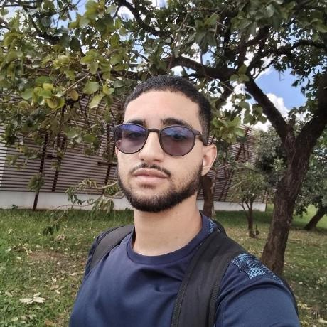

# Integrantes da Equipe

## Tabela de Contribuição

| Integrante | Contribuição no Artefato | Data | Ferramenta de IA e Contribuição |
| :--- | :--- | :---: | :--- |
| [Edvaldo Soares Brasileiro Filho](https://github.com/PajeMurici-dev) | [Revisão e conferência dos perfis ativos e históricos](#integrantes-ativos-etapa-2-em-diante) | 26/09/2026 | Suporte na formatação Markdown e tabelas |
| [Gustavo Antonio Rodrigues e Silva](https://github.com/gus-ant) | [Revisão geral da documentação e apoio na governança](#membros-anteriores-e-contribuicoes-historicas-etapa-1) | 26/09/2026 | Suporte na formatação Markdown e tabelas |
| [Vinicius Silva Araruna](https://github.com/ViniciusA05) | [Reestruturação das tabelas de integrantes, restauração de créditos e nota de governança](#nota-de-governanca-e-transparencia-academica) | 26/09/2026 | Suporte na formatação Markdown e tabelas |

---

## Introdução

Este artefato apresenta os integrantes do **Grupo 08** da disciplina de **Interação Humano-Computador (IHC)** do curso de Engenharia de Software da Universidade de Brasília (UnB), referente ao segundo semestre letivo de 2026 (2026.2), ministrada pelo Prof. Dr. André Barros de Sales.

O propósito deste documento é dar transparência pública à composição da equipe, aos canais de contato, aos históricos de contribuições individuais e à organização colaborativa dos estudantes que atuam no planejamento, pesquisa com usuários, modelagem de tarefas, prototipação e avaliação de usabilidade do **Fórum Diolinux Plus**, em consonância com as práticas éticas e metodológicas preconizadas por Barbosa e Silva (2010).

---

## Integrantes da Equipe

Em estrito cumprimento às diretrizes éticas e de privacidade da disciplina e da Lei Geral de Proteção de Dados Pessoais (LGPD), os números de matrícula acadêmica dos discentes não são divulgados publicamente.

### Integrantes Ativos (Etapa 2 em diante)

A Tabela 1 apresenta a composição oficial dos estudantes atualmente responsáveis pela condução do projeto, exibindo a fotografia de identificação facial, o nome completo e o hiperlink para o respectivo perfil no GitHub.

**Tabela 1** — Integrantes ativos da equipe (Grupo 08)

| Foto | Nome | GitHub |
| :---: | :--- | :---: |
|  | Edvaldo Soares Brasileiro Filho | [@PajeMurici-dev](https://github.com/PajeMurici-dev) |
|  | Gustavo Antonio Rodrigues e Silva | [@gus-ant](https://github.com/gus-ant) |
|  | Vinicius Silva Araruna | [@ViniciusA05](https://github.com/ViniciusA05) |

_Fonte: Elaborada pelos autores, 2026._

Conforme detalhado na Tabela 1, a equipe ativa é formada por três graduandos em Engenharia de Software.

---

### Membros Anteriores e Contribuições Históricas (Etapa 1)

Em estrito respeito à ética acadêmica, autoria científica e transparência institucional, o Grupo 08 preserva integralmente os créditos e o reconhecimento das atividades desenvolvidas pelos discentes que integraram a equipe durante a primeira etapa do projeto.

A Tabela 2 apresenta os membros que contribuíram ativamente na Etapa 1 e que posteriormente se desvincularam da disciplina.

**Tabela 2** — Membros anteriores e histórico de contribuições na Etapa 1

| Foto | Nome | GitHub | Contribuições Desenvolvidas na Etapa 1 |
| :---: | :--- | :---: | :--- |
|  | Jonathan Lourenço Carpaneda | [@Jonathan-Carpaneda](https://github.com/Jonathan-Carpaneda) | Atuação ativa na Etapa 1: elaboração do artefato de Ferramentas, padronização da documentação, estruturação das Referências Bibliográficas em padrão ABNT e participação nas Atas 1 a 3. |
|  | Pedro Paulo Almeida Araujo | [@Pedrop06](https://github.com/Pedrop06) | Atuação ativa na Etapa 1: criação inicial da página da equipe com suporte à alternância de contraste de cores, elaboração do Heatmap de disponibilidade, consolidação de datas no cronograma e atuação nas Atas 1 a 3. |

_Fonte: Elaborada pelos autores, 2026._

Como evidenciado na Tabela 2, todas as contribuições técnicas e documentais realizadas por Jonathan Lourenço Carpaneda e Pedro Paulo Almeida Araujo permanecem registradas nos históricos de versão e nos artefatos correspondentes.

---

### Nota de Governança e Transparência Acadêmica

Durante a fase de planejamento e execução da Etapa 1, o Grupo 08 foi formalmente composto por cinco discentes. Em 25 de setembro de 2026, os estudantes Jonathan Lourenço Carpaneda e Pedro Paulo Almeida Araujo solicitaram o trancamento formal de matrícula na disciplina por motivos de ordem pessoal. 

Em cumprimento aos preceitos bioéticos e de integridade da pesquisa científica (*Barbosa & Silva, 2010*), **nenhuma contribuição, linha de código, ata ou histórico de versão previamente produzido foi apagado ou desconsiderado**. A partir da Etapa 2, as responsabilidades futuras, o escopo integral do Fórum Diolinux Plus e as modelagens de análise de tarefas foram formalmente remanejados entre os três integrantes ativos, conforme deliberado na Ata da Reunião 4.

---

## Histórico de Versão

A Tabela 3 documenta o histórico de versões deste artefato.

**Tabela 3** — Histórico de versão do documento

| Versão | Data | Descrição | Autor(es) | Revisor(es) |
| :---: | :---: | :--- | :---: | :---: |
| `1.0` | 04/09/2026 | Criação da página da equipe com fotos e perfis (sem matrícula) | [Pedro Paulo](https://github.com/Pedrop06) | [Gustavo Antonio](https://github.com/gus-ant) |
| `1.1` | 04/09/2026 | Inclusão de suporte a alternância de contraste de cores e atualização da tabela de contribuição | [Pedro Paulo](https://github.com/Pedrop06) | [Gustavo Antonio](https://github.com/gus-ant) |
| `1.2` | 05/09/2026 | Reorganização da tabela de contribuição no início, bibliografia ABNT e complementação do conteúdo | [Jonathan Lourenço Carpaneda](https://github.com/Jonathan-Carpaneda) | [Pedro Paulo](https://github.com/Pedrop06) |
| `1.3` | 25/09/2026 | Atualização preliminar da composição ativa da equipe | [Gustavo Antonio](https://github.com/gus-ant) | [Vinicius Silva Araruna](https://github.com/ViniciusA05) |
| `1.4` | 26/09/2026 | Restauração dos registros e fotos dos membros da Etapa 1 com tabela histórica de contribuições, padronização de Referências Bibliográficas e nota de governança acadêmica | [Vinicius Silva Araruna](https://github.com/ViniciusA05) | [Edvaldo Soares](https://github.com/PajeMurici-dev), [Gustavo Antonio](https://github.com/gus-ant) |

_Fonte: Elaborada pelos autores, 2026._

---

## Referências Bibliográficas

[1] BARBOSA, Simone Diniz Junqueira; SILVA, Bruno Santana da. *Interação Humano-Computador*. 1. ed. Rio de Janeiro: Elsevier, 2010.

---

## Agradecimentos e Uso de Inteligência Artificial (IA) Generativa

Durante a organização das tabelas e formatação do layout em Markdown, foi utilizado suporte supervisionado de Inteligência Artificial Generativa (LLM), tendo todo o conteúdo textual, governança e conformidade sido revisados e validados pelos membros da equipe.
