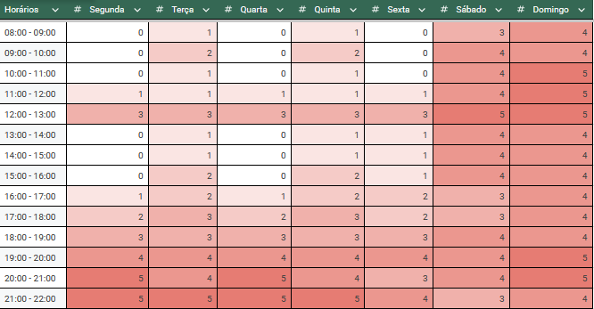

# Heat Map

## Tabela de Contribuição

| Integrante | Contribuição | Data |
| :--- | :--- | :---: |
| Edvaldo Soares Brasileiro Filho | [Preenchimento de horários e disponibilidade individual](#disponibilidade) | 04/09/2026 |
| Gustavo Antonio Rodrigues e Silva | [Criação inicial da página do Heat Map e compilação dos horários](#historico-de-versao) | 04/09/2026 |
| Jonathan Lourenço Carpaneda | [Inclusão da tabela de contribuição no início, padronização e bibliografia ABNT](#introducao) | 05/09/2026 |
| Pedro Paulo Almeida Araujo | [Revisão e conferência dos horários de intersecção](#disponibilidade) | 04/09/2026 |
| Vinicius Silva Araruna | [Preenchimento de horários e disponibilidade individual](#disponibilidade) | 04/09/2026 |

---

## Introdução

Na fase de planejamento inicial do projeto, o Grupo 08 elaborou um mapa de calor (*heat map*) para mapear visualmente os horários livres e ocupados de cada um dos cinco integrantes ao longo dos dias úteis e finais de semana. Essa técnica de visualização permite identificar com clareza as janelas de intersecção temporal ideais para a realização de reuniões síncronas de alinhamento, sessões de trabalho colaborativo e gravações das etapas.

---

## Disponibilidade

A partir do preenchimento individual de uma planilha compartilhada no Google Sheets, foram identificados os intervalos com maior número de membros simultaneamente disponíveis.

A Figura 1 apresenta o mapa de calor consolidado do grupo.

**Figura 1** - Mapa de calor de disponibilidade de horários dos integrantes. (Fonte: Autores, 2026)

Com base na distribuição visual do mapa de calor, deliberou-se que as reuniões gerais e gravações síncronas ocorrerão preferencialmente nos horários de maior sobreposição comum, priorizando o uso do Discord e Google Meet.

---

## Histórico de Versão

| Versão | Data | Descrição | Autor(es) | Revisor(es) |
| :---: | :---: | :--- | :---: | :---: |
| `1.0` | 04/09/2026 | Criação da página do Heat Map | [Gustavo Antonio](https://github.com/gus-ant) | [Pedro Paulo](https://github.com/Pedrop06) |
| `1.1` | 05/09/2026 | Inclusão da tabela de contribuição no início, padronização e bibliografia ABNT | [Jonathan Lourenço Carpaneda](https://github.com/Jonathan-Carpaneda) | [Gustavo Antonio](https://github.com/gus-ant) |

---

## Bibliografia

[1] BARBOSA, Simone D. J.; SILVA, Bruno S. *Interação Humano-Computador*. 1. ed. Rio de Janeiro: Elsevier, 2010.

[2] SOMMERVILLE, Ian. *Engenharia de Software*. 10. ed. São Paulo: Pearson Education do Brasil, 2018.

---

## Agradecimentos e Uso de Inteligência Artificial (IA) Generativa

Durante a organização sintática e padronização da tabela de contribuição em Markdown, foi utilizado o suporte de Inteligência Artificial Generativa (LLM), tendo todo o conteúdo sido revisado e validado pelos membros da equipe.
