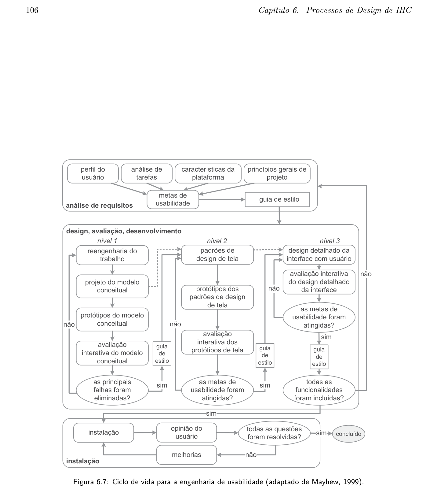

# Processo de Design

## Tabela de Contribuição

| Integrante | Contribuição | Data | Horário |
| :--- | :--- | :---: | :---: |
| [Edvaldo Soares Brasileiro Filho](https://github.com/PajeMurici-dev) | — | — | — |
| [Gustavo Antonio Rodrigues e Silva](https://github.com/gus-ant) | — | — | — |
| [Jonathan Lourenço Carpaneda](https://github.com/Jonathan-Carpaneda) | — | — | — |
| [Pedro Paulo Almeida Araujo](https://github.com/Pedrop06) | — | — | — |
| [Vinicius Silva Araruna](https://github.com/ViniciusA05) | [Elaboração completa do artefato: levantamento comparativo dos ciclos de vida, justificativa da escolha e referências bibliográficas](#processos-de-design-em-ihc) | 06/09/2026 | 13:30 : 16:30 |

---

## Introdução

O processo de design é um conjunto estruturado de atividades que orienta a equipe de desenvolvimento na concepção, prototipação, avaliação e refinamento de sistemas interativos com foco na qualidade de uso. Conforme Barbosa e Silva (2010, p. 93), *"um processo de design define as atividades básicas de análise da situação atual, síntese de uma intervenção e avaliação dessa intervenção junto à situação atual ou a uma representação dela"*, de modo iterativo e orientado ao usuário.

Para o Grupo 08, a escolha do processo de design considerou o perfil do sistema avaliado (Portal Domínio Público do MEC), o público-alvo da disciplina e as restrições de tempo e recursos do semestre letivo. Conforme deliberado formalmente na Ata de Reunião 1 (04/09/2026), a equipe adotou a Engenharia de Usabilidade de Mayhew (1999) como ciclo de vida norteador do projeto.

Este artefato apresenta o contexto teórico dos três principais ciclos de vida em IHC, compara suas características e fundamenta a escolha realizada pelo grupo com base em critérios objetivos vinculados ao sistema e ao contexto de projeto.

---

## Processos de Design em IHC

Os processos de design em IHC compartilham três atividades fundamentais, conforme identificado por Barbosa e Silva (2010, p. 94):

1. Análise da situação atual: compreender quem são os usuários, quais são suas tarefas, seus objetivos e o contexto de uso do sistema.
2. Síntese de uma intervenção: projetar uma solução de interação e interface que atenda às necessidades identificadas.
3. Avaliação da intervenção: verificar se a solução proposta satisfaz os requisitos e metas de usabilidade estabelecidos, gerando insumos para refinamentos iterativos.

A diferença entre os ciclos de vida reside principalmente em como essas atividades são organizadas, em que sequência são executadas e qual é o papel da avaliação em cada modelo. A seguir, são descritos os três ciclos considerados pela equipe.

---

## Ciclos de Vida Considerados

### Ciclo de Vida em Estrela

- Referência: BARBOSA, Simone D. J.; SILVA, Bruno S. *Interação Humano-Computador*. Elsevier, 2010. Capítulo 6, Seção 6.3.1, pp. 101–102.
- Autor do Item: Vinicius Silva Araruna

O Ciclo de Vida em Estrela foi proposto por Hix e Hartson (1993) como um dos primeiros ciclos de vida voltados especificamente ao desenvolvimento de interfaces interativas. Sua principal característica é a centralidade da avaliação: toda atividade do processo deve obrigatoriamente passar por uma etapa de avaliação antes de progredir para a próxima.

Conforme Barbosa e Silva (2010, pp. 101–102):

> *"O ciclo de vida em estrela também é iterativo e não prescreve a sequência das atividades. A única exigência aqui é que, após concluir cada atividade, o designer avalie os resultados obtidos para verificar se ele encontrou ou está no caminho de encontrar uma solução satisfatória. Todas as atividades do ciclo de vida em estrela estão interligadas pela atividade de avaliação."*

A Tabela 1 sintetiza as principais características do Ciclo em Estrela.

**Tabela 1** — Características do Ciclo de Vida em Estrela

| Aspecto | Característica |
| :--- | :--- |
| Origem | Hix e Hartson (1993) |
| Sequência | Não prescrita, qualquer atividade pode ser o ponto de entrada |
| Avaliação | Central e obrigatória entre todas as atividades |
| Ponto forte | Flexibilidade para projetos exploratórios |
| Limitação | Não define formalmente metas de usabilidade mensuráveis |

_Fonte: Elaborada pelo autor com base em Barbosa e Silva (2010), 2026._

---

### Engenharia de Usabilidade de Nielsen

- Referência: BARBOSA, Simone D. J.; SILVA, Bruno S. *Interação Humano-Computador*. Elsevier, 2010. Capítulo 6, Seções 6.3.2–6.3.3, pp. 102–105.
- Autor do Item: Vinicius Silva Araruna

Jakob Nielsen (1993) propôs um conjunto de atividades de engenharia de usabilidade estruturadas em torno da prototipação rápida e dos testes empíricos iterativos. O modelo é orientado ao teste com usuários como mecanismo de validação principal, sendo amplamente reconhecido por sua praticidade em contextos com recursos limitados.

Conforme Barbosa e Silva (2010, p. 105):

> *"Com base nos problemas de usabilidade e nas oportunidades reveladas pelos testes empíricos, os designers produzem uma nova versão da interface, e repassam pelas atividades do processo, num design iterativo. A cada iteração de design e avaliação, alguns problemas são corrigidos [...] e o processo deve se repetir até que as metas de usabilidade tenham sido alcançadas."*

A Tabela 2 sintetiza as principais características do modelo de Nielsen.

**Tabela 2** — Características da Engenharia de Usabilidade de Nielsen

| Aspecto | Característica |
| :--- | :--- |
| Origem | Nielsen (1993) |
| Sequência | Iterativa: análise, design, prototipação, teste e redesign |
| Avaliação | Testes empíricos com usuários como validação central |
| Ponto forte | Pragmatismo e ênfase em encontrar e corrigir problemas reais |
| Limitação | Não estrutura formalmente as fases de análise de requisitos e instalação |

_Fonte: Elaborada pelo autor com base em Barbosa e Silva (2010), 2026._

---

### Engenharia de Usabilidade de Mayhew

- Referência: BARBOSA, Simone D. J.; SILVA, Bruno S. *Interação Humano-Computador*. Elsevier, 2010. Capítulo 6, Seção 6.3.3, pp. 105–107.
- Autor do Item: Vinicius Silva Araruna

Deborah Mayhew (1999) propôs um ciclo de vida abrangente e estruturado para a engenharia de usabilidade. Conforme Barbosa e Silva (2010, p. 105):

> *"Mayhew (1999) também propôs um ciclo de vida para a engenharia de usabilidade. Com uma visão holística, esse processo de design reúne e organiza diferentes atividades propostas na área de IHC para orientar o trabalho do designer em direção a uma boa solução interativa."*

O ciclo é dividido em três fases principais, apresentadas na Figura 1 (BARBOSA; SILVA, 2010, p. 106).

A Figura 1 reproduz o diagrama oficial do Ciclo de Vida para a Engenharia de Usabilidade de Mayhew.

**Figura 1** — Ciclo de vida para a engenharia de usabilidade. (Fonte: Barbosa e Silva, 2010, p. 106).

#### Fase 1: Análise de Requisitos

As metas de usabilidade são definidas com base no perfil dos usuários, análise de tarefas, características da plataforma e princípios gerais de design de IHC. Essas metas são formalizadas em um guia de estilo que serve de referência nas fases seguintes.

#### Fase 2: Design, Avaliação e Desenvolvimento

O design da solução é desenvolvido em três níveis progressivos de fidelidade. No primeiro nível, realiza-se a reengenharia do trabalho, elabora-se o modelo conceitual e constroem-se protótipos de baixa fidelidade. No segundo nível, estabelecem-se padrões de design de tela e constroem-se protótipos de média fidelidade. No terceiro nível, realiza-se o design detalhado da interface com alta fidelidade para implementação. Em cada nível, a solução é avaliada interativamente com usuários antes de progredir.

#### Fase 3: Instalação

Após a entrega do sistema, o designer coleta opiniões dos usuários em contexto real de uso, alimentando o refinamento de versões futuras.

A Tabela 3 sintetiza as características do modelo de Mayhew.

**Tabela 3** — Características da Engenharia de Usabilidade de Mayhew

| Aspecto | Característica |
| :--- | :--- |
| Origem | Mayhew (1999) |
| Sequência | Prescrita e iterativa: análise de requisitos, design/avaliação/desenvolvimento e instalação |
| Avaliação | Integrada em todos os níveis de design com critérios formais |
| Ponto forte | Estrutura holística com metas de usabilidade mensuráveis e guia de estilo |
| Limitação | Mais complexo e exige mais planejamento que os demais modelos |

_Fonte: Elaborada pelo autor com base em Barbosa e Silva (2010), 2026._

#### Mapeamento do Ciclo de Mayhew com as Etapas do Projeto

Para garantir a operacionalização do modelo ao longo do semestre letivo, a equipe mapeou as três fases de Mayhew diretamente nas entregas práticas da disciplina de Interação Humano-Computador:

- Fase 1 (Análise de Requisitos): Corresponde às Etapas 2 e 3 do projeto, contemplando a definição do perfil de usuário, elaboração de personas, análise hierárquica de tarefas (HTA), definição formal das metas de usabilidade e concepção do guia de estilo.
- Fase 2 (Design, Avaliação e Desenvolvimento): Corresponde às Etapas 4, 5 e 7, abrangendo o planejamento da avaliação, construção de protótipos de baixa fidelidade em papel, avaliação formativa e desenvolvimento do protótipo de alta fidelidade navegável.
- Fase 3 (Instalação): Corresponde ao fechamento da Etapa 7, com o relato dos resultados finais obtidos na avaliação com usuários e a consolidação do relatório de conclusão do projeto.

---

## Justificativa da Escolha

A escolha da Engenharia de Usabilidade de Mayhew foi tomada por unanimidade na Reunião 1 (04/09/2026) e fundamenta-se em quatro critérios objetivos avaliados à luz das características do Portal Domínio Público (MEC) e das exigências da disciplina de IHC.

A Tabela 4 apresenta a matriz comparativa dos três ciclos avaliados em relação a esses critérios.

**Tabela 4** — Matriz Comparativa dos Ciclos de Vida por Critérios do Projeto

| Critério de Decisão | Ciclo em Estrela | Nielsen | Mayhew |
| :--- | :---: | :---: | :---: |
| C1: Metas de usabilidade formalizadas | ❌ Não define | ⚠️ Implícitas | ✅ Guia de estilo obrigatório |
| C2: Sequência clara de atividades | ❌ Não prescrita | ⚠️ Parcial | ✅ Três fases bem definidas |
| C3: Prototipação de fidelidade crescente | ⚠️ Presente | ✅ Forte | ✅ Três níveis explícitos |
| C4: Adequação a redesenho com usuários diversos | ⚠️ Possível | ⚠️ Possível | ✅ Análise de perfil obrigatória |

_Fonte: Elaborada pelo autor com base em Barbosa e Silva (2010), 2026._

### Critério 1: Metas de Usabilidade Formalizadas

O Portal Domínio Público atende a usuários com perfis amplamente distintos: professores universitários, estudantes do ensino fundamental, pesquisadores e idosos. Essa diversidade exige que as metas de usabilidade sejam definidas e documentadas formalmente antes do design, para que as decisões não sejam tomadas por intuição e não privilegiem um perfil em detrimento de outro. O ciclo de Mayhew é o único dos três que torna essa formalização obrigatória, por meio do guia de estilo, ainda na fase de Análise de Requisitos.

### Critério 2: Clareza de Sequência para a Equipe

Por se tratar de um projeto acadêmico com cinco integrantes em diferentes níveis de familiaridade com IHC, a clareza da sequência de atividades é um critério operacional relevante. O Ciclo em Estrela, ao não prescrever sequência, exigiria um grau de maturidade da equipe que poderia resultar em atividades sobrepostas ou omitidas. O modelo de Mayhew, com três fases ordenadas, oferece um roteiro estruturado que facilita o planejamento, a divisão de tarefas e o acompanhamento do progresso.

### Critério 3: Prototipação de Fidelidade Crescente

O Domínio Público apresenta problemas de usabilidade em diferentes níveis de complexidade: desde ausência de responsividade (resolvível com wireframes de baixa fidelidade) até falhas na arquitetura de informação (que exigem protótipos navegáveis de alta fidelidade). O ciclo de Mayhew estrutura a prototipação em três níveis progressivos, garantindo que as decisões conceituais sejam validadas com usuários antes de avançar para maior fidelidade.

### Critério 4: Redesenho de Sistema Público com Usuários Diversos

O ciclo de Mayhew enfatiza, já na Fase 1, a necessidade de um perfil de usuário detalhado e de uma análise de tarefas estruturada, que constituem as atividades centrais das Etapas 2 e 3 da disciplina. Essa integração entre o processo de design e os artefatos das próximas entregas torna o modelo de Mayhew o mais coerente com o calendário e os objetivos pedagógicos da disciplina.

---

## Referências Bibliográficas

[1] BARBOSA, Simone D. J.; SILVA, Bruno S. *Interação Humano-Computador*. 1. ed. Rio de Janeiro: Elsevier, 2010. Capítulo 6: Processos de Design de IHC, pp. 93–119.

[2] HIX, Deborah; HARTSON, H. Rex. *Developing User Interfaces: Ensuring Usability Through Product and Process*. New York: John Wiley & Sons, 1993.

[3] MAYHEW, Deborah J. *The Usability Engineering Lifecycle: A Practitioner's Handbook for User Interface Design*. San Francisco: Morgan Kaufmann, 1999.

[4] NIELSEN, Jakob. *Usability Engineering*. San Francisco: Morgan Kaufmann, 1993.

---

## Histórico de Versão

| Versão | Data | Descrição | Autor(es) | Revisor(es) |
| :---: | :---: | :--- | :---: | :---: |
| `1.0` | 04/09/2026 | Criação da estrutura inicial do artefato | [Gustavo Antonio](https://github.com/gus-ant) | — |
| `1.1` | 06/09/2026 | Desenvolvimento completo: levantamento comparativo dos três ciclos de vida, inserção da Figura 1 com imagem oficial da referência, matriz de decisão e justificativa com base em Barbosa e Silva (2010) | [Vinicius Araruna](https://github.com/ViniciusA05) | [Pedro Paulo](https://github.com/Pedrop06) |

---

## Agradecimentos e Uso de Inteligência Artificial (IA) Generativa

Durante a elaboração deste artefato, foi utilizado apoio de Inteligência Artificial Generativa (LLM) para estruturação e formatação das tabelas comparativas em Markdown. Todo o conteúdo teórico, incluindo citações, páginas de referência, critérios de decisão e argumentação, foi elaborado, verificado e validado pelo autor com base na leitura direta do livro de referência da disciplina (Barbosa e Silva, 2010).
