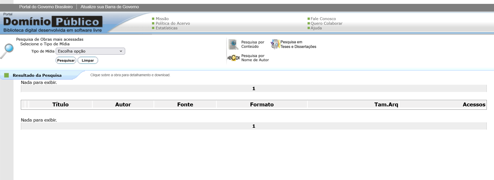
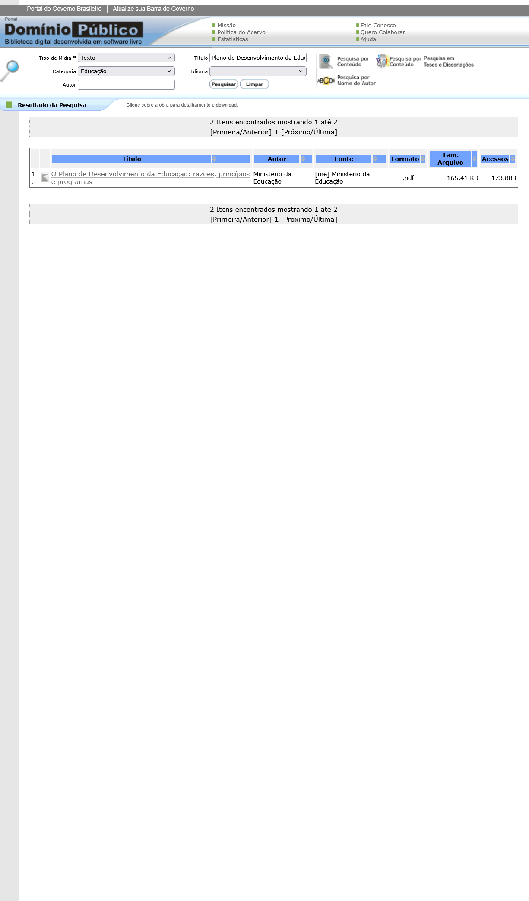
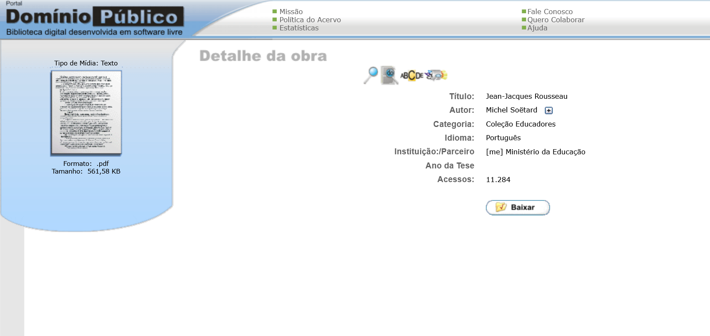

# Site Selecionado

## Tabela de Contribuição

| Integrante | Contribuição | Data |
| :--- | :--- | :---: |
| Edvaldo Soares Brasileiro Filho | [Discussão e consenso na escolha do portal](#website-escolhido-pela-equipe) | 04/09/2026 |
| Gustavo Antonio Rodrigues e Silva | [Elaboração da documentação do site selecionado, levantamento de problemas e prints (Ações 05 e 13)](#portal-dominio-publico-mec) | 04/09/2026 |
| Jonathan Lourenço Carpaneda | [Inclusão da tabela de contribuição no início, padronização e bibliografia ABNT](#introducao) | 05/09/2026 |
| Pedro Paulo Almeida Araujo | [Revisão e validação dos problemas de usabilidade mapeados](#problemas-encontrados) | 04/09/2026 |
| Vinicius Silva Araruna | [Revisão e acompanhamento das diretrizes de IHC](#historico-de-versao) | 04/09/2026 |

---

## Introdução

Na primeira fase do projeto, os integrantes do Grupo 08 avaliaram individualmente sítios eletrônicos focando no escopo e nas necessidades da disciplina de Interação Humano-Computador (IHC). Após análises preliminares e deliberações em reuniões síncronas, o grupo convergiu na escolha de uma plataforma pública que atendesse plenamente aos critérios de relevância pedagógica e acessibilidade aos usuários finais.

---

## Website Escolhido pela Equipe

A seleção do sistema baseou-se nos seguintes critérios norteadores:

- O sítio eletrônico não ter sido abordado recentemente em semestres anteriores da disciplina de Interação Humano-Computador;
- Apresentar problemas claros e significativos de usabilidade, acessibilidade e comunicabilidade;
- Pertencer à esfera governamental ou disponibilizar acervo de domínio público / acesso livre à sociedade;
- Contar com um público de usuários acessível para recrutamento e realização de entrevistas, observações e testes empíricos de usabilidade ao longo do semestre.

---

## Portal Domínio Público (MEC)

Entre as alternativas analisadas, o grupo elegeu o **Portal Domínio Público**, mantido pelo Ministério da Educação (MEC). Lançado em novembro de 2004, o portal constitui um ambiente virtual que permite a coleta, preservação e compartilhamento de obras literárias, artísticas e científicas (em texto, som, imagem e vídeo) em domínio público ou com devida autorização dos titulares.

O público-alvo principal é formado por estudantes, pesquisadores e professores universitários, perfil com o qual a equipe possui contato direto e contínuo, facilitando a aplicação de métodos de pesquisa de IHC.

A Figura 1 exibe a tela inicial do Portal Domínio Público.

**Figura 1** - Imagem da página inicial do sítio eletrônico do Portal Domínio Público. (Fonte: dominiopublico.mec.gov.br)

---

## Problemas Encontrados

Durante a análise exploratória preliminar, a equipe identificou diversas oportunidades críticas de melhoria na experiência do usuário:

### 1. Interface visual e arquitetura de informação defasadas e confusas
A hierarquia das informações é fragmentada, os rótulos de navegação não são intuitivos e os formulários de busca apresentam sobrecarga visual e cognitiva, desrespeitando padrões modernos de usabilidade.

**Figura 2** - Arquitetura de informação e filtros de busca fragmentados. (Fonte: dominiopublico.mec.gov.br)

### 2. Falta de responsividade para dispositivos móveis
O sítio foi concebido para resoluções de tela fixas e antigas, sem adaptação dinâmica a telas de smartphones e tablets, gerando barras de rolagem horizontais e quebra de usabilidade em navegadores móveis.

**Figura 3** - Ausência de responsividade na visualização em dispositivos móveis. (Fonte: dominiopublico.mec.gov.br)

### 3. Inexistência de pré-visualização de documentos
Ao pesquisar uma obra literária ou científica, a plataforma não oferece recurso de pré-visualização do conteúdo, obrigando o usuário a efetuar o download obrigatório do arquivo (.pdf ou similar) apenas para verificar se trata-se do material desejado.

**Figura 4** - Falta de ferramenta de pré-visualização integrada de arquivos. (Fonte: dominiopublico.mec.gov.br)

---

## Histórico de Versão

| Versão | Data | Descrição | Autor(es) | Revisor(es) |
| :---: | :---: | :--- | :---: | :---: |
| `1.0` | 04/09/2026 | Criação da página do site selecionado baseada na referência | [Gustavo Antonio](https://github.com/gus-ant) | [Pedro Paulo](https://github.com/Pedrop06) |
| `1.1` | 05/09/2026 | Inclusão da tabela de contribuição no início, padronização e bibliografia ABNT | [Jonathan Lourenço Carpaneda](https://github.com/Jonathan-Carpaneda) | [Gustavo Antonio](https://github.com/gus-ant) |

---

## Bibliografia

[1] BARBOSA, Simone D. J.; SILVA, Bruno S. *Interação Humano-Computador*. 1. ed. Rio de Janeiro: Elsevier, 2010.

[2] MINISTÉRIO DA EDUCAÇÃO. *Portal Domínio Público*. Brasília: MEC, 2004. Disponível em: <http://www.dominiopublico.mec.gov.br>. Acesso em: 04 set. 2026.

---

## Agradecimentos e Uso de Inteligência Artificial (IA) Generativa

Durante a organização sintática e padronização da tabela de contribuição em Markdown, foi utilizado o suporte de Inteligência Artificial Generativa (LLM), tendo todo o conteúdo sido revisado e validado pelos membros da equipe.
