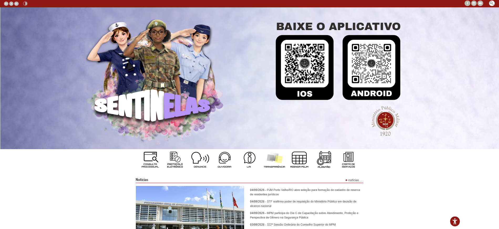
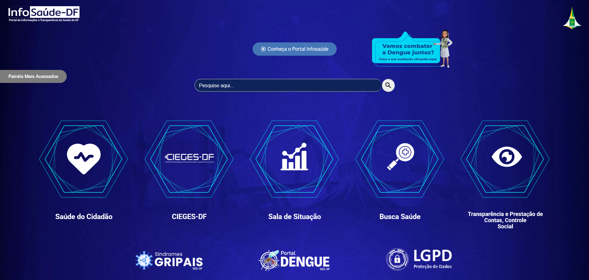
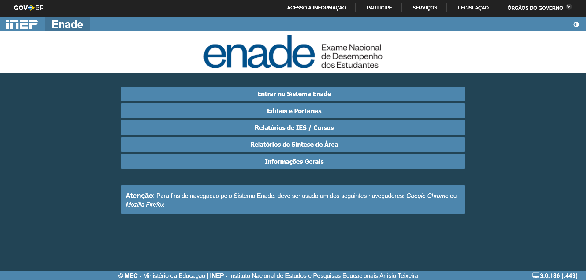
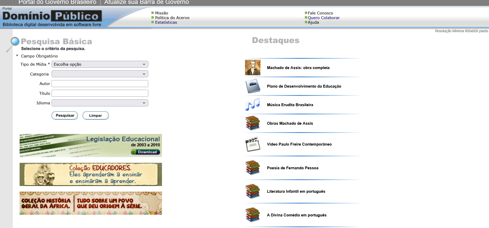

# Sites Avaliados

## Tabela de Contribuição

| Integrante | Contribuição | Data | Horário |
| :--- | :--- | :---: | :---: |
| [Edvaldo Soares Brasileiro Filho](https://github.com/PajeMurici-dev) | [Avaliação preliminar do Ministério Público Militar (MPM)](#ministerio-publico-militar-mpm) | 04/09/2026 | 18:30 - 19:00 |
| [Gustavo Antonio Rodrigues e Silva](https://github.com/gus-ant) | [Criação da estrutura da página, matriz de decisão e seções dos sites MPM, InfoSaúde, Enade e Domínio Público](#matriz-de-decisao) | 04/09/2026 | 19:00 - 19:45 |
| [Jonathan Lourenço Carpaneda](https://github.com/Jonathan-Carpaneda) | [Avaliação preliminar do InfoSaúde DF e referências ABNT](#infosaude-df) | 04/09/2026 | 19:45 - 20:15 |
| [Pedro Paulo Almeida Araujo](https://github.com/Pedrop06) | [Avaliação preliminar do Enade e revisão cruzada](#enade-inep) | 04/09/2026 | 20:15 - 20:45 |
| [Vinicius Silva Araruna](https://github.com/ViniciusA05) | [Adição do BRB Mobilidade (avaliação heurística com Framework DECIDE), atualização da matriz e figuras](#brb-mobilidade) | 05/09/2026 | 20:00 - 20:30 |

---

## Introdução

Este documento apresenta a lista de sites e sistemas avaliados pelo grupo como potenciais candidatos para o projeto da disciplina. A avaliação foi baseada em critérios definidos previamente em reunião, para garantir que o sistema escolhido atendesse aos requisitos pedagógicos de IHC.

Para garantir uma escolha técnica e alinhada aos objetivos da disciplina, o grupo definiu quatro critérios principais:

- **C1 - Facilidade de Acesso a Usuários:** Grau de facilidade para encontrar, recrutar e entrevistar usuários reais do sistema ao longo do semestre.
- **C2 - Problemas de Usabilidade e Acessibilidade:** Quantidade de falhas heurísticas que oferecem boas oportunidades de redesenho.
- **C3 - Escopo Adequado:** Avaliação do tamanho do sistema e se possui fluxos de tarefas claros.
- **C4 - Relevância Prática:** O impacto do sistema na sociedade ou no ambiente acadêmico.

---

## Matriz de Decisão

A Matriz de decisão dos sites candidatos pode ser visualizada na Tabela 1.

**Tabela 1: Matriz de decisão dos sites candidatos.**

| Site Avaliado | Avaliador Principal | C1: Acesso a Usuários | C2: Problemas de Usabilidade | C3: Escopo Adequado | C4: Relevância Prática | Nota Final |
|---|---|---|---|---|---|---|
| Ministério Público Militar (MPM) | Edvaldo | 1 | 3 | 3 | 3 | 10 |
| InfoSaúde DF | Jonathan | 4 | 3 | 3 | 5 | 15 |
| BRB Mobilidade | Vinicius | 4 | 4 | 3 | 4 | 15 |
| Enade (INEP) | Pedro Paulo | 4 | 4 | 4 | 4 | 16 |
| Domínio Público (MEC) | Gustavo | 5 | 5 | 5 | 5 | 20 |

_Fonte: Elaborada pelos autores, 2026._

---

## Ministério Público Militar (MPM)

Embora seja um portal governamental importante, identificamos alguns limitadores para o projeto:

- O público-alvo (procuradores, advogados militares) é extremamente restrito.
- A dificuldade de recrutar esses usuários inviabilizaria a etapa de pesquisa e entrevistas.

Conforme ilustrado na Figura 1, a interface inicial do MPM apresenta informações muito institucionais.

**Figura 1 - Imagem da página inicial do site eletrônico - MPM. (Fonte: mpm.mp.br)**

---

## InfoSaúde DF

Possui enorme relevância prática para a população local do Distrito Federal no acompanhamento de dados epidemiológicos. No entanto:

- Foca muito em painéis de visualização de dados (dashboards).
- Limita a criação de fluxos de interação complexos exigidos pela disciplina.

Como podemos ver na Figura 2, o site do InfoSaúde DF é voltado para dashboards.

**Figura 2 - Imagem da página inicial do site eletrônico - InfoSaúde DF. (Fonte: info.saude.df.gov.br)**

---

## BRB Mobilidade

O Portal BRB Mobilidade é a plataforma responsável pela gestão do Bilhete Único, cartões de vale-transporte e passe estudantil no Distrito Federal. Foi avaliado individualmente por Vinicius Silva Araruna utilizando o **Framework DECIDE** e o **método de Avaliação Heurística** conforme Barbosa et al. (2021).

A avaliação heurística individual identificou **10 problemas de usabilidade**, sendo:

- **Severidade 3 (Grave):** 4 problemas — incluindo ausência de feedback em tempo real e falta de prevenção de erros nos formulários de cadastro do passe estudantil.
- **Severidade 4 (Catastrófico):** 1 problema — falha crítica que impede o usuário de concluir o processo de renovação.

Apesar da relevância dos problemas encontrados, o site foi descartado como alvo principal do projeto pelos seguintes motivos:

- **Escopo regional:** O público-alvo é restrito ao Distrito Federal, limitando o universo de usuários recrutáveis para entrevistas e testes ao longo do semestre.
- **Foco em mobilidade urbana:** Limita os fluxos de interação a serviços de transporte, reduzindo a variedade de análises possíveis na disciplina.

A Figura 3 ilustra a página inicial do portal BRB Mobilidade.

**Figura 3 - Imagem da página inicial do site eletrônico - BRB Mobilidade. (Fonte: brbnovo.brb.com.br/mobilidade/)**

> **Nota:** A avaliação completa deste site está documentada no artefato individual de Vinicius Silva Araruna, incluindo o planejamento com o Framework DECIDE e o relatório da inspeção heurística.

---

## Enade (INEP)

Tem um escopo muito bom e relevância para o contexto universitário, porém o grupo decidiu não seguir com ele porque:

- O sistema possui alta sazonalidade (só tem picos de uso durante o período de provas).
- Isso dificulta a avaliação do contexto de uso contínuo ao longo de um semestre padrão.

A Figura 4 demonstra a página inicial do Enade, focada no acesso do estudante.

**Figura 4 - Imagem da página inicial do site eletrônico - Enade. (Fonte: enade.inep.gov.br)**

---

## Domínio Público (MEC)

O Portal Domínio Público foi o site escolhido pela equipe, pois obteve a maior pontuação (20/20) em nossa avaliação, sendo superior a todos os demais candidatos em todos os critérios analisados.

- O público-alvo (estudantes, professores e pesquisadores) é de fácil acesso, incluindo os próprios membros da equipe e colegas da universidade.
- Apresenta problemas graves de usabilidade e responsividade, garantindo boas oportunidades de melhoria e análise aprofundada.
- É mantido pelo Ministério da Educação (MEC), com relevância nacional e social elevada.

Conforme ilustrado na Figura 5, a interface inicial do Portal Domínio Público é bastante defasada.

**Figura 5 - Imagem da página inicial do site eletrônico - Domínio Público. (Fonte: dominiopublico.mec.gov.br)**

---

## Histórico de Versão

| Versão | Data | Descrição | Autor(es) | Revisor(es) |
| :---: | :---: | :--- | :---: | :---: |
| `1.0` | 04/09/2026 | Criação da página de sites avaliados no padrão de referência | [Gustavo Antonio](https://github.com/gus-ant) | [Pedro Paulo](https://github.com/Pedrop06) |
| `1.1` | 05/09/2026 | Adição do BRB Mobilidade na matriz de decisão e seção de análise; atualização das figuras numeradas | [Vinicius Araruna](https://github.com/ViniciusA05) | [Edvaldo Soares](https://github.com/PajeMurici-dev) |
| `1.2` | 06/09/2026 | Posicionamento da tabela de contribuição no topo (D10) e expansão das referências bibliográficas no padrão ABNT (D3) | [Vinicius Araruna](https://github.com/ViniciusA05) | [Pedro Paulo](https://github.com/Pedrop06) |

---

## Referências Bibliográficas

[1] BARBOSA, Simone Diniz Junqueira; SILVA, Bruno Santana da. *Interação Humano-Computador e Experiência do Usuário*. Autopublicação, 2021.

[2] BRB MOBILIDADE. *Portal de Serviços e Bilhetagem Eletrônica do Distrito Federal*. Brasília: Banco de Brasília, 2026. Disponível em: <https://brbnovo.brb.com.br/mobilidade/>. Acesso em: 05 set. 2026.

[3] INSTITUTO NACIONAL DE ESTUDOS E PESQUISAS EDUCACIONAIS ANÍSIO TEIXEIRA. *Portal do Enade*. Brasília: INEP, 2026. Disponível em: <https://enade.inep.gov.br>. Acesso em: 04 set. 2026.

[4] MINISTÉRIO DA EDUCAÇÃO. *Portal Domínio Público*. Brasília: MEC, 2004. Disponível em: <http://www.dominiopublico.mec.gov.br>. Acesso em: 04 set. 2026.

[5] MINISTÉRIO PÚBLICO MILITAR. *Portal do Ministério Público Militar*. Brasília: MPM, 2026. Disponível em: <https://www.mpm.mp.br>. Acesso em: 04 set. 2026.

[6] SECRETARIA DE SAÚDE DO DISTRITO FEDERAL. *Portal InfoSaúde DF*. Brasília: SES-DF, 2026. Disponível em: <https://info.saude.df.gov.br>. Acesso em: 04 set. 2026.

---

## Agradecimentos e Uso de Inteligência Artificial (IA) Generativa

Durante a elaboração e reestruturação deste artefato, foi utilizado apoio de Inteligência Artificial Generativa (LLM) para geração e formatação de tabelas em Markdown, sendo o conteúdo revisado e validado pela equipe humana antes da publicação final.
