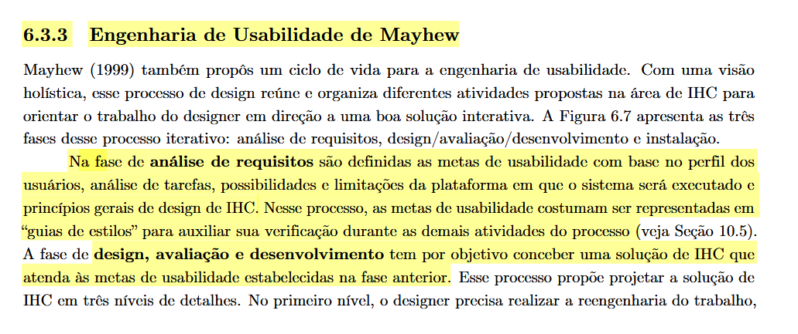

# Características da Plataforma

## Tabela de Contribuição e Uso de IA Generativa

| Integrante | Contribuição | Revisor | Ferramenta de IA Utilizada | Propósito do Uso de IA |
| :--- | :--- | :--- | :--- | :--- |
| [Gustavo Antonio](https://github.com/gus-ant) | Elaboração do documento de Características da Plataforma | [Vinicius Silva Araruna](https://github.com/ViniciusA05) | Gemini | Apoio na estruturação inicial e formatação Markdown. |

---

## Introdução

Este artefato documenta as características da plataforma tecnológica que suporta o **Fórum Diolinux Plus**. O objetivo é apresentar as propriedades do sistema, limitações de hardware e software, e os recursos nativos de navegação que impactam diretamente a usabilidade e a experiência do usuário (UX), servindo como insumo crítico para a Etapa 3 (Análise de Requisitos) da disciplina de Interação Humano-Computador.

---

## Metodologia e Fundamentação Teórica

O levantamento das características da plataforma baseia-se na Engenharia de Usabilidade orientada pelo Ciclo de Vida de Mayhew. Segundo Barbosa e Silva (2010, p. 105), a análise das características da plataforma corresponde a uma atividade da fase de análise de requisitos, na qual o designer deve entender as restrições tecnológicas — como resoluções de tela suportadas, navegadores, sistemas operacionais e periféricos de entrada.

Identificar corretamente essas limitações permite direcionar as decisões de design para projetar interfaces que explorem o potencial máximo do hardware e do software sem comprometer a estabilidade ou a acessibilidade do sistema.

> **Figura 1:** Trecho do livro-texto de IHC detalhando as Características da Plataforma no Ciclo de Mayhew.
>
> 
>
> *Fonte: BARBOSA e SILVA (2010, p. 105).*

---

## Características do Fórum Diolinux Plus

Com base na avaliação técnica do repositório e da interface do Fórum Diolinux Plus, foram mapeadas as seguintes características da plataforma:

### Arquitetura Base

O fórum opera sob a infraestrutura de uma **Aplicação Web SPA (Single Page Application)**, fundamentada no software de código aberto *Discourse*. A arquitetura promove carregamento dinâmico do conteúdo sem recarregamento completo da página, oferecendo uma experiência contínua similar a um aplicativo nativo.

### Responsividade e Dispositivos

A plataforma foi desenhada sob o paradigma *mobile-first*, oferecendo um layout adaptável para diferentes tamanhos de viewport:

- **Desktops e Notebooks:** Resoluções widescreen, priorizando o uso de mouse e teclado para navegação veloz e edição complexa via atalhos.
- **Tablets e Smartphones (Android/iOS):** Resoluções verticais com interfaces otimizadas para interações baseadas em toque (*touch*), escondendo painéis secundários atrás de menus expansíveis (menus hambúrguer) para economizar espaço de tela.

### Navegadores Suportados

Por ser baseada em tecnologias web modernas (HTML5, CSS3, ES6+), a aplicação apresenta plena compatibilidade de renderização e funcionalidade nos seguintes navegadores:

- Google Chrome
- Mozilla Firefox
- Microsoft Edge
- Apple Safari
- Opera

### Recursos Nativos e Interação Avançada

A plataforma conta com funcionalidades avançadas projetadas para acelerar a produtividade da comunidade:

- **Atalhos de Teclado Universais:** Usuários experientes podem pressionar a tecla `c` para criar um novo tópico, `f` para ativar a barra de busca avançada e `/` para focar imediatamente no campo de pesquisa.
- **Personalização de Interface:** Suporte integrado a alternância de temas (claro e escuro) no painel de preferências e alto contraste nativo.
- **Renderização Assíncrona e Notificações:** Utilização de conexões WebSocket e requisições REST para garantir que alertas, novos tópicos e atualizações de perfil ocorram em tempo real, inclusive com suporte a notificações *Push* via *Progressive Web App* (PWA).

---

## Histórico de Versão

| Versão | Data | Descrição | Autor(es) | Revisor(es) |
| :---: | :---: | :--- | :--- | :--- |
| `1.0` | 25/09/2026 | Criação inicial do documento com a fundamentação do livro | [Gustavo Antonio](https://github.com/gus-ant) | [Vinicius Silva Araruna](https://github.com/ViniciusA05) |

---

## Referências Bibliográficas

[1] BARBOSA, Simone Diniz Junqueira; SILVA, Bruno Santana da. *Interação Humano-Computador*. 1. ed. Rio de Janeiro: Elsevier, 2010. Cap. 6: Processos de Design de IHC (Ciclo de Mayhew), p. 105–106; Cap. 8: Princípios e Diretrizes para o Design de IHC, p. 203–205.
