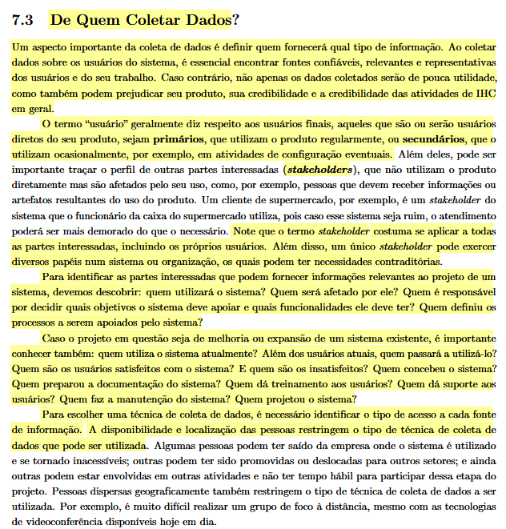
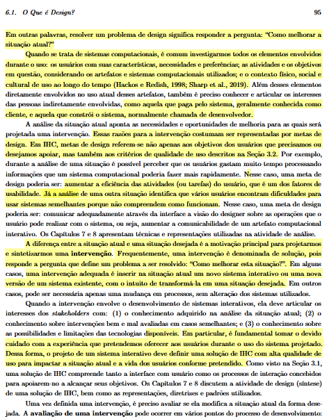

# Perfil do Usuário

## 1. Introdução

Este documento apresenta a caracterização detalhada do Perfil de Usuário dos membros e visitantes do Fórum Diolinux Plus. O perfil busca mapear quem são os usuários, suas características demográficas, nível de experiência com tecnologia, domínio computacional e objetivos ao interagir com a comunidade.

## 2. Metodologia e Coleta de Dados (Item 1)

Antes de definir os métodos de coleta, a equipe estabeleceu o público-alvo baseando-se no conceito de identificação de perfis. Segundo Barbosa e Silva (2010, p. 124), *"O termo 'usuário' geralmente diz respeito aos usuários finais, aqueles que são ou serão usuários diretos do seu produto, sejam primários [...] ou secundários"*, estendendo-se também à análise de *stakeholders*.

> **Figura 1:** Trecho do livro de IHC abordando a importância de definir de quem coletar os dados e como classificar os papéis no sistema (Seção 7.3).  
>   
> *Fonte: BARBOSA e SILVA (2010, p. 124).*

Para abranger essa diversidade de perfis, a caracterização não se baseou em suposições. Empregamos **mais de uma técnica de elicitação e ferramenta de coleta de dados** de forma complementar:

1. **Questionário Online (Quantitativo):** Instrumento estruturado aplicado via Google Forms aos membros e frequentadores da comunidade Linux, coletando dados demográficos, frequência de uso, hábitos de navegação e atitudes perante novas tecnologias.
2. **Análise Documental e Etnográfica dos Tópicos do Fórum (Qualitativo):** Investigação de discussões reais, categorização de dúvidas recorrentes e identificação dos papéis ativos assumidos pelos usuários (novatos em busca de suporte vs. especialistas/mantenedores de soluções).

## 3. Atributos do Perfil de Usuário (Item 2)

Com base na taxonomia consolidada de **Hackos e Redish (1998)** e **Courage e Baxter (2005)** apresentada por **Barbosa e Silva (2010, p. 123-124)**, o público-alvo do Diolinux Plus foi mapeado sob as seguintes dimensões:

- **Dados Demográficos:** Faixa etária predominante concentrada entre 18 e 45 anos, com ampla distribuição geográfica no Brasil e predominância de público jovem-adulto conectado.
- **Experiência e Cargo:** Estudantes de Engenharia/Ciência da Computação, profissionais de TI, administradores de sistemas (SysAdmins), analistas de suporte, desenvolvedores open-source e entusiastas de hardware/software livre.
- **Educação e Alfabetismo:** Alto nível de escolaridade (superior incompleto ou completo em cursos técnicos/exatas), facilidade na interpretação de documentações técnicas, logs de erro e materiais em língua inglesa, com preferência pelo aprendizado autônomo ("hands-on").
- **Experiência Computacional:** Elevada proficiência digital, familiaridade com múltiplos ecossistemas (Linux, Windows, macOS), conforto com interfaces de linha de comando (CLI/Terminal), particionamento de disco e customização de desktops (DEs/WMs).
- **Atitudes e Valores:** Comunidade engajada e tecnófila, com apreço pela filosofia de software livre, autonomia na resolução de problemas, customização do sistema operacional e espírito de ajuda mútua.
- **Tarefas e Objetivos:** Solução de problemas específicos de configuração/drivers, busca de recomendações de distribuições, participação em debates sobre novidades no mundo Linux e compartilhamento de tutorias.

---

### Referência Bibliográfica Comprobatória

Abaixo consta a comprovação teórica extraída do livro-texto da disciplina contendo a fundamentação para a elicitação e classificação dos atributos do perfil de usuário:

> **Figura 2:** Trecho do livro de IHC detalhando a classificação de atributos de perfil de usuário com base em Hackos & Redish (1998) e Courage & Baxter (2005).  
>   
> *Fonte: BARBOSA e SILVA (2010, p. 95).*

---

## Tabela de Contribuição e Uso de IA Generativa

| Integrante | Contribuição | Revisor | Ferramenta de IA Utilizada | Propósito do Uso de IA |
| :--- | :--- | :--- | :--- | :--- |
| Gustavo Antonio | Elaboração e estruturação da definição do Perfil de Usuário | Vinicius Silva Araruna | Gemini | Apoio na estruturação dos atributos e síntese teórica. |

## Histórico de Versão

| Versão | Data | Descrição | Autor(es) | Revisor(es) |
| :---: | :---: | :--- | :--- | :--- |
| `1.0` | 25/09/2026 | Definição inicial do Perfil de Usuário com base em Hackos & Redish e Courage & Baxter | Gustavo Antonio | Vinicius Silva Araruna |

## Bibliografia

- BARBOSA, Simone Diniz Junqueira; SILVA, Bruno Santana da. *Interação Humano-Computador*. Rio de Janeiro: Elsevier, 2010. Cap. 7: Análise e Definição dos Requisitos, p. 123–124; Cap. 8: Organização do Espaço de Problema, p. 151–152.
- COURAGE, Catherine; BAXTER, Kathy. *Understanding Your Users: A Practical Guide to User Requirements Methods, Tools, and Techniques*. San Francisco: Morgan Kaufmann, 2005.
- HACKOS, JoAnn T.; REDISH, Janice C. *User and Task Analysis for Interface Design*. New York: John Wiley & Sons, 1998.
