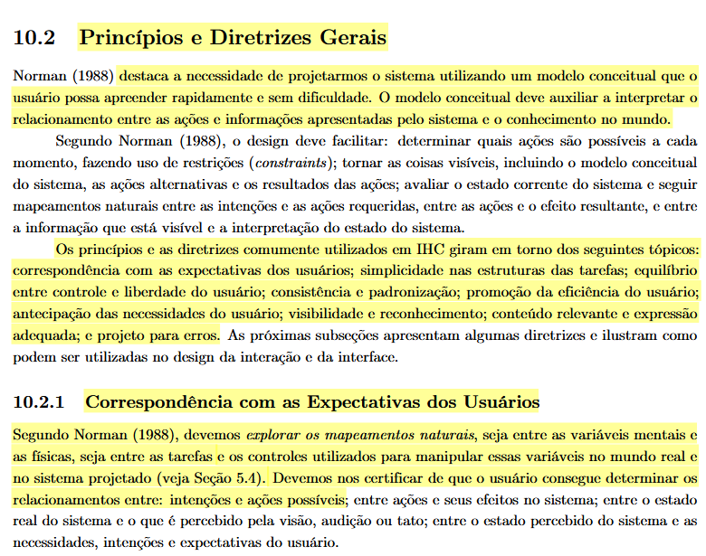
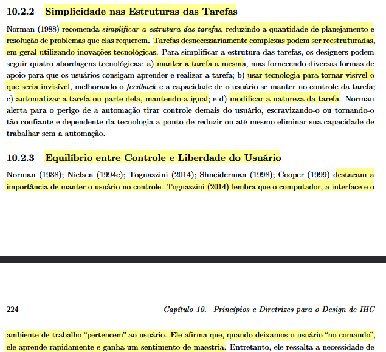
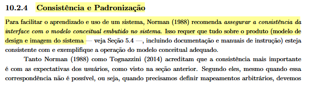
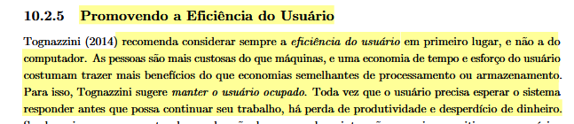
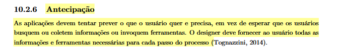
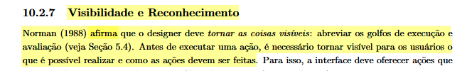
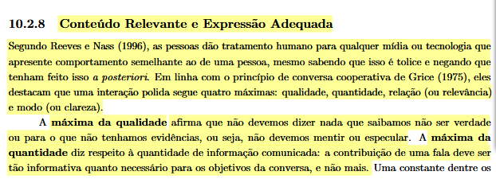
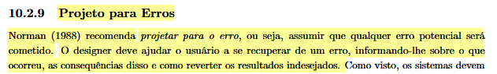

# Princípios Gerais de Projeto

## Tabela de Contribuição e Uso de IA Generativa

| Integrante | Contribuição | Revisor | Ferramenta de IA Utilizada | Propósito do Uso de IA |
| :--- | :--- | :--- | :--- | :--- |
| [Gustavo Antonio](https://github.com/gus-ant) | Elaboração do documento de Princípios Gerais de Projeto | [Vinicius Silva Araruna](https://github.com/ViniciusA05) | Gemini | Apoio na estruturação inicial e revisão de linguagem. |

---

## Introdução

Este artefato apresenta os **Princípios Gerais de Projeto** que balizam as decisões de design, avaliação e prototipagem da interface do **Fórum Diolinux Plus**. Os princípios estabelecem as diretrizes e regras fundamentais que visam assegurar um padrão de usabilidade de alta qualidade, garantindo que o sistema atenda as necessidades do usuário de maneira eficiente, segura e com baixo esforço cognitivo.

---

## Metodologia e Fundamentação Teórica

No campo de Interação Humano-Computador, os princípios gerais de projeto funcionam como bússolas metodológicas. Conforme definido por Barbosa e Silva (2010, p. 203), esses princípios constituem orientações amplas aplicáveis à maioria das situações de design, independentemente do tipo de software ou da plataforma utilizada.

Para as análises da Etapa 3 (Análise de Requisitos) e prototipagem do Diolinux Plus, apoiamo-nos nos 8 princípios fundamentais discutidos pela literatura, permitindo não apenas a avaliação heurística da plataforma, mas também projetando soluções para cenários falhos.

> **Figura 1:** Trecho do livro-texto de IHC apresentando os Princípios Gerais de Design de IHC.
>
> 
>
> *Fonte: BARBOSA e SILVA (2010, p. 204).*

---

## Princípios Gerais Aplicados ao Fórum Diolinux Plus

O grupo detalhou os 8 tópicos fundamentais e como eles estão (ou devem ser) aplicados dentro do contexto do fórum da comunidade Linux.

### 1. Correspondência com as Expectativas dos Usuários

O sistema deve falar a linguagem do usuário, empregando palavras, frases e conceitos que lhe sejam familiares, e operando de acordo com as convenções do mundo real.

* **Aplicação no Diolinux Plus:** A interface faz uso extensivo de terminologias e categorias consolidadas da comunidade *Open Source* e de Tecnologia da Informação, como *Distros*, *Kernel*, *Terminal* e *Hardware*. Tais termos estabelecem uma conexão imediata e reduzem a curva de aprendizado para o perfil focado da plataforma.

### 2. Simplicidade nas Estruturas das Tarefas

As tarefas devem ser projetadas de modo a reduzir a carga de processamento exigida do usuário (memória de trabalho), dividindo tarefas complexas em subtarefas simples e objetivas.

* **Aplicação no Diolinux Plus:** Minimização rigorosa do número de cliques (passos) necessários para publicar uma nova dúvida ou responder em tópicos de suporte técnico. O editor de mensagens está sempre acessível e fixo na base da tela para facilitar interações imediatas.

<small><em>Fonte: BARBOSA et al. (2021, p. 223-224).</em></small>

### 3. Equilíbrio entre Controle e Liberdade do Usuário

Usuários frequentemente selecionam opções do sistema por engano e precisam de "saídas de emergência" claras para abandonar um estado indesejado.

* **Aplicação no Diolinux Plus:** A plataforma proporciona autonomia disponibilizando opções seguras para editar postagens enviadas, cancelar ou excluir rascunhos em progresso, desfazer ações (`undo`) e navegar livremente utilizando a arquitetura flexível de *breadcrumbs* no topo dos tópicos.

<small><em>Fonte: BARBOSA et al. (2021, p. 225).</em></small>

### 4. Consistência e Padronização / Promoção da Eficiência do Usuário

O sistema não deve fazer o usuário questionar se diferentes palavras, situações ou ações significam a mesma coisa (consistência). Adicionalmente, deve fornecer atalhos e mecanismos que acelerem a navegação para usuários experientes (eficiência).

* **Aplicação no Diolinux Plus:** A interface mantém um padrão visual coeso de "cartões de tópicos" independentemente da categoria acessada. Adicionalmente, suporta uma extensa gama de aceleradores visuais e teclas de atalho invisíveis que promovem a produtividade para a base de usuários avançados.

<small><em>Fonte: BARBOSA et al. (2021, p. 226).</em></small>

### 5. Antecipação das Necessidades do Usuário

Um bom sistema é capaz de prever os próximos passos mais lógicos ou cruciais que o usuário deseja dar, fornecendo as ferramentas necessárias antes de serem explicitamente solicitadas.

* **Aplicação no Diolinux Plus:** O fórum implementa a sugestão autônoma e em tempo real de tópicos parecidos que já constam como resolvidos na base de dados assim que o usuário começa a digitar o título de uma nova postagem. Esse recurso previne retrabalho e evita a duplicação na criação de conteúdo de suporte.

<small><em>Fonte: BARBOSA et al. (2021, p. 227).</em></small>

### 6. Visibilidade e Reconhecimento

A interface deve minimizar a dependência da memória do usuário, tornando ações, botões e informações críticas explicitamente visíveis na tela.

* **Aplicação no Diolinux Plus:** A interface fornece destaque visual claro para o status atual dos tópicos (através de ícones e cores para tópicos "Resolvidos", "Abertos" ou "Fechados"). Da mesma forma, botões de ação primária estão espalhados com alto contraste cromático, exigindo zero esforço de memorização.

<small><em>Fonte: BARBOSA et al. (2021, p. 228).</em></small>

### 7. Conteúdo Relevante e Expressão Adequada

Toda informação, erro ou rótulo na interface deve ser claro, livre de ruídos textuais e diretamente pertinente ao objetivo do usuário.

* **Aplicação no Diolinux Plus:** Design com tipografia nítida e ausência de poluição visual (como banners invasivos). O grande foco recai sobre o texto centralizado da discussão técnica, com suporte a blocos ressaltados para fragmentos de código (*syntax highlighting*), vital para uma comunidade Linux.

<small><em>Fonte: BARBOSA et al. (2021, p. 230).</em></small>

### 8. Projeto para Erros (Prevenção e Recuperação)

Até mesmo usuários atentos cometem falhas; a interface deve evitar que eles gerem erros sempre que possível e os ajudar a recuperar o sistema em caso de acidentes.

* **Aplicação no Diolinux Plus:** O formulário de tópicos possui validação contínua: não é possível publicar sem título ou sem categoria. Além disso, a plataforma apresenta mensagens claras em balões de alerta vermelhos caso o usuário infrinja o limite mínimo/máximo de caracteres ou se esqueça de preencher parâmetros essenciais.

<small><em>Fonte: BARBOSA et al. (2021, p. 231).</em></small>

---

## Histórico de Versão

| Versão | Data | Descrição | Autor(es) | Revisor(es) |
| :---: | :---: | :--- | :--- | :--- |
| `1.0` | 25/09/2026 | Criação inicial do documento com a fundamentação do livro | [Gustavo Antonio](https://github.com/gus-ant) | [Vinicius Silva Araruna](https://github.com/ViniciusA05) |

---

## Referências Bibliográficas

[1] BARBOSA, Simone Diniz Junqueira; SILVA, Bruno Santana da. *Interação Humano-Computador*. 1. ed. Rio de Janeiro: Elsevier, 2010. Cap. 8: Princípios e Diretrizes para o Design de IHC, p. 203–218.

[2] BARBOSA, Simone Diniz Junqueira et al. *Interação Humano-Computador e Experiência do Usuário*. 1. ed. Rio de Janeiro: Autopublicação, 2021. Cap. 10: Princípios e Diretrizes para o Design de IHC, p. 221–232.
